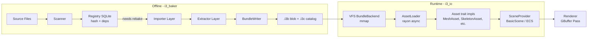
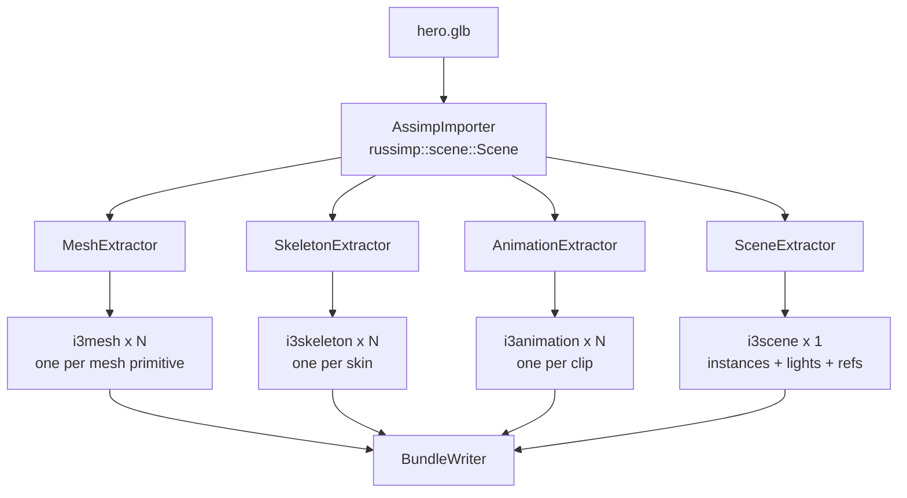
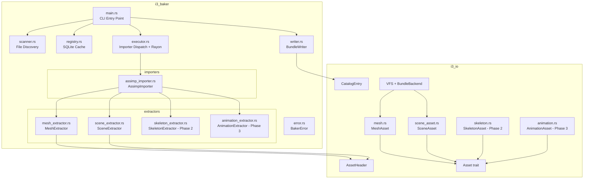
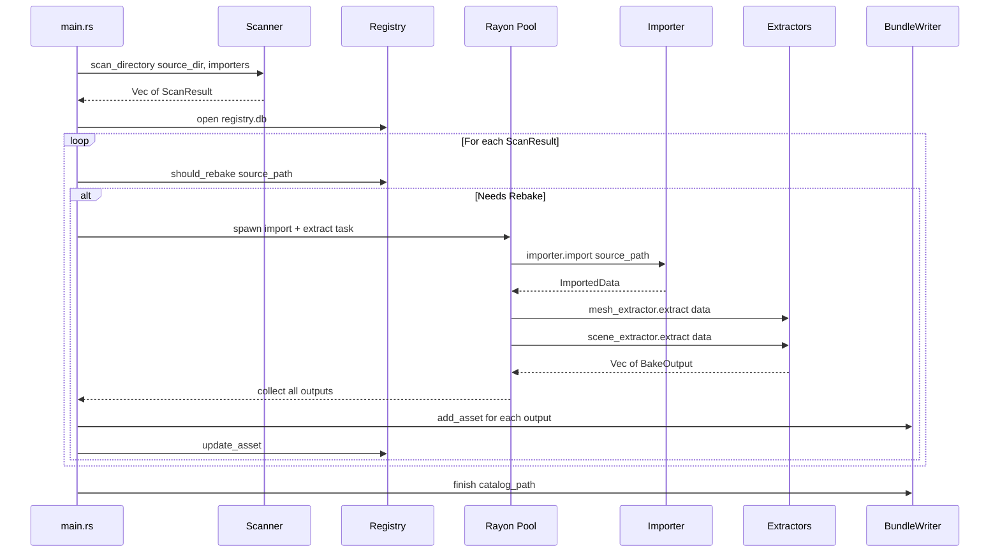
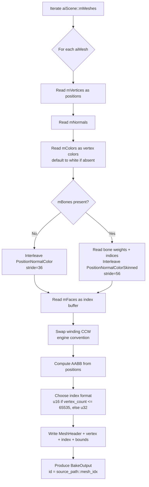
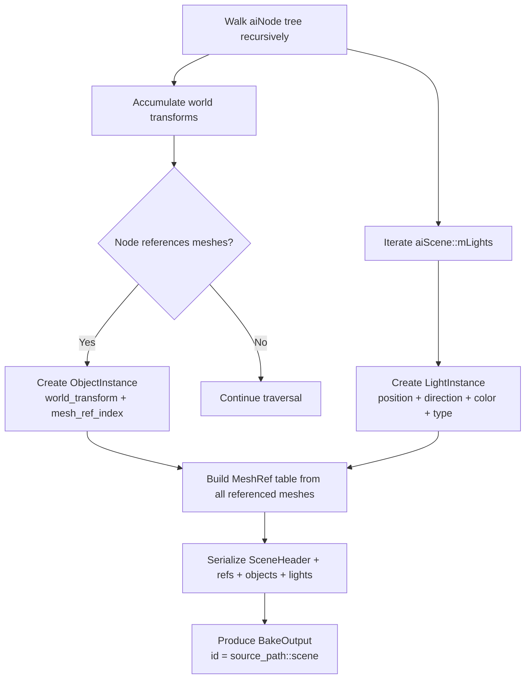
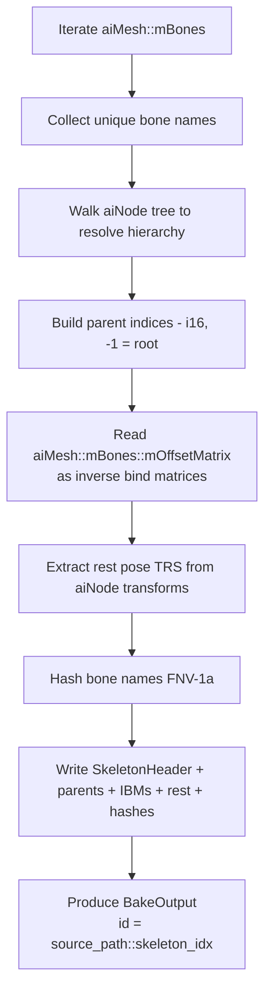
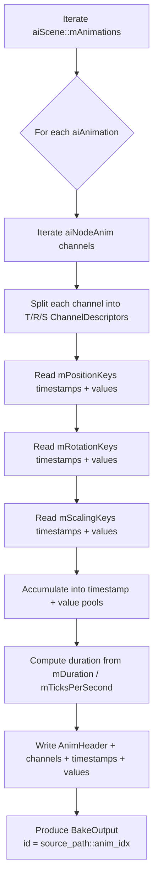

# i3 Baker — Asset Baking Architecture

## 1. Overview

The baker transforms **source assets** (glTF, FBX, OBJ, images, shaders) into **baked assets** (.i3b bundles) optimized for zero-copy GPU loading. It is an offline CLI tool that produces bundles consumed at runtime by the VFS.

### Global Flow



### Design Principles

1. **GPU-ready** — Baked data is in the exact format expected by the renderer (vertex layout, index type, alignment). Zero transformation at runtime.
2. **Zero-copy** — Bundles are designed for `mmap`. Vertex/index data is directly mappable as GPU buffers.
3. **Incremental** — Only modified assets are re-baked (SQLite registry + SHA-256).
4. **Parallel** — Each asset bake is independent, parallelizable via rayon.
5. **Extensible** — Each source format is handled by an `Importer`, each output type by an `Extractor`.

---

## 2. Importer → Extractor Architecture

The baker uses a two-layer architecture that separates **parsing** (importers) from **conversion** (extractors).

### 2.1 Importers — Who Reads What

An importer reads a source file format and produces an intermediate representation. Each source file is parsed **once** by a single importer, then all relevant extractors operate on the parsed result.

| Importer         | Library / Crate | Source Extensions                          | Phase |
|------------------|-----------------|--------------------------------------------|-------|
| `AssimpImporter` | `russimp`       | .gltf, .glb, .fbx, .obj, .dae, .3ds, .blend, ... | 1   |
| `SlangImporter`  | `i3_slang`      | .slang                                     | future |
| `ImageImporter`  | `image` / `basis_universal` | .png, .jpg, .tga, .hdr, .exr    | future |

**Assimp** (via `russimp` Rust bindings) is the geometry importer. It provides a unified `Scene` data model covering meshes, skeletons, animations, lights, cameras, materials, and the scene graph — all from a single parse. This avoids redundant re-parsing of the same source file for each output type.

Assimp is a native C++ library. It is integrated via the existing `third_party/` bootstrap system (same pattern as SDL2): `download.rs` fetches pre-built binaries, `build-support/mod.rs` handles linking and DLL copying.

### 2.2 Extractors — What Comes Out

Extractors operate on the parsed intermediate data (e.g., Assimp `Scene`) and produce typed `BakeOutput` assets. Multiple extractors run on the same parsed data.

| Extractor          | Input               | Output Asset    | Phase |
|--------------------|----------------------|-----------------|-------|
| `MeshExtractor`    | Assimp `Scene`       | `i3mesh`        | 1     |
| `SceneExtractor`   | Assimp `Scene`       | `i3scene`       | 1     |
| `SkeletonExtractor`| Assimp `Scene`       | `i3skeleton`    | 2     |
| `AnimationExtractor`| Assimp `Scene`      | `i3animation`   | 3     |
| `PipelineExtractor`| Slang `ShaderModule` | `i3pipeline`    | future |
| `TextureExtractor` | Image data           | `i3texture`     | future |

### 2.3 Data Flow — Single Source File



### 2.4 Importer Trait

```rust
/// Intermediate data produced by an importer.
/// Each importer defines its own concrete type.
pub trait ImportedData: Send + Sync {}

/// An importer reads a source file format and produces parsed data.
pub trait Importer: Send + Sync {
    /// Importer name (for logging/debug).
    fn name(&self) -> &str;

    /// Supported source extensions (e.g., &["gltf", "glb", "fbx", "obj"]).
    fn source_extensions(&self) -> &[&str];

    /// Parse a source file. Called once per source file.
    fn import(&self, source_path: &Path) -> Result<Box<dyn ImportedData>>;

    /// Run all extractors on the imported data, producing baked assets.
    fn extract(&self, data: &dyn ImportedData, ctx: &BakeContext) -> Result<Vec<BakeOutput>>;
}
```

### 2.5 Assimp Integration via third_party

Assimp follows the same pattern as SDL2 in the bootstrap system:

```
third_party/
├── download.rs          # Add download_assimp() alongside download_sdl2()
├── libs/
│   ├── sdl2/            # Existing
│   └── assimp/          # New: pre-built assimp libraries
│       ├── lib/x64/     # assimp.lib (Windows)
│       ├── bin/x64/     # assimp.dll
│       └── include/     # (not needed, russimp handles FFI)
└── build-support/
    └── mod.rs           # Add setup for assimp linking
```

The `i3_baker` crate's `build.rs` calls `i3_build_support::setup_native_lib("assimp", &["assimp"])` to configure linking.

---

## 3. Asset Type Catalog

| Type ID | Name            | Extension | Description                                    | Phase |
|---------|-----------------|-----------|------------------------------------------------|-------|
| 0x01    | `i3mesh`        | .i3mesh   | GPU-ready mesh (vertex + index + bounds)       | 1     |
| 0x02    | `i3scene`       | .i3scene  | Scene (instances, lights, mesh/skeleton refs)  | 1     |
| 0x03    | `i3skeleton`    | .i3skel   | Joint hierarchy + inverse bind matrices        | 2     |
| 0x04    | `i3animation`   | .i3anim   | Animation clips (keyframes, channels)          | 3     |
| 0x10    | `i3texture`     | .i3tex    | Block-compressed texture (BC7/ASTC)            | future|
| 0x11    | `i3material`    | .i3mat    | PBR material (texture refs + parameters)       | future|
| 0x20    | `i3pipeline`    | .i3pipe   | Complete render pipeline (shader modules + states) | future|

**Note on `i3pipeline`:** The baking unit for shaders is not an isolated shader but a **complete Pipeline in the Vulkan sense** — the full set of render states (rasterization, depth/stencil, blend, vertex input, render targets) plus compiled shader modules in SPIR-V (and later DXIL, Metal, etc.). This maps directly to `GraphicsPipelineCreateInfo` / `ComputePipelineCreateInfo` in `i3_gfx`.

**Multiple input types, same output:**
- **Today:** `.slang` files compiled via `i3_slang` (all entry points in a single module)
- **Future:** A high-level DSL to specify complete pipelines (shader refs + all fixed states), producing the same `i3pipeline` format

---

## 4. Binary Formats

### 4.1 i3mesh — Baked Mesh

A mesh asset contains GPU-ready vertex and index buffers, preceded by a descriptive header.

```
┌─────────────────────────────────────────────┐
│ AssetHeader  (64 bytes, from i3_io)         │  ← Standard i3 header
├─────────────────────────────────────────────┤
│ MeshHeader   (64 bytes)                     │  ← Mesh-specific metadata
├─────────────────────────────────────────────┤
│ Vertex Data  (vertex_count * vertex_stride) │  ← GPU-ready, tightly packed
├─────────────────────────────────────────────┤
│ Index Data   (index_count * index_size)     │  ← u16 or u32
├─────────────────────────────────────────────┤
│ AABB         (24 bytes: min[3] + max[3])    │  ← Bounding box for culling
└─────────────────────────────────────────────┘
```

#### MeshHeader (repr C, 64 bytes)

| Offset | Field             | Type      | Description                                      |
|--------|-------------------|-----------|--------------------------------------------------|
| 0      | `vertex_count`    | `u32`     | Number of vertices                               |
| 4      | `index_count`     | `u32`     | Number of indices                                |
| 8      | `vertex_stride`   | `u32`     | Size of one vertex in bytes                      |
| 12     | `index_format`    | `u32`     | 0 = u16, 1 = u32                                |
| 16     | `vertex_format`   | `u32`     | VertexFormat enum (see below)                    |
| 20     | `vertex_offset`   | `u32`     | Offset of vertex data from payload start         |
| 24     | `index_offset`    | `u32`     | Offset of index data from payload start          |
| 28     | `bounds_offset`   | `u32`     | Offset of bounds from payload start              |
| 32     | `skeleton_id`     | `[u8;16]` | UUID of associated skeleton (zero if static)     |
| 48     | `_reserved`       | `[u8;16]` | Padding to 64 bytes total                        |

The `skeleton_id` field links a skinned mesh to its skeleton. If all bytes are zero, the mesh is static.

#### VertexFormat (enum u32)

Formats are defined incrementally. The stride is derived from the format.

**Phase 1 — Static meshes:**

| Value | Name                    | Attributes                                          | Stride |
|-------|-------------------------|-----------------------------------------------------|--------|
| 0     | `PositionNormalColor`   | pos: Float3 + normal: Float3 + color: Float3        | 36     |

**Phase 2 — Skinning + UVs:**

| Value | Name                          | Attributes                                                           | Stride |
|-------|-------------------------------|----------------------------------------------------------------------|--------|
| 1     | `PositionNormalUv`            | pos: Float3 + normal: Float3 + uv: Float2                           | 32     |
| 2     | `PositionNormalTangentUv`     | pos: Float3 + normal: Float3 + tangent: Float4 + uv: Float2         | 48     |
| 3     | `PositionNormalColorSkinned`  | pos: Float3 + normal: Float3 + color: Float3 + joints: U8x4 + weights: Float4 | 56 |
| 4     | `PositionNormalUvSkinned`     | pos: Float3 + normal: Float3 + uv: Float2 + joints: U8x4 + weights: Float4    | 52 |
| 5     | `PositionNormalTangentUvSkinned` | pos: Float3 + normal: Float3 + tangent: Float4 + uv: Float2 + joints: U8x4 + weights: Float4 | 68 |

**Skinning attribute layout:**
- `joints` (U8x4) — 4 joint indices, packed in 4 bytes. Supports up to 256 joints per skeleton.
- `weights` (Float4) — 4 skinning weights, 16 bytes. The 4th weight could be derived (w4 = 1 - w1 - w2 - w3) but is stored explicitly to avoid runtime computation.

### 4.2 i3skeleton — Skeleton

A skeleton defines the joint (bone) hierarchy and inverse bind matrices required for GPU skinning.

```
┌──────────────────────────────────────────────────┐
│ AssetHeader      (64 bytes)                      │
├──────────────────────────────────────────────────┤
│ SkeletonHeader   (32 bytes)                      │
├──────────────────────────────────────────────────┤
│ Parent indices   (joint_count * 2 bytes)         │  ← i16, -1 = root
├──────────────────────────────────────────────────┤
│ Inverse bind matrices (joint_count * 64 bytes)   │  ← Mat4 column-major
├──────────────────────────────────────────────────┤
│ Rest pose local transforms (joint_count * 40 B)  │  ← TRS compact
├──────────────────────────────────────────────────┤
│ Joint name hashes (joint_count * 8 bytes)        │  ← FNV-1a u64
└──────────────────────────────────────────────────┘
```

#### SkeletonHeader (repr C, 32 bytes)

| Offset | Field                  | Type       | Description                                |
|--------|------------------------|------------|--------------------------------------------|
| 0      | `joint_count`          | `u32`      | Number of joints                           |
| 4      | `parent_offset`        | `u32`      | Offset of parent indices table             |
| 8      | `inv_bind_offset`      | `u32`      | Offset of inverse bind matrices            |
| 12     | `rest_pose_offset`     | `u32`      | Offset of rest poses (TRS)                 |
| 16     | `name_hash_offset`     | `u32`      | Offset of joint name hashes                |
| 20     | `_reserved`            | `[u8; 12]` | Padding to 32 bytes                        |

#### JointTransform — Compact Pose (40 bytes)

| Field         | Type       | Description                  |
|---------------|------------|------------------------------|
| `translation` | `[f32; 3]` | Local position (12 bytes)    |
| `rotation`    | `[f32; 4]` | Quaternion xyzw (16 bytes)   |
| `scale`       | `[f32; 3]` | Local scale (12 bytes)       |

This compact TRS representation (40 bytes) is more efficient than Mat4 (64 bytes) for storage and animation interpolation. It is also the native format used by Assimp's `aiNodeAnim` channels.

### 4.3 i3animation — Animation Clip

An animation clip contains keyframes for animating a skeleton. Each channel targets a specific joint and property (translation, rotation, scale).

```
┌───────────────────────────────────────────────────┐
│ AssetHeader        (64 bytes)                     │
├───────────────────────────────────────────────────┤
│ AnimationHeader    (48 bytes)                     │
├───────────────────────────────────────────────────┤
│ Channel descriptors (channel_count * 16 bytes)    │  ← Which joint, which property
├───────────────────────────────────────────────────┤
│ Timestamp pool     (total_keyframes * 4 bytes)    │  ← f32 seconds
├───────────────────────────────────────────────────┤
│ Value pool         (variable, depends on type)    │  ← Vec3/Quat/Vec3 per keyframe
└───────────────────────────────────────────────────┘
```

#### AnimationHeader (repr C, 48 bytes)

| Offset | Field                 | Type       | Description                                   |
|--------|-----------------------|------------|-----------------------------------------------|
| 0      | `channel_count`       | `u32`      | Number of channels                            |
| 4      | `total_keyframes`     | `u32`      | Total keyframe count (all channels)           |
| 8      | `duration`            | `f32`      | Clip duration in seconds                      |
| 12     | `skeleton_id`         | `[u8; 16]` | UUID of targeted skeleton                     |
| 28     | `channels_offset`     | `u32`      | Offset of channel table                       |
| 32     | `timestamps_offset`   | `u32`      | Offset of timestamp pool                      |
| 36     | `values_offset`       | `u32`      | Offset of value pool                          |
| 40     | `_reserved`           | `[u8; 8]`  | Padding to 48 bytes                           |

#### ChannelDescriptor (16 bytes)

| Offset | Field              | Type  | Description                                        |
|--------|--------------------|-------|----------------------------------------------------|
| 0      | `joint_index`      | `u16` | Index of targeted joint in skeleton                |
| 2      | `property`         | `u8`  | 0=Translation, 1=Rotation, 2=Scale                |
| 3      | `interpolation`    | `u8`  | 0=Step, 1=Linear, 2=CubicSpline                   |
| 4      | `keyframe_offset`  | `u32` | Start index in timestamp pool                      |
| 8      | `keyframe_count`   | `u32` | Number of keyframes for this channel               |
| 12     | `value_offset`     | `u32` | Start index in value pool (in bytes)               |

#### Value Pool — Formats Per Property

| Property    | Type per keyframe | Size    | Notes                                    |
|-------------|-------------------|---------|------------------------------------------|
| Translation | `[f32; 3]`        | 12 B    | Local position                           |
| Rotation    | `[f32; 4]`        | 16 B    | Quaternion (x,y,z,w), normalized         |
| Scale       | `[f32; 3]`        | 12 B    | Local scale                              |

For CubicSpline interpolation, each keyframe stores 3 values (in-tangent, value, out-tangent), so 3x the size above.

#### Assimp → i3animation mapping

| Assimp concept                | i3animation                              |
|-------------------------------|------------------------------------------|
| `aiAnimation`                 | One `i3animation` asset per clip         |
| `aiNodeAnim` (per bone)       | Split into T/R/S `ChannelDescriptor`s    |
| `aiNodeAnim::mPositionKeys`   | Translation channel + timestamp/value pools |
| `aiNodeAnim::mRotationKeys`   | Rotation channel + timestamp/value pools |
| `aiNodeAnim::mScalingKeys`    | Scale channel + timestamp/value pools    |
| `aiAnimation::mDuration / mTicksPerSecond` | `duration` (converted to seconds) |

### 4.4 i3scene — Baked Scene

A scene assembles references to assets (meshes, skeletons, animations) and instances (objects, lights).

```
┌─────────────────────────────────────────────┐
│ AssetHeader   (64 bytes)                    │
├─────────────────────────────────────────────┤
│ SceneHeader   (64 bytes)                    │
├─────────────────────────────────────────────┤
│ MeshRef table (mesh_count * 32 bytes)       │  ← Refs to baked meshes
├─────────────────────────────────────────────┤
│ SkeletonRef table (skel_count * 32 bytes)   │  ← Refs to baked skeletons
├─────────────────────────────────────────────┤
│ AnimRef table (anim_count * 32 bytes)       │  ← Refs to baked animations
├─────────────────────────────────────────────┤
│ Object table  (object_count * 80 bytes)     │  ← Transform + mesh/skel refs
├─────────────────────────────────────────────┤
│ Light table   (light_count * 48 bytes)      │  ← Light parameters
└─────────────────────────────────────────────┘
```

#### SceneHeader (repr C, 64 bytes)

| Offset | Field              | Type       | Description                           |
|--------|--------------------|------------|---------------------------------------|
| 0      | `mesh_count`       | `u32`      | Number of mesh refs                   |
| 4      | `skeleton_count`   | `u32`      | Number of skeleton refs               |
| 8      | `animation_count`  | `u32`      | Number of animation refs              |
| 12     | `object_count`     | `u32`      | Number of object instances            |
| 16     | `light_count`      | `u32`      | Number of lights                      |
| 20     | `mesh_ref_offset`  | `u32`      | Offset of MeshRef table               |
| 24     | `skel_ref_offset`  | `u32`      | Offset of SkeletonRef table           |
| 28     | `anim_ref_offset`  | `u32`      | Offset of AnimRef table               |
| 32     | `object_offset`    | `u32`      | Offset of Object table                |
| 36     | `light_offset`     | `u32`      | Offset of Light table                 |
| 40     | `_reserved`        | `[u8; 24]` | Padding to 64 bytes                   |

#### AssetRef — Reference to a Baked Asset (32 bytes)

Used for MeshRef, SkeletonRef and AnimRef (same structure).

| Offset | Field        | Type       | Description                                    |
|--------|--------------|------------|------------------------------------------------|
| 0      | `asset_id`   | `[u8; 16]` | UUID of the asset in the bundle                |
| 16     | `name_hash`  | `u64`      | FNV-1a of source path for fast lookup          |
| 24     | `_reserved`  | `[u8; 8]`  | Padding                                        |

#### ObjectInstance (80 bytes)

| Offset | Field             | Type       | Description                                |
|--------|-------------------|------------|--------------------------------------------|
| 0      | `world_transform` | `[f32;16]` | 4x4 matrix column-major (64 bytes)        |
| 64     | `mesh_ref_index`  | `u32`      | Index into MeshRef table                   |
| 68     | `material_id`     | `u32`      | Material ID (0 = default in Phase 1)      |
| 72     | `skeleton_ref_index` | `i32`   | Index into SkeletonRef table (-1 = none)  |
| 76     | `_reserved`       | `[u8; 4]`  | Padding                                   |

#### LightInstance (48 bytes)

| Offset | Field       | Type       | Description                                |
|--------|-------------|------------|--------------------------------------------|
| 0      | `position`  | `[f32; 3]` | World position                             |
| 12     | `light_type`| `u32`      | 0=Point, 1=Directional, 2=Spot            |
| 16     | `direction` | `[f32; 3]` | Direction (for Directional/Spot)           |
| 28     | `intensity` | `f32`      | Intensity                                  |
| 32     | `color`     | `[f32; 3]` | RGB color                                  |
| 44     | `radius`    | `f32`      | Influence radius                           |

#### Assimp → i3scene mapping

| Assimp concept      | i3scene                                       |
|---------------------|-----------------------------------------------|
| `aiScene::mMeshes`  | MeshRef table (one per extracted i3mesh)       |
| `aiNode` tree       | Flattened into ObjectInstance table (with world transforms) |
| `aiNode::mTransformation` | `world_transform` (accumulated from root)  |
| `aiNode::mMeshes[]` | `mesh_ref_index` (index into MeshRef table)   |
| `aiLight`           | LightInstance table                           |
| `aiScene::mAnimations` | AnimRef table                              |

### 4.5 i3pipeline — Baked Render Pipeline (Future)

A pipeline asset represents a **complete GPU pipeline** in the Vulkan/DX12 sense: compiled shader modules plus all fixed-function render states. This is the atomic unit for shader baking — not an isolated shader.

**Key design insight:** `i3_slang` already compiles all entry points (vertex, fragment, compute, etc.) into a single `ShaderModule` with unified bytecode. The pipeline wraps this with the full state needed to create a `VkPipeline` or `ID3D12PipelineState`.

```
┌───────────────────────────────────────────────────┐
│ AssetHeader          (64 bytes)                   │
├───────────────────────────────────────────────────┤
│ PipelineHeader       (64 bytes)                   │
├───────────────────────────────────────────────────┤
│ ShaderBytecodeTable  (variant_count * 16 bytes)   │  ← Per-backend offsets
├───────────────────────────────────────────────────┤
│ SPIR-V bytecode      (variable)                   │  ← Vulkan shader module
├───────────────────────────────────────────────────┤
│ DXIL bytecode        (variable, optional)         │  ← DX12 shader module
├───────────────────────────────────────────────────┤
│ Reflection blob      (variable)                   │  ← Bindings, push constants
├───────────────────────────────────────────────────┤
│ Pipeline state blob  (variable)                   │  ← Serialized render states
└───────────────────────────────────────────────────┘
```

#### PipelineHeader (repr C, 64 bytes)

| Offset | Field                  | Type       | Description                                       |
|--------|------------------------|------------|---------------------------------------------------|
| 0      | `pipeline_type`        | `u32`      | 0=Graphics, 1=Compute                             |
| 4      | `variant_count`        | `u32`      | Number of shader bytecode variants (backends)     |
| 8      | `entry_point_count`    | `u32`      | Number of entry points in the module              |
| 12     | `bytecode_table_offset`| `u32`      | Offset of ShaderBytecodeTable                     |
| 16     | `reflection_offset`    | `u32`      | Offset of reflection blob                         |
| 20     | `reflection_size`      | `u32`      | Size of reflection blob                           |
| 24     | `state_offset`         | `u32`      | Offset of pipeline state blob                     |
| 28     | `state_size`           | `u32`      | Size of pipeline state blob                       |
| 32     | `_reserved`            | `[u8; 32]` | Padding to 64 bytes                               |

#### Pipeline State Blob

The pipeline state blob contains a serialized (bincode) version of all fixed-function state. For graphics pipelines, this maps to `GraphicsPipelineCreateInfo` minus the `ShaderModule`:

- `VertexInputState` — bindings and attributes
- `InputAssemblyState` — topology, primitive restart
- `RasterizationState` — cull mode, polygon mode, depth bias
- `MultisampleState` — sample count, alpha-to-coverage
- `DepthStencilState` — depth test, stencil ops, compare ops
- `RenderTargetsInfo` — color target formats, blend states, logic ops

**Input Sources:**
- **Today:** `.slang` files compiled via `i3_slang`
- **Future:** A high-level pipeline DSL specifying shader refs + all fixed states

Both produce the same `i3pipeline` output format.

---

## 5. Baker Core Architecture

### 5.1 Module Diagram



### 5.2 Execution Pipeline



### 5.3 Scanner

The scanner recursively walks a source directory and maps each file to the importer that handles it (via extensions).

```rust
pub struct ScanResult {
    pub source_path: PathBuf,
    pub importer_index: usize, // Index into Vec<Box<dyn Importer>>
}

pub fn scan_directory(
    root: &Path,
    importers: &[Box<dyn Importer>],
) -> Vec<ScanResult>;
```

---

## 6. Assimp Extraction Details

### 6.1 MeshExtractor (Phase 1)

Produces one `i3mesh` per Assimp `aiMesh`.



**Assimp → i3mesh mapping:**

| Assimp field              | i3mesh field                              |
|---------------------------|-------------------------------------------|
| `aiMesh::mVertices`       | Vertex position (Float3)                  |
| `aiMesh::mNormals`        | Vertex normal (Float3)                    |
| `aiMesh::mColors[0]`      | Vertex color (Float3, default white)      |
| `aiMesh::mFaces`          | Index buffer (u16/u32)                    |
| `aiMesh::mBones`          | Skinning joints + weights (Phase 2)       |
| `aiMesh::mNumVertices`    | `vertex_count`                            |
| `aiMesh::mAABB`           | AABB bounds (or computed from vertices)   |

### 6.2 SceneExtractor (Phase 1)

Produces one `i3scene` from the Assimp `aiScene`.



### 6.3 SkeletonExtractor (Phase 2)



### 6.4 AnimationExtractor (Phase 3)



---

## 7. GPU Skinning — Runtime Architecture (Phase 2)

For future reference, here is how skinning integrates with the renderer.

### 7.1 Skinning Pipeline


### 7.2 Compute Skinning Matrices

```
// Pseudocode for skinning matrix computation
for each joint j in skeleton:
    local_transform[j] = interpolate(animation, j, time)  // TRS → Mat4
    
for each joint j in topological order:
    if parent[j] == -1:
        global_transform[j] = local_transform[j]
    else:
        global_transform[j] = global_transform[parent[j]] * local_transform[j]
    
    skinning_matrix[j] = global_transform[j] * inverse_bind_matrix[j]
```

### 7.3 Vertex Shader Skinning

```hlsl
// Skinning in vertex shader (Phase 2)
float4x4 skin_matrix = 
    weights.x * joint_matrices[joints.x] +
    weights.y * joint_matrices[joints.y] +
    weights.z * joint_matrices[joints.z] +
    weights.w * joint_matrices[joints.w];

float4 skinnedPos = mul(skin_matrix, float4(position, 1.0));
float3 skinnedNormal = normalize(mul((float3x3)skin_matrix, normal));
```

---

## 8. Runtime — Loading Baked Assets

### 8.1 Types in i3_io

| File                           | Types                                   | Phase |
|--------------------------------|-----------------------------------------|-------|
| `crates/i3_io/src/mesh.rs`    | MeshHeader, VertexFormat, MeshAsset     | 1     |
| `crates/i3_io/src/scene_asset.rs` | SceneHeader, ObjectInstance, LightInstance, SceneAsset | 1 |
| `crates/i3_io/src/skeleton.rs` | SkeletonHeader, JointTransform, SkeletonAsset | 2 |
| `crates/i3_io/src/animation.rs`| AnimationHeader, ChannelDescriptor, AnimationAsset | 3 |

### 8.2 Integration with BasicScene

```rust
impl BasicScene {
    /// Load a mesh from a baked asset (Phase 1).
    pub fn add_baked_mesh(
        &mut self,
        backend: &mut dyn RenderBackend,
        mesh: &MeshAsset,
    ) -> u32 {
        // Upload vertex/index buffers directly from baked bytes
    }

    /// Load a complete scene from a baked asset (Phase 1).
    pub fn load_baked_scene(
        &mut self,
        backend: &mut dyn RenderBackend,
        scene: &SceneAsset,
        meshes: &[MeshAsset],
    ) {
        // 1. Upload all meshes
        // 2. Create ObjectData from ObjectInstances
        // 3. Create LightData from LightInstances
    }
}
```

---

## 9. Implementation Plan by Phase

### Phase 1 — Static Mesh + Scene (Immediate Scope)

| Step | Files                                          | Description                                |
|------|------------------------------------------------|--------------------------------------------|
| 1.0  | `third_party/download.rs`                     | Add `download_assimp()` to bootstrap       |
| 1.1  | `i3_io/src/mesh.rs`                           | MeshHeader, VertexFormat, MeshAsset (Asset impl) |
| 1.2  | `i3_io/src/scene_asset.rs`                    | SceneHeader, ObjectInstance, LightInstance, SceneAsset |
| 1.3  | `i3_io/src/lib.rs`, `prelude.rs`              | Register new modules                       |
| 1.4  | `i3_baker/Cargo.toml` + `build.rs`            | Add russimp dep, assimp linking via build-support |
| 1.5  | `i3_baker/src/pipeline.rs`                    | Importer trait, BakeContext, BakeOutput    |
| 1.6  | `i3_baker/src/scanner.rs`                     | Recursive scan + importer association      |
| 1.7  | `i3_baker/src/importers/assimp_importer.rs`   | AssimpImporter + MeshExtractor + SceneExtractor |
| 1.8  | `i3_baker/src/main.rs`                        | Functional CLI scan→import→extract→write   |
| 1.9  | `i3_baker/src/writer.rs`                      | Adapt to BakeOutput                        |
| 1.10 | `examples/common/basic_scene.rs`              | add_baked_mesh, load_baked_scene           |
| 1.11 | `i3_baker/tests/integration_test.rs`          | End-to-end test                            |

### Phase 2 — Skinning

| Step | Files                                              | Description                              |
|------|----------------------------------------------------|------------------------------------------|
| 2.1  | `i3_io/src/skeleton.rs`                           | SkeletonHeader, SkeletonAsset            |
| 2.2  | `i3_baker/src/importers/assimp_importer.rs`       | Add SkeletonExtractor                    |
| 2.3  | `i3_baker/src/importers/assimp_importer.rs`       | Add skinned vertex support in MeshExtractor |
| 2.4  | `i3_renderer/shaders/gbuffer.slang`               | Skinning vertex shader variant           |
| 2.5  | `i3_renderer/src/passes/gbuffer.rs`               | Pipeline variant for skinned meshes      |
| 2.6  | Compute pass or CPU                                | Skinning matrix computation              |

### Phase 3 — Animations

| Step | Files                                              | Description                            |
|------|----------------------------------------------------|-----------------------------------------|
| 3.1  | `i3_io/src/animation.rs`                          | AnimationHeader, AnimationAsset         |
| 3.2  | `i3_baker/src/importers/assimp_importer.rs`       | Add AnimationExtractor                  |
| 3.3  | Animation runtime module                            | Sampler, interpolation, blending        |
| 3.4  | SceneProvider integration                           | Per-object animation state              |

### Phase Future — Render Pipelines

| Step | Files                                              | Description                            |
|------|----------------------------------------------------|-----------------------------------------|
| F.1  | `i3_io/src/pipeline_asset.rs`                     | PipelineHeader, PipelineAsset           |
| F.2  | `i3_baker/src/importers/slang_importer.rs`        | SlangImporter (SlangPipelineExtractor)  |
| F.3  | Pipeline DSL definition                             | High-level DSL for pipeline specs       |
| F.4  | `i3_baker/src/importers/dsl_importer.rs`          | DSL → i3pipeline                        |
| F.5  | Runtime pipeline cache                              | Load baked pipelines, create VkPipeline |

### Phase Future — Other Extensions
- Textures (block-compressed BC7 via `basis_universal` or `intel-tex`)
- PBR materials (roughness, metallic, normal maps)
- UV coordinates + tangent space
- Meshlets for mesh shaders
- Automatic LOD (meshoptimizer)
- Zstd/GDeflate compression in bundles
- Hot-reload (watch mode)

---

## 10. Files to Create/Modify — Phase 1

### New Files

| File                                                | Role                                        |
|-----------------------------------------------------|---------------------------------------------|
| `crates/i3_io/src/mesh.rs`                         | MeshHeader, MeshAsset, VertexFormat enum    |
| `crates/i3_io/src/scene_asset.rs`                  | SceneHeader, SceneAsset, ObjectInstance, etc.|
| `crates/i3_baker/src/scanner.rs`                   | Recursive source directory scan             |
| `crates/i3_baker/src/importers/mod.rs`             | Importers module                            |
| `crates/i3_baker/src/importers/assimp_importer.rs` | AssimpImporter + MeshExtractor + SceneExtractor |
| `crates/i3_baker/build.rs`                         | Assimp native lib linking                   |

### Modified Files

| File                                         | Modification                             |
|----------------------------------------------|------------------------------------------|
| `third_party/download.rs`                   | Add `download_assimp()`                  |
| `crates/i3_io/src/lib.rs`                   | Add mesh + scene_asset modules           |
| `crates/i3_io/src/prelude.rs`               | Export MeshAsset, SceneAsset             |
| `crates/i3_baker/src/lib.rs`                | Add scanner + importers modules          |
| `crates/i3_baker/src/pipeline.rs`           | Importer trait + BakeContext/BakeOutput  |
| `crates/i3_baker/src/main.rs`               | Full CLI scan→import→extract→write       |
| `crates/i3_baker/src/writer.rs`             | Adapt to new BakeOutput API              |
| `crates/i3_baker/src/registry.rs`           | Support inter-asset dependencies         |
| `crates/i3_baker/Cargo.toml`               | Add russimp dependency                   |
| `Cargo.toml`                                | Add russimp to workspace dependencies    |
| `examples/common/src/basic_scene.rs`        | Add add_baked_mesh, load_baked_scene     |
| `crates/i3_baker/tests/integration_test.rs` | Full source → bundle → load test         |
