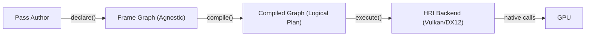

# i3fx Frame Graph — Architecture Design

## Problem Statement

Explicit GPU APIs (Vulkan, DX12) require manual synchronization barriers between resource state transitions. This creates **implicit coupling** between render passes that should be independent. The Frame Graph solves this by making **the engine** responsible for synchronization, while the **pass author** focuses purely on rendering logic.

**3rd attempt.** Previous failures: deferred recording had awkward parallelization; secondary command buffers were too slow.

## State of the Art & Key References

| Reference | Year | Key Contribution |
|---|---|---|
| Frostbite FrameGraph (Wihlidal, GDC) | 2017 | Established Declare/Compile/Execute pattern, transient resources, memory aliasing |
| Granite Render Graph (themaister) | 2017 | Deep Vulkan implementation, CONCURRENT queue sharing, practical aliasing |
| `VK_KHR_dynamic_rendering` | 2021 | Eliminates VkRenderPass/VkFramebuffer objects. Implementation convenience, not structural. |
| Cyclic Render Graphs (Dolp, Vulkanised) | 2025 | Graph partitioning for cyclic dependencies (temporal reprojection, iterative denoising) |

**Our design builds on Frostbite's core pattern.** `VK_KHR_dynamic_rendering` simplifies the backend implementation but is not architecturally structuring — the graph compiler could generate `VkRenderPass` objects at compile time regardless.

---

## Platform Scope & API Baseline

**Target:** High-end open source engine. The niche Godot doesn't cover.

| | Decision | Rationale |
|---|---|---|
| **Platforms** | Windows, Linux (console later) | Desktop high-end focus |
| **No mobile** | Deliberate | Avoids leveling down abstractions (wgpu trap) |
| **No macOS** | Deliberate | Metal is a dead-end for high-end; MoltenVK is a wrapper. Community PRs welcome, not a project goal. |
| **Primary API** | **Vulkan 1.3** | Open standard, covers desktop GPU since ~2018 |
| **Validation API** | **DX12** | Validates RHI decoupling, covers Windows without Vulkan |
| **No OpenGL** | Deliberate | Would pull every design decision downward. GL lacks explicit barriers, flexible compute, universal bindless. Time better spent on renderer. |

### Vulkan 1.3 Baseline — Key Features We Rely On

- `VK_KHR_dynamic_rendering` — no VkRenderPass/VkFramebuffer management
- `VK_KHR_synchronization2` — modern barrier API (`VkDependencyInfo`, split pipeline stages)
- Timeline semaphores — cross-queue synchronization
- Buffer device address — bindless buffer access
- Descriptor indexing — bindless textures/samplers

### Optional High-End Features (capability-gated)

- **Ray Tracing** (`VK_KHR_ray_tracing_pipeline`, `VK_KHR_acceleration_structure`)
- **Mesh Shaders** (`VK_EXT_mesh_shader`)
- **Hardware RT + Mesh Shaders** combo for GPU-driven rendering

## Design Principles

1. **Pass authors never touch barriers.** They declare what they use, the engine does the rest.
2. **Parallel by default.** Independent passes record in parallel on separate threads.
3. **Single recording pass.** No deferred → resolve → re-record. Declare lightweight, compile fast, record once.
4. **Multi-queue transparent.** Async compute/transfer supported natively; falls back silently on single-queue GPUs.
5. **Memory aliasing from day one.** Transient resources share memory when lifetimes don't overlap.

---

## The Pass Invariant

> **A Pass is an uninterruptible sequence of GPU commands that operates on a set of resources whose states are fixed at the pass boundaries.**

This is the foundational contract of the system. Formally:

1. **Single sync point at entry.** All resource states required by the pass are resolved **before** the pass begins. No barriers are emitted during pass execution.
2. **No mid-pass state transitions.** If a pass needs a resource in two different states (e.g., compute-write then shader-read), that's **two passes**, not one.
3. **Atomic from the graph's perspective.** The compiler treats each pass as an indivisible node. It reasons about inter-pass dependencies, never intra-pass.
4. **Resource usage is declared, not discovered.** The `declare()` call is the **complete** and **exhaustive** contract. The `execute()` call must not use any resource not declared.

### What this enables
- **Barrier resolution is purely a graph-level problem.** The compiler only needs to reason about transitions *between* nodes, never within them.
- **Parallelism is clean.** Any two passes without a data dependency can execute concurrently — no risk of hidden internal sync requirements.
- **Error detection.** A pass that violates this invariant (e.g., undeclared resource access) can be caught by validation layers or debug tooling.

### Examples

| Scenario | Valid? | Why |
|---|---|---|
| Pass reads texture A as SRV, draws to RT B | ✅ | Both resources in fixed state for the entire pass |
| Pass dispatches compute to generate texture A, then reads A as SRV | ❌ | A transitions mid-pass. Split into 2 passes. |
| Pass reads buffer A (vertex) and buffer B (index) | ✅ | Both in fixed state |
| Pass does N independent dispatches on UAV A (GENERAL) | ✅ | All dispatches share the same resource state, no ordering between them |
| Pass dispatch 1 writes UAV A, dispatch 2 reads the result | ❌ | Data dependency between dispatches requires a barrier → split into 2 passes |

---

## Architecture Overview

```
┌──────────────────────────────────────────────────────┐
│                   Frame N                            │
│                                                      │
│  1. DECLARE  ──►  2. COMPILE  ──►  3. EXECUTE        │
│  (sequential)     (sequential)     (parallel)        │
│                                                      │
│  Passes declare   Graph resolves   Passes record     │
│  reads/writes     barriers,        into primary CBs  │
│  (no GPU work)    aliasing,        (one per pass)    │
│                   queue assign                       │
└──────────────────────────────────────────────────────┘
```

---

## Phase 1: Declare

Each pass implements a trait and declares its resource dependencies. **Zero GPU work.**

```rust
pub enum ResourceUsage {
    ColorAttachment,
    DepthAttachment,
    ShaderReadOnly,      // SRV
    StorageReadWrite,    // UAV
    TransferSrc,
    TransferDst,
    CpuRead,             // Readback / mapped access
    CpuWrite,            // Upload / mapped access
    /// Final state for swapchain images.
    Present,
}

/// Defines what a pass IS and where it runs.
/// Derived from the Pass Invariant: no barriers inside → one domain per pass.
/// Replaces the separate "PassType" and "QueueAffinity" concepts.
pub enum PassDomain {
    /// CPU-only work. No command buffer. Runs on thread pool.
    /// Use cases: culling, readback processing, asset baking.
    Cpu,
    /// Graphics queue: raster, mesh shaders, ray tracing, blits.
    /// Pipeline type (raster vs RT vs mesh) is a bind-level concern, not a domain concern.
    Graphics,
    /// Compute queue. Falls back to Graphics if no async compute HW.
    Compute,
    /// Transfer queue. Falls back to Graphics if no dedicated transfer HW.
    Transfer,
}

pub trait Pass {
    fn name(&self) -> &str;
    fn domain(&self) -> PassDomain;

    /// Declare resource dependencies. No GPU/CPU work here.
    fn declare(&mut self, builder: &mut PassBuilder);

    /// Execute the pass. Context adapts based on domain.
    fn execute(&self, ctx: &mut PassContext);
}
```

**PassBuilder API** (what the pass author sees):

```rust
impl PassBuilder {
    /// Declare a read on an existing resource.
    fn read(&mut self, res: ResourceId, usage: ResourceUsage);

    /// Declare a write on an existing resource.
    fn write(&mut self, res: ResourceId, usage: ResourceUsage);

    /// Create a frame-transient resource (candidate for aliasing).
    fn create_transient(&mut self, desc: &ResourceDesc) -> ResourceId;

    /// Current render target dimensions (framebuffer size).
    /// Use in declare() to compute derived sizes (e.g., quarter-res bloom).
    fn render_size(&self) -> (u32, u32);

    /// Hint: this pass is small and should be merged into a shared command buffer
    /// with adjacent inline passes. Trades parallel recording for reduced CB overhead.
    /// Default: false (standalone CB, eligible for parallel recording).
    /// Ignored for Cpu domain.
    fn set_inline(&mut self, inline: bool);

    /// Access a specific version of a resource from the past.
    /// offset: -1 for previous frame, -2 for two frames ago, etc.
    /// Panics if offset < -history_depth.
    fn read_history(&mut self, res: ResourceId, offset: i32, usage: ResourceUsage) -> ResourceId;
}
```

**PassContext** (adapts based on domain):

```rust
pub enum PassContext<'a> {
    Gpu {
        cmd: &'a mut CommandRecorder,
        resources: &'a ResourceRegistry,
    },
    Cpu {
        resources: &'a ResourceRegistry,
    },
}
```

> [!IMPORTANT]
> **Open question:** Should `read`/`write` return a scoped handle that the pass uses in `execute()`, or is `ResourceId` sufficient everywhere? Scoped handles add safety but add complexity.

---

## Phase 2: Compile

Sequential, pure data computation. No GPU API calls. **Must be fast** (target: <100μs for ~100 passes).

### Steps:
1. **Dependency graph** — build DAG from read/write declarations.
2. **Topological sort** — determine execution order.
3. **Dead pass elimination** — passes whose outputs are never consumed are culled.
4. **Barrier resolution** — for each resource, compute `(usage_before, usage_after)` at each transition point. Emit `BarrierBatch` between passes.
5. **Memory aliasing** — compute lifetime intervals for transient resources. Assign overlapping memory blocks.
6. **Queue assignment** — assign passes to queues based on affinity + GPU capabilities. Insert cross-queue sync points (timeline semaphores).
7. **Parallelism groups** — identify passes with no mutual dependencies that can record concurrently.

### Output: `CompiledGraph`

```rust
pub struct CompiledGraph {
    /// Ordered list of execution steps.
    steps: Vec<ExecutionStep>,
    /// Memory aliasing plan for transient resources.
    aliasing_plan: AliasingPlan,
    /// Cross-queue synchronization points.
    sync_points: Vec<SyncPoint>,
}

pub enum ExecutionStep {
    /// Insert barriers (system-generated, no user code).
    Barriers(BarrierBatch),
    /// Execute a single pass.
    ExecutePass { pass_index: usize, queue: QueueType },
    /// Execute multiple independent passes in parallel.
    ExecuteParallel { pass_indices: Vec<usize>, queue: QueueType },
    /// Cross-queue sync point.
    Signal(SyncPoint),
    Wait(SyncPoint),
}
```

> [!IMPORTANT]
> **Open question:** Barrier batching strategy. Option A: one barrier batch per pass transition. Option B: merge adjacent barriers into larger batches. B is more GPU-efficient but more complex to implement.

---

## Phase 3: Execute

Walk the `CompiledGraph`. Each pass records into its own **primary command buffer**.

```
For each ExecutionStep:
  Barriers(batch)       → System emits vkCmdPipelineBarrier in current CB
  ExecutePass(i)        → pass[i].execute(ctx) records into a dedicated CB
  ExecuteParallel(list) → rayon: each pass records into its own CB
  Signal/Wait           → Timeline semaphore operations at submit
```

### Threading Model (Fork-Join / Work-Stealing)

- **Implementation**: `rayon` — fork-join with work-stealing.
- **Thread count**: automatic. N cores = N worker threads. No hardcoded limits.
- **Scaling**: linear with core count. 8 cores → 8 threads, 64 cores → 64 threads.
- **Nested parallelism**: supported. A pass group can fork internally via `rayon::scope`.
- **Workload balancing**: work-stealing handles imbalanced passes (tiny blit vs heavy GBuffer) naturally.

**Execution flow:**
1. Compile phase produces **parallelism groups** (sets of independent passes).
2. Execute phase maps each group to a `rayon::scope` → passes in the group execute in parallel.
3. Sequential dependencies between groups are barriers / sync points.
4. **CPU passes**: same pool, same work-stealing. No separate thread pool.

**Command pool allocation**: one `VkCommandPool` per thread per frame (thread-local). Each standalone pass grabs a CB from its thread's pool. No contention.

### Command Buffer Strategy

- **Standalone passes**: one primary CB per pass (eligible for inter-pass parallel recording).
- **Inline passes**: consecutive inline passes on the same queue are merged into a single primary CB.
- At submit: all CBs are submitted in topological order via `vkQueueSubmit` (batched).

**Inline pass merging**: the compiler fuses consecutive inline passes (same queue, sequential in DAG) into a single CB. Barriers between them are emitted as `vkCmdPipelineBarrier` within the CB. A standalone pass breaks an inline chain.

### Auto Begin/End Rendering

For `Graphics` domain passes, the system **automatically** handles rendering scopes based on declared intents. 

| Intents | Auto `vkCmdBeginRendering`? | Use Case |
|---|---|---|
| `ColorAttachment` / `DepthAttachment` | ✅ Yes | Rasterization, Mesh Shaders |
| `StorageReadWrite` (UAV) only | ❌ No | Ray Tracing, Compute-in-Graphics |
| None (Read-only) | ❌ No | Blits (sometimes), Debug |

**The pass author never calls begin/end rendering.** For Raster/Mesh passes, they just record draw calls. For RT, they just record `vkCmdTraceRaysKHR`.

### Intra-Pass Parallel Recording (Secondary Command Buffers)

For heavy passes (e.g., 12k objects in GBuffer), the pass can request **parallel recording via secondary CBs**. The primary CB handles begin/end rendering; secondaries record draw calls in parallel.

```rust
fn execute(&self, ctx: &mut PassContext) {
    // System has already called vkCmdBeginRendering on the primary CB.
    // Request parallel recording via secondaries:
    ctx.parallel_record(&self.objects, 1000, |sub_ctx, chunk| {
        for obj in chunk {
            sub_ctx.draw(obj);
        }
    });
    // → N secondary CBs recorded in parallel (rayon, thread-local pools)
    // → Primary CB calls vkCmdExecuteCommands(secondaries)
    // → System calls vkCmdEndRendering
}
```

**Key points:**
- Secondaries inherit rendering state via `VkCommandBufferInheritanceRenderingInfo` (Vulkan 1.3 — no VkRenderPass compatibility needed).
- Thread-local command pools: one `VkCommandPool` per thread per frame, zero contention.
- Chunking granularity is controlled by the pass author (e.g., 1000 objects/secondary).
- If the pass doesn't call `parallel_record()`, it records directly into the primary CB (no secondary overhead).

The pass **never** creates/destroys resources or inserts barriers. It only records draw/dispatch/copy commands through the `PassContext`.

---

## Pipeline State & Shaders

We adopt **Vulkan terminology** (`GraphicsPipeline`, `ComputePipeline`, `RayTracingPipeline`) to avoid leveling down to lower-denominator APIs.

- **Shader Language**: **Slang** is the primary target, providing high-level features while emitting performant SPIR-V/DXIL.
- **PSO Ownership**: The `Pass` provides a `PipelineDescription`. The **backend** is responsible for caching and deduplication (leveraging `VkPipelineCache`). 
- **Creation**: Pipeline compilation happens during or before graph execution, potentially as a `Cpu` pass in the asset pipeline or during a "warm-up" phase.

---

## Resource Model

Resources are **unified** under a single `ResourceId`. Both GPU and CPU data participate in the same dependency graph.

```rust
/// Opaque ID, valid for the current frame only. Covers GPU and CPU resources.
pub struct ResourceId(u32);

pub enum ResourceDesc {
    Texture { width: u32, height: u32, format: Format, history_depth: u32, /* ... */ },
    Buffer { size: u64, history_depth: u32, /* ... */ },
    /// CPU-side data. Struct-level granularity.
    CpuData { size: usize, history_depth: u32 },
}

pub enum ResourceLifetime {
    /// Exists only within this frame (history_depth = 0). 
    /// Candidate for memory aliasing.
    Transient,
    /// Persists across frames (history_depth > 0). 
    /// Owned by the graph.
    Persistent,
    /// Owned by an external manager (ContentStore, Swapchain). 
    /// Borrowed by the graph for synchronization.
    Imported,
}
```

### Temporal Resources (History)

To support temporal algorithms (TAA, Reprojection, GI feedback), resources can declare a **history depth**. 

- **Versioning**: The engine maintains a ring buffer of `depth + 1` versions.
- **Reference**: Passes access versions relative to the current frame.

```rust
fn declare(&mut self, builder: &mut PassBuilder) {
    // Read previous frame's result
    let prev_color = builder.read_history(self.color_id, -1, ShaderReadOnly);
    // Write current frame's result
    let curr_color = builder.write(self.color_id, ColorAttachment);
}
```

**Initialization & First Frame:**
- On the very first frame (or after a reset), history versions are effectively "empty" or "black".
- The engine can provide a `is_first_frame()` hint so the pass can skip history sampling or use a different path.

**Automatic Versioning (Double/Triple Buffering):**
Even if `history_depth` is 0, resources are internally versioned by the engine to support **Frame Overlap** (N frames in flight). This is transparent: the pass always gets the "correct" version for its frame index. Explicit `history_depth` is only for when the *content* of the resource must be preserved across frames.

### Resolution Change

The graph propagates the current render size. Passes query it via `builder.render_size()` during `declare()` and compute dimensions in plain Rust.

```rust
fn declare(&mut self, builder: &mut PassBuilder) {
    let (w, h) = builder.render_size();
    self.rt = builder.create_transient(&ResourceDesc::Texture {
        width: w, height: h, format: RGBA8_UNORM,
    });
}
```

**On resize**: 
1. The system detects a resolution change.
2. The graph is rebuilt: all passes have their `declare()` method called.
3. `builder.render_size()` returns new values; passes declare new resource sizes.
4. For persistent resources (history), the builder detects the descriptor change and reallocates accordingly.

`declare()` is the **unique source of truth** for all graph-managed resources. Passes do not need a separate resize hook.

### Imported Resources (Static Assets)

Static assets (textures, meshes) are managed by a `ContentStore` or `AssetManager` outside the Frame Graph. 

- **Ownership**: The Frame Graph **never** owns or destroys imported resources.
- **Importing**: Done at the start of the frame via `graph.import_texture(native_handle)`.
- **Synchronization**: The graph tracks their state *across* frames.
- **Swapchain Integration**: The backbuffer is a special case of imported resource. It is imported via `graph.import_backbuffer(swap_handle)`. 

**The Flow:**
1. **Acquire**: Call `vkAcquireNextImageKHR` externally. The resulting semaphore is passed to the HRI backend, NOT the graph API.
2. **Import**: `graph.import_backbuffer(swap_handle)`. The HRI backend internally associates the acquire semaphore with this resource.
3. **Wait**: The first pass using the backbuffer triggers the HRI to inject a semaphore wait in the command stream. This is transparent to the graph and the pass author.
4. **Use**: Passes render directly into the backbuffer.
5. **Final State**: The last pass (or a explicit pseudo-pass) declares `write(backbuffer, Present)`. This intent is only valid for backbuffers.
6. **Present**: Call `vkQueuePresentKHR` externally after graph execution.

```rust
// 1. External Acquire
let (swap_handle, ready_sem) = hri.acquire_next_image();

// 2. Import Backbuffer (HRI handles ready_sem internally)
let backbuffer = graph.import_backbuffer(swap_handle, "backbuffer");

// 3. Render directly into it
graph.add_pass(UI_Pass {
    // declare(): write(backbuffer, ColorAttachment)
});

// 4. Final transition to Present
graph.add_pass(Present_Pass {
    // declare(): write(backbuffer, Present)
});
```

### CPU Data Resources (Declared Blackboard)

Traditional blackboards are an anti-pattern: shared mutable state with no contract. Our approach makes CPU data **declarative** — same `read()`/`write()` contract as GPU resources.

```rust
// Import external CPU data (e.g., camera from game loop)
let camera = graph.import_cpu::<CameraData>(&scene.camera);

// CPU pass creates a constant buffer from camera data
graph.add_pass(PrepareConstantsPass {
    // declare(): read(camera, CpuRead), write(constants, CpuWrite)
    // execute(): reads camera data → fills constant buffer struct
});

// Graphics pass consumes the constant buffer
graph.add_pass(GBufferPass {
    // declare(): read(constants, UniformBuffer), ...
    // execute(): uploads buffer, draws
});
```

**What the compiler sees:** `Camera (ext) → PrepareConstants (Cpu) → GBuffer (Graphics)`

**What this enables:**
- CPU passes that don't touch the same data run in **parallel** (thread pool)
- CPU → GPU ordering is automatic (the CPU pass finishes before the GPU pass records)
- Ownership follows Rust semantics: the creating pass owns the data, readers borrow

---

## Pass Groups (Subgraph Composition)

A `PassGroup` is a composable container of child passes. From outside the graph, it's a single node with declared inputs/outputs. Inside, it's an ordered sub-graph.

**Use case:** A renderer module (e.g., GBuffer) defines its structure, and other systems (voxels, decals) inject their passes into it.

```rust
// Renderer defines the GBuffer group
let gbuffer = graph.add_group("gbuffer", |group| {
    let albedo = group.create_transient(&albedo_desc);
    let normal = group.create_transient(&normal_desc);
    let depth  = group.create_transient(&depth_desc);

    group.add_pass(ClearPass::new(albedo, normal, depth));
    group.add_pass(OpaquePass::new(albedo, normal, depth));
});

// Voxel system extends the group (without knowing about OpaquePass)
graph.extend_group("gbuffer", |group| {
    group.add_pass(VoxelPass::new(
        group.resource("albedo"),
        group.resource("depth"),
    ));
});
```

**Rules:**
- Resources created by the group are **scoped** — visible to children and to `extend_group`, not leaked to the global graph.
- The group **exports** only what it explicitly declares as outputs.
- The compiler flattens groups into individual passes for execution, preserving internal ordering.
- Groups can be nested (a group can contain sub-groups).

---

## Multi-Queue Model

```
┌─────────────────────────────────────────────────┐
│  Graphics Queue    ┃  Compute Queue  ┃ Transfer │
│  ━━━━━━━━━━━━━━━━━━╋━━━━━━━━━━━━━━━━━╋━━━━━━━━━ │
│  GBuffer pass      ┃  SSAO compute   ┃          │
│  Lighting pass     ┃  Particle sim   ┃          │
│  PostFX pass       ┃                 ┃          │
│       ▲            ┃      │          ┃          │
│       └── wait ────╋──────┘          ┃          │
│   (timeline sem)   ┃                 ┃          │
└─────────────────────────────────────────────────┘
```

- Pass declares `QueueAffinity` as a **hint**, not a hard constraint.
- Compiler assigns queues based on actual GPU capabilities (`vkGetPhysicalDeviceQueueFamilyProperties`).
- **Fallback**: if no async compute queue, compute-affinity passes run on graphics queue. Zero code change in the pass.
- Cross-queue sync via **timeline semaphores** (Vulkan 1.2).
- **Queue sharing** (hybrid strategy):
  - **Buffers** cross-queue → `VK_SHARING_MODE_CONCURRENT` (no hardware compression to lose, zero overhead in practice).
  - **Images** cross-queue → `VK_SHARING_MODE_EXCLUSIVE` (preserves DCC/Delta Color Compression on AMD; ownership transfers handled by the graph compiler, invisible to pass authors).
  - **Images** single-queue → `VK_SHARING_MODE_EXCLUSIVE` (default, no question).

---

## Memory Aliasing

Transient resources with non-overlapping lifetimes within a frame share the same logical offsets in a `MemoryPool`.

```
Pass A creates T1 (64MB)    ████░░░░░░░░░░░░
Pass B creates T2 (64MB)    ░░░░░░████░░░░░░
                             ↑ T1 and T2 share the same 64MB block
```

### Interaction with Asynchronous Submission

To support **Zero Stall** parallel execution (CPU recording Frame N+1 while GPU executes Frame N):

1.  **Multi-Framing**: The system maintains a ring buffer of `MemoryPool` objects (typically 2 or 3, matching the frame-in-flight count).
2.  **Safety**: A `MemoryPool` used in Frame N is **locked** by its `PendingSubmission`. 
3.  **Reuse**: The pool is only "reset" and made available for aliasing in a new frame once `collect_garbage()` detects that the GPU has finished using it.

This means aliasing is a **two-tier optimization**:
- **Tier 1 (Intra-frame)**: Bin-packing resources within a single pool based on the DAG.
- **Tier 2 (Inter-frame)**: Rotating/Ring-buffering pools to allow overlap without data corruption.

---

## Error Handling

Reliability is paramount. Conflict detection happens during the **Compile** phase.

- **Conflicting Declarations**: If two passes write to the same resource without an ordering dependency (DAG cycle or independent branches), a `ResourceConflictError` is raised.
- **Invalid Transitions**: Attempting to transition a resource to an incompatible state (e.g., Depth → Color) triggers an error.
- **Undeclared Access**: Debug builds of the `RenderContext` check that every resource used in `execute()` was properly declared.
- **Type Safety**: `compile()` returns `Result<CompiledGraph, GraphError>`, allowing the engine to gracefully handle or report failures without crashing.

---

## Debugging & Profiling

The Frame Graph provides observability by default.

- **GPU Timestamps**: The system can inject `vkCmdWriteTimestamp` queries before/after every pass. This provides per-pass GPU timing without manual instrumentation.
- **RenderDoc Integration**: Pass names are propagated to `vkCmdBeginDebugUtilsLabel`. Resources are named in Vulkan based on their Graph name.
- **Visualizer**: The `CompiledGraph` can be exported as a `.dot` file for visualization in Graphviz.
- **Validation Layers**: The graph's explicit synchronization logic should eliminate validation errors. If they occur, they are likely bugs in the graph compiler itself.

---

---

## Runtime / Backend Decoupling (HRI boundary)

To ensure the Frame Graph remains **API agnostic**, we enforce a strict separation between the logical graph (Runtime) and the hardware-specific implementation (HRI - Hardware Rendering Interface).



### The Boundary: Hardware Rendering Interface (HRI)

The Frame Graph doesn't know what a `VkImage` or `ID3D12Resource` is. It operates on **Logical Handles**.

1.  **Logical Commands**: The graph produces a stream of commands (`Draw`, `Dispatch`, `SetPipeline`) using `ResourceId`.
2.  **The Registry**: A backend-specific component that maps `ResourceId` to actual hardware resources (`VkImage`, `VkBuffer`).
3.  **Barrier Translation**: The Runtime says "Transition Resource 42 to ColorAttachment". The Vulkan HRI translates this into a `VkImageMemoryBarrier2`.

---

## API Specification

### 1. The Pass Trait
This is the only thing the user implements.

```rust
pub trait RenderPass {
    fn name(&self) -> &str;
    fn domain(&self) -> PassDomain; // Graphics, Compute, Transfer

    /// Declare intents. No hardware access allowed.
    /// This is called whenever the graph needs rebuilding (including resizes).
    fn declare(&mut self, builder: &mut PassBuilder);

    /// Record commands. Logical access via ctx.
    fn execute(&self, ctx: &mut PassContext);
}
```

### 2. PassBuilder (Declaration Phase)
Sequential, logical only.

```rust
pub trait PassBuilder {
    // Resource Management
    fn create_transient(&mut self, desc: ResourceDesc) -> ResourceId;
    fn read(&mut self, res: ResourceId, usage: ResourceUsage);
    fn write(&mut self, res: ResourceId, usage: ResourceUsage);
    fn read_history(&mut self, res: ResourceId, offset: i32, usage: ResourceUsage) -> ResourceId;

    // Intents
    fn set_inline(&mut self, inline: bool);
    fn render_size(&self) -> (u32, u32);
}
```

pub trait FrameGraphBuilder {
    // Import API (External Ownership)
    fn import_texture(&mut self, handle: HriTexture, name: &str) -> ResourceId;
    fn import_buffer(&mut self, handle: HriBuffer, name: &str) -> ResourceId;
    
    /// Specialized import for swapchain images. 
    /// The HRI backend handles the acquire/present synchronization internally.
    fn import_backbuffer(&mut self, handle: HriTexture, name: &str) -> ResourceId;

    // Graph Construction
    fn add_pass<T: RenderPass>(&mut self, pass: T);
    fn add_group(&mut self, name: &str, f: impl FnOnce(&mut FrameGraphBuilder));
}

### 3. PassContext (Execution Phase)
The bridge to the HRI.

```rust
pub trait PassContext {
    // Pipeline Selection (Slang/Backend defined)
    fn set_pipeline(&mut self, pipeline: PipelineHandle);

    // Standard Commands (Agnostic)
    fn draw(&mut self, count: u32, first: u32);
    fn dispatch(&mut self, x: u32, y: u32, z: u32);
    fn bind_resources(&mut self, set: u32, resources: &[ResourceBinding]);

    // Parallelism
    fn parallel_record<T>(&mut self, data: &[T], chunk_size: usize, f: impl Fn(&mut PassContext, &T) + Sync);
}
```

### 4. The HRI Backend Trait
What i3fx must implement for each API.

```rust
pub trait HriBackend {
    fn create_texture(&mut self, desc: &ResourceDesc) -> HriTexture;
    fn create_buffer(&mut self, desc: &ResourceDesc) -> HriBuffer;
    
    /// The "Magic" function that turns logical transitions into API barriers.
    fn apply_barriers(&mut self, batch: &BarrierBatch, cmdbuf: &mut NativeCmdBuf);
    
    fn begin_rendering(&mut self, attachments: &[RenderingAttachment], cmdbuf: &mut NativeCmdBuf);
    fn end_rendering(&mut self, cmdbuf: &mut NativeCmdBuf);

    /// Submit command buffers and return a handle to track GPU completion.
    fn submit(&mut self, cmdbufs: &[NativeCmdBuf]) -> PendingSubmission;

    /// Process finished submissions and release associated resources.
    fn collect_garbage(&mut self);
}
```

---

## Asynchronous Submission & Lifetime

Submission is the boundary where logical passes become asynchronous GPU work.

### 1. Pending Submissions
When the graph finishes recording, the HRI backend produces one or more `PendingSubmission` objects.
- Each submission is associated with a **Timeline Semaphore** value.
- The submission "pins" the resources it uses until the GPU reaches that value.

### 2. Resource Pinning & GC
- **Transient Resources**: Memory is returned to the pool only after the `PendingSubmission` signals completion.
- **Imported/Persistent Resources**: Must not be destroyed by their external owners while referenced by an active `PendingSubmission`.
- **Garbage Collection (GC)**: The engine calls `hri.collect_garbage()` periodically. It checks timeline values, retires finished submissions, and releases memory.

This ensures **Zero Stall** between frames: the CPU can record Frame N+1 while Frame N is still executing on the GPU, provided sufficient memory is available.

---


## Verification Plan

This is a design document — no code to test yet. Verification will consist of:

### 1. The Design Review
- User reviews and approves architecture before any implementation.
- Iterate on open questions until all are resolved.

### 2. NullBackend Strategy (The "Oracle")
A specialized `HriBackend` that performs no hardware work but logs every action.
- **Validation**: Ensures that barriers are logically correct (no read-after-write without sync).
- **Visualization**: Generates Mermaid or DOT diagrams of the compiled graph and memory aliasing plan.
- **Unit Testing**: Allows testing the Frame Graph Runtime in CI without a GPU/Vulkan driver.

### 3. Integration Testing
- **Simple Triangle**: Minimal Graphics pass to verify HRI command recording.
- **Async Compute**: Verify cross-queue timeline semaphore signals and waits.
- **Temporal Stress Test**: Verify history depth ring-buffer rotation and resize behavior.

---

## Areas for Refinement

1. **Hot reload**: Can passes be swapped at runtime? Supported by per-frame rebuild.
2. **Cyclic dependencies** (future): Temporal reprojection nodes.

---
