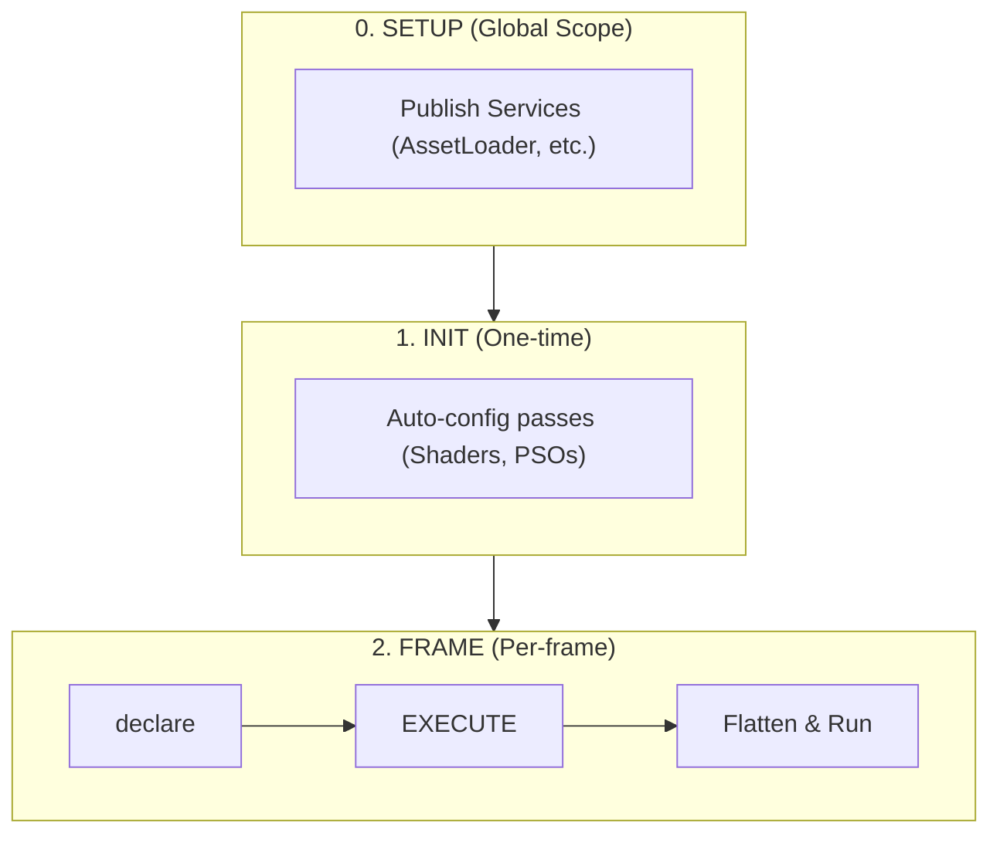
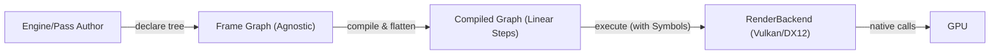

# i3fx Frame Graph — Architecture Design

## Problem Statement

Explicit GPU APIs (Vulkan, DX12) require manual synchronization barriers between resource state transitions. This creates **implicit coupling** between render passes that should be independent. The Frame Graph solves this by making **the engine** responsible for synchronization, while the **pass author** focuses purely on rendering logic.

**3rd attempt.** Previous failures: deferred recording had awkward parallelization; secondary command buffers were too slow.

## State of the Art & Key References

| Reference | Year | Key Contribution |
|---|---|---|
| Frostbite FrameGraph (Wihlidal, GDC) | 2017 | Established Declare/Compile/Execute pattern, transient resources, memory aliasing |
| Granite Render Graph (themaister) | 2017 | Deep Vulkan implementation, CONCURRENT queue sharing, practical aliasing |
| `VK_KHR_dynamic_rendering` | 2021 | Eliminates VkRenderPass/VkFramebuffer objects. Implementation convenience, not structural. |
| Cyclic Render Graphs (Dolp, Vulkanised) | 2025 | Graph partitioning for cyclic dependencies (temporal reprojection, iterative denoising), SSA/Phi-node approach |

**Our design builds on Frostbite's core pattern.** `VK_KHR_dynamic_rendering` simplifies the backend implementation but is not architecturally structuring — the graph compiler could generate `VkRenderPass` objects at compile time regardless.

---

## Platform Scope & API Baseline

**Target:** High-end open source engine. The niche Godot doesn't cover.

| | Decision | Rationale |
|---|---|---|
| **Platforms** | Windows, Linux (console later) | Desktop high-end focus |
| **No mobile** | Deliberate | Avoids leveling down abstractions (wgpu trap) |
| **No macOS** | Deliberate | Metal is a dead-end for high-end; MoltenVK is a wrapper. Community PRs welcome, not a project goal. |
| **Primary API** | **Vulkan 1.3** | Open standard, covers desktop GPU since ~2018 |
| **Validation API** | **DX12** | Validates RHI decoupling, covers Windows without Vulkan |
| **No OpenGL** | Deliberate | Would pull every design decision downward. GL lacks explicit barriers, flexible compute, universal bindless. Time better spent on renderer. |

### Vulkan 1.3 Baseline — Key Features We Rely On

- `VK_KHR_dynamic_rendering` — no VkRenderPass/VkFramebuffer management
- `VK_KHR_synchronization2` — modern barrier API (`VkDependencyInfo`, split pipeline stages)
- Timeline semaphores — cross-queue synchronization
- Buffer device address — bindless buffer access
- Descriptor indexing — bindless textures/samplers

### Optional High-End Features (capability-gated)

- **Ray Tracing** (`VK_KHR_ray_tracing_pipeline`, `VK_KHR_acceleration_structure`)
- **Mesh Shaders** (`VK_EXT_mesh_shader`)
- **Hardware RT + Mesh Shaders** combo for GPU-driven rendering

## Design Principles

1. **Pass authors never touch barriers.** They declare what they use, the engine does the rest.
2. **Parallel by default.** Independent passes declare in parallel on separate threads.
3. **Single recording pass.** No deferred → resolve → re-declare. Declare lightweight, compile fast, declare once.
4. **Multi-queue transparent.** Async compute/transfer supported natively; falls back silently on single-queue GPUs.
5. **Memory aliasing from day one.** Transient resources share memory when lifetimes don't overlap.
6. **Hierarchical Scoping.** Both CPU data and GPU resources live in a Scoped Symbol Table.

---

## The Node Invariant

> **The Graph is a tree of Nodes. A Node is either a leaf (Render Pass) or a branch (Scoped Node).**

1. **Atomic Leaf.** A Leaf (Pass) is an uninterruptible sequence of GPU commands.
2. **Recursive Branch.** A Branch (Group) encapsulates a sub-tree of nodes and manages a local symbol scope.
3. **No mid-pass state transitions.** If a pass needs a resource in two different states (e.g., compute-write then shader-read), that's **two passes**, not one.
4. **Resource usage is declared, not discovered.** The `declare()` call is the **complete** and **exhaustive** contract. The `execute()` call must not use any resource not declared.
5. **Global Scope Invariant.** Services (AssetLoader, ECS, Physics) live in a persistent **Global Scope** that outlives the frame.

### What this enables
- **Barrier resolution is purely a graph-level problem.** The compiler only needs to reason about transitions *between* nodes, never within them.
- **Parallelism is clean.** Any two passes without a data dependency can execute concurrently.
- **Separation of Initialization.** Passes boot up once using the **Global Scope**, avoiding per-frame lookups for static services.
- **Error detection.** A pass that violates this invariant (e.g., undeclared resource access) can be caught by validation layers or debug tooling.

### Examples

| Scenario | Valid? | Why |
|---|---|---|
| Pass reads texture A as SRV, draws to RT B | ✅ | Both resources in fixed state for the entire pass |
| Pass dispatches compute to generate texture A, then reads A as SRV | ❌ | A transitions mid-pass. Split into 2 passes. |
| Pass reads buffer A (vertex) and buffer B (index) | ✅ | Both in fixed state |
| Pass does N independent dispatches on UAV A (GENERAL) | ✅ | All dispatches share the same resource state, no ordering between them |
| Pass dispatch 1 writes UAV A, dispatch 2 reads the result | ❌ | Data dependency between dispatches requires a barrier → split into 2 passes |

---

## Architecture Overview


```mermaid
graph TD
    subgraph Setup ["0. SETUP (Global Scope)"]
        direction TB
        S1["Publish Services (AssetLoader, etc.)"]
    end
    
    subgraph Init ["1. INIT (One-time)"]
        direction TB
        I1["Auto-config passes (Shaders, PSOs)"]
    end
    
    subgraph Frame ["2. FRAME (Per-frame)"]
        direction LR
        R["declare"] --> E["EXECUTE"]
        E --> F["Flatten & Run"]
    end

    Setup --> Init
    Init --> Frame
```

---

## Phase 1: declare

The user builds an arborescent structure (Node Tree) by declaring passes and groups. CPU and GPU dependencies are handled via a **Scoped Symbol Table**.

### Scoped Symbol Table (The "Internal Compiler")
Inspired by compiler theory (SSA/Phi-nodes), the graph treats all dependencies as symbols.

- **Symbols**: `ImageHandle`, `BufferHandle`, `Camera`, `RenderSettings`.
- **Global Scope**: Persistent root scope for engine services (AssetLoader, Physics).
- **Frame Scope**: Root scope for per-frame resources (Backbuffer, GBuffer).
- **Publish**: Register a symbol in the current node's scope.
- **Consume**: Resolve a symbol by looking up the tree (all the way to Global Scope).
- **Acquire**: Special publisher for external swapchain resources.

```rust
pub trait RenderPass {
    fn name(&self) -> &str;
    
    /// Called once when the graph is initialized.
    /// Use to load pipelines, create persistent GPU resources, consume AssetLoader.
    /// `globals` is a PassBuilder connected to the global scope (services).
    fn init(&mut self, backend: &mut dyn RenderBackend, globals: &mut PassBuilder);

    /// Declare per-frame resource usage and resolve symbols.
    /// Called every frame (or on dirty flag).
    fn declare(&mut self, builder: &mut PassBuilder);

    /// Record GPU commands. `frame` holds per-frame typed data (matrices, etc.).
    fn execute(&self, ctx: &mut dyn PassContext, frame: &FrameBlackboard);
}
```

**PassBuilder API** (implémenté dans `i3_gfx/src/graph/pass.rs`) :

```rust
impl PassBuilder {
    // ── Scoped Symbol Table ──────────────────────────────────────────────────
    /// Publish typed data into the frame blackboard (consumed by other passes).
    fn publish<T: Send + Sync + 'static>(&mut self, name: &str, data: T);
    /// Consume typed data from the global or frame scope (panics if missing).
    fn consume<T: Send + Sync + 'static>(&mut self, name: &str) -> Arc<T>;

    // ── Resource Declaration ─────────────────────────────────────────────────
    /// Declare a transient image (per-frame, not persisted across frames).
    fn declare_image(&mut self, name: &str, desc: ImageDesc) -> ImageHandle;
    /// Declare a persistent output image (survives frame end, re-used next frame).
    fn declare_image_output(&mut self, name: &str, desc: ImageDesc) -> ImageHandle;
    /// Declare a ping-pong history image (current + previous version maintained).
    fn declare_image_history_output(&mut self, name: &str, desc: ImageDesc) -> ImageHandle;
    /// Declare a transient buffer.
    fn declare_buffer(&mut self, name: &str, desc: BufferDesc) -> BufferHandle;

    // ── Resource Import ──────────────────────────────────────────────────────
    /// Import a physical GPU buffer as a named symbol (master importer, creates write intent).
    fn import_buffer(&mut self, name: &str, buf: BackendBuffer) -> BufferHandle;
    /// Import a physical GPU image as a named symbol.
    fn import_image(&mut self, name: &str, img: BackendImage) -> ImageHandle;
    /// Import the swapchain backbuffer (special case).
    fn acquire_backbuffer(&mut self, window: WindowHandle) -> ImageHandle;
    /// Register the physical backing for an already-declared image handle.
    fn register_external_image(&mut self, handle: ImageHandle, image: BackendImage);

    // ── Symbol Resolution ────────────────────────────────────────────────────
    /// Look up a named image; returns INVALID + error log if not found.
    fn resolve_image(&mut self, name: &str) -> ImageHandle;
    /// Look up a named buffer; returns INVALID + error log if not found.
    fn resolve_buffer(&mut self, name: &str) -> BufferHandle;
    /// Look up previous-frame version of a history image.
    fn read_image_history(&mut self, name: &str) -> ImageHandle;
    /// Look up previous-frame version of a history buffer.
    fn read_buffer_history(&mut self, name: &str) -> BufferHandle;
    /// Try to resolve an acceleration structure by name.
    fn try_resolve_acceleration_structure(&mut self, name: &str)
        -> Option<AccelerationStructureHandle>;

    // ── Usage Declaration ────────────────────────────────────────────────────
    fn read_image(&mut self, h: ImageHandle, usage: ResourceUsage);
    fn write_image(&mut self, h: ImageHandle, usage: ResourceUsage);
    fn read_buffer(&mut self, h: BufferHandle, usage: ResourceUsage);
    fn write_buffer(&mut self, h: BufferHandle, usage: ResourceUsage);
    fn import_acceleration_structure(&mut self, name: &str, h: BackendAccelerationStructure);
    fn write_acceleration_structure(&mut self, h: BackendAccelerationStructure, usage: ResourceUsage);
    fn read_acceleration_structure(&mut self, h: AccelerationStructureHandle, usage: ResourceUsage);

    // ── Descriptor Sets (at declare time) ────────────────────────────────────
    /// Pre-build a descriptor set layout binding list (consumed during execute).
    fn descriptor_set(&mut self, set_index: u32, f: impl FnOnce(&mut DescriptorSetBuilder));

    // ── Helpers ──────────────────────────────────────────────────────────────
    fn get_image_desc(&self, h: ImageHandle) -> ImageDesc;
    fn get_buffer_desc(&self, h: BufferHandle) -> BufferDesc;
}
```

**FrameBlackboard** — typed per-frame data injected before `execute()`:

```rust
impl FrameBlackboard {
    fn consume<T: Send + Sync + 'static>(&self, name: &str) -> Arc<T>;
}
// Typical entries: "Common" → CommonData (matrices, screen size),
//                 "BindlessSet" → DescriptorSetHandle,
//                 "PrevViewProjection" → Mat4
```

**PassContext** (implémenté dans `i3_gfx/src/graph/backend.rs`) :

```rust
pub trait PassContext {
    fn bind_pipeline_raw(&mut self, pipeline: BackendPipeline);
    fn bind_descriptor_set(&mut self, set: u32, ds: DescriptorSetHandle);
    fn create_descriptor_set(&mut self, pipeline: BackendPipeline,
        set_index: u32, writes: &[DescriptorWrite]) -> DescriptorSetHandle;
    fn push_bytes(&mut self, stage: ShaderStageFlags, offset: u32, data: &[u8]);
    fn push_constant_data<T: Pod>(&mut self, stage: ShaderStageFlags, offset: u32, data: &T);
    fn draw(&mut self, vertex_count: u32, first: u32);
    fn draw_indexed(&mut self, index_count: u32, first_index: u32, vertex_offset: i32);
    fn draw_indexed_indirect(&mut self, buffer: BufferHandle, draw_count: u32, stride: u32);
    fn dispatch(&mut self, x: u32, y: u32, z: u32);
    fn dispatch_indirect(&mut self, buffer: BufferHandle, offset: u64);
    fn copy_buffer(&mut self, src: BufferHandle, dst: BufferHandle,
        src_offset: u64, dst_offset: u64, size: u64);
    fn map_buffer(&mut self, buffer: BufferHandle) -> *mut u8;
    fn unmap_buffer(&mut self, buffer: BufferHandle);
    fn build_blas(&mut self, blas: BackendAccelerationStructure, update: bool);
    fn build_tlas(&mut self, tlas: BackendAccelerationStructure,
        instances: &[TlasInstanceDesc], update: bool);
    fn bind_vertex_buffer(&mut self, slot: u32, buffer: BufferHandle);
    fn bind_index_buffer(&mut self, buffer: BufferHandle, index_type: IndexType);
    fn set_scissor(&mut self, x: i32, y: i32, width: u32, height: u32);
}
```

---

## Phase 2: Compile

Sequential, pure data computation. No GPU API calls. **Must be fast** (target: <100μs for ~100 passes).

### Steps (implémentés) :
1. **Tree Flattening** — `flatten_recursive` traverse le Node Tree, produit un `Vec<FlatPass>` avec les dépendances data (image/buffer/AS reads/writes).
2. **Dependency Graph** — `has_dependency(a, b)` analyse les RAW, WAW, WAR entre passes.
3. **Topological Sort** — Kahn par niveaux (`topological_sort_levels`), retourne des groupes de passes indépendantes.
4. **Barrier Resolution** — `SyncPlanner::simulate_pass` calcule les transitions de layout/access/stage pour images, buffers et AS. Émet des `AbstractTransition` (traduits en `VkImageMemoryBarrier2`, `VkBufferMemoryBarrier2`, `VkMemoryBarrier2` dans le backend Vulkan).

### Étapes non encore implémentées :
- **Dead Node Elimination** — `is_output` est en place comme fondation mais le culling des nœuds sans consommateur n'est pas actif (GFX-08).
- **Memory Aliasing** — `AliasingPlan` décrit dans ce document n'est pas implémenté. Toutes les ressources transientes sont allouées indépendamment (GFX-06).

### Output : `CompiledGraph` (implémenté)

```rust
pub struct CompiledGraph {
    /// Passes in topological order, grouped by independence level.
    pub levels: Vec<Vec<usize>>,   // level → [pass_indices]
    /// Per-pass pre/post barrier plans.
    pub sync_plan: SyncPlan,       // pass_sync[i].pre_transitions
}
```

L'exécution est pilotée par `CompiledGraph::execute` qui itère les niveaux, lance les passes du même niveau en parallèle via `rayon`, et injecte les barrières avant chaque passe.

---

## Phase 3: Execute

Walk the `CompiledGraph`. Each pass records into its own **primary command buffer**.

```
For each ExecutionStep:
  Barriers(batch)       → System emits vkCmdPipelineBarrier in current CB
  ExecutePass(i)        → pass[i].execute(ctx) records into a dedicated CB
  ExecuteParallel(list) → rayon: each pass records into its own CB
  Signal/Wait           → Timeline semaphore operations at submit
```

### Threading Model (Fork-Join / Work-Stealing)

- **Implementation**: `rayon` — fork-join with work-stealing.
- **Thread count**: automatic. N cores = N worker threads. No hardcoded limits.
- **Scaling**: linear with core count. 8 cores → 8 threads, 64 cores → 64 threads.
- **Nested parallelism**: supported. A pass group can fork internally via `rayon::scope`.
- **Workload balancing**: work-stealing handles imbalanced passes (tiny blit vs heavy GBuffer) naturally.

**Execution flow:**
1. Compile phase produces **parallelism groups** (sets of independent passes).
2. Execute phase maps each group to a `rayon::scope` → passes in the group execute in parallel.
3. Sequential dependencies between groups are barriers / sync points.
4. **CPU passes**: same pool, same work-stealing. No separate thread pool.

**Command pool allocation**: one `VkCommandPool` per thread per frame (thread-local). Each standalone pass grabs a CB from its thread's pool. No contention.

### Command Buffer Strategy

- **Standalone passes**: one primary CB per pass (eligible for inter-pass parallel recording).
- **Inline passes**: consecutive inline passes on the same queue are merged into a single primary CB.
- At submit: all CBs are submitted in topological order via `vkQueueSubmit` (batched).

**Inline pass merging**: the compiler fuses consecutive inline passes (same queue, sequential in DAG) into a single CB. Barriers between them are emitted as `vkCmdPipelineBarrier` within the CB. A standalone pass breaks an inline chain.

### Auto Begin/End Rendering

For `Graphics` domain passes, the system **automatically** handles rendering scopes based on declared intents. 

| Intents | Auto `vkCmdBeginRendering`? | Use Case |
|---|---|---|
| `ColorAttachment` / `DepthAttachment` | ✅ Yes | Rasterization, Mesh Shaders |
| `StorageReadWrite` (UAV) only | ❌ No | Ray Tracing, Compute-in-Graphics |
| None (Read-only) | ❌ No | Blits (sometimes), Debug |

**The pass author never calls begin/end rendering.** For Raster/Mesh passes, they just declare draw calls. For RT, they just declare `vkCmdTraceRaysKHR`.

### Intra-Pass Parallel Recording (Secondary Command Buffers)

> **Non implémenté.** Les secondary CBs et `ctx.parallel_record()` sont décrits dans ce document comme objectif architectural futur. Actuellement, chaque passe enregistre dans un seul command buffer primaire.

The pass **never** creates/destroys resources or inserts barriers. It only records draw/dispatch/copy commands through the `PassContext`.

---

## Pipeline State & Shaders

We adopt **Vulkan terminology** (`GraphicsPipeline`, `ComputePipeline`, `RayTracingPipeline`) to avoid leveling down to lower-denominator APIs.

- **Shader Language**: **Slang** is the primary target, providing high-level features while emitting performant SPIR-V/DXIL.
- **PSO Ownership**: The `Node` provides a `PipelineDescription`. The **backend** is responsible for caching and deduplication.
- **Creation**: Pipeline compilation happens during or before graph execution, potentially as a `Cpu` node.

---

## Symbol Model

Both GPU resources and CPU data are unified as **Symbols**. A symbol represents a typed value within the graph's scope tree.

```rust
pub enum SymbolType {
    Image(ImageDesc),
    Buffer(BufferDesc),
    CpuData(TypeId), // References std::any::TypeId
}

pub enum SymbolLifetime {
    /// Exists only within its declaring scope. 
    /// Candidate for memory aliasing (GPU) or scope-exit drop (CPU).
    Transient,
    /// Persists across frames. Owned by the graph.
    Persistent,
    /// Injected from outside.
    External,
}
```

### Temporal Symbols (History) — implémenté

Pour les algorithmes temporels (RTAO, SSSR, exposition), les ressources peuvent garder leur état d'une frame à l'autre via deux primitives :

```rust
fn declare(&mut self, builder: &mut PassBuilder) {
    // Déclare la version courante ET maintient la version précédente automatiquement.
    self.ao_resolved = builder.declare_image_history_output("AO_Resolved", hist_desc);
    // Accès en lecture à la version précédente.
    self.ao_history = builder.read_image_history("AO_Resolved");
    
    // Alternative : lire l'état précédent d'un buffer (e.g., ExposureBuffer).
    self.prev_exposure = builder.read_buffer_history("ExposureBuffer");
}
```

Le frame graph maintient une paire (current, previous) pour chaque ressource history. Ping-pong automatique à chaque frame.

### Resolution Change

The graph propagates the current render size. Nodes query it during `declare()` and compute dimensions.

```rust
fn declare(&mut self, builder: &mut PassBuilder) {
    let (w, h) = builder.render_size();
    builder.publish("InternalRT", ImageDesc::new(w, h, ...));
}
```

**On resize**: 
1. The system detects a resolution change.
2. The graph is rebuilt: all nodes have their `declare()` method called.
3. Persistent symbols detect descriptor changes and reallocate.

`declare()` is the **unique source of truth** for all graph-managed resources. Passes do not need a separate resize hook.

### External Symbols (Imported)

Static assets (textures, meshes) are managed outside the Frame Graph but are "bound" as symbols.

- **Ownership**: The Frame Graph **never** owns or destroys external symbols.
- **Importing**: Done via `graph.bind_external<T>(name, handle)`.
- **Swapchain Integration**: The backbuffer is a special external symbol introduced via `acquire_backbuffer()`.

**The Flow:**
1. **Acquire**: `builder.acquire_backbuffer(window)` creates a symbol.
2. **Use**: Nodes render into the symbol.
3. **Present**: `ctx.present(symbol)` triggers the queue call.

```rust
// 1. External Acquire
let (swap_handle, ready_sem) = hri.acquire_next_image();

// 2. Import Backbuffer (HRI handles ready_sem internally)
let backbuffer = graph.import_backbuffer(swap_handle, "backbuffer");

// 3. Render directly into it
graph.add_pass(UI_Pass {
    // declare(): write(backbuffer, ColorAttachment)
});

// 4. Final transition to Present
graph.add_pass(Present_Pass {
    // declare(): write(backbuffer, Present)
});
```

### CPU Data Symbols (Typed Blackboard)

The Scoped Symbol Table replaces the traditional untyped blackboard.

```rust
// Game loop binds external data symbols
graph.bind_external("MainCamera", camera_controller.get());

// Pass A consumes camera, publishes internal data
builder.add_pass("Culling", |sub| {
    let cam = sub.consume::<Camera>("MainCamera");
    let visible_list = perform_culling(cam);
    sub.publish("VisibleObjects", visible_list);
    |_| {}
});

// Pass B (Graphics) consumes the culled list
builder.add_pass("GBuffer", |sub| {
    let list = sub.consume::<CullingResult>("VisibleObjects");
    move |ctx| { ctx.draw_list(list); }
});
```

**What the compiler sees:** `Camera (ext) → PrepareConstants (Cpu) → GBuffer (Graphics)`

**What this enables:**
- CPU passes that don't touch the same data run in **parallel** (thread pool)
- CPU → GPU ordering is automatic (the CPU pass finishes before the GPU pass records)
- Ownership follows Rust semantics: the creating pass owns the data, readers borrow

---

## Node Hierarchy (Composition)

Composition is achieved through nesting. A Node can contain children, effectively creating a sub-graph.

**Rules:**
- **Symbol Scoping**: Symbols published by a node are visible to its descendants.
- **Resource Aliasing**: The compiler tracks the "In-Use" range of a symbol based on its scope. If a branch node ends, all its transient GPU symbols are released for aliasing.
- **Flattening**: During compilation, the tree is linearized into a list of hardware execution steps, while preserving the semantic barriers between scopes.

---

## Multi-Queue Model

> **État actuel** : toutes les passes s'exécutent sur la **graphics queue** unique. La structure (`QueueAffinity`, timeline semaphores, multi-queue submit) est en place dans le backend Vulkan, mais le compilateur n'assigne pas encore de passes à l'async compute queue. Architecture cible ci-dessous.

```
┌─────────────────────────────────────────────────┐
│  Graphics Queue    ┃  Compute Queue  ┃ Transfer │
│  ━━━━━━━━━━━━━━━━━━╋━━━━━━━━━━━━━━━━━╋━━━━━━━━━ │
│  GBuffer pass      ┃  SSAO compute   ┃          │
│  Lighting pass     ┃  Particle sim   ┃          │
│  PostFX pass       ┃                 ┃          │
│       ▲            ┃      │          ┃          │
│       └── wait ────╋──────┘          ┃          │
│   (timeline sem)   ┃                 ┃          │
└─────────────────────────────────────────────────┘
```

- Pass declares `QueueAffinity` as a **hint**, not a hard constraint.
- Compiler assigns queues based on actual GPU capabilities (`vkGetPhysicalDeviceQueueFamilyProperties`).
- **Fallback**: if no async compute queue, compute-affinity passes run on graphics queue. Zero code change in the pass.
- Cross-queue sync via **timeline semaphores** (Vulkan 1.2).
- **Queue sharing** (hybrid strategy):
  - **Buffers** cross-queue → `VK_SHARING_MODE_CONCURRENT` (no hardware compression to lose, zero overhead in practice).
  - **Images** cross-queue → `VK_SHARING_MODE_EXCLUSIVE` (preserves DCC; ownership transfers handled by the graph compiler via symbol tracking).
  - **Images** single-queue → `VK_SHARING_MODE_EXCLUSIVE` (default, no question).

---

## Memory Aliasing

> **Non implémenté (GFX-06).** L'aliasing mémoire est décrit ci-dessous comme objectif architectural. Actuellement, chaque ressource transiente est allouée indépendamment — aucun partage d'offset mémoire n'est effectué.

Transient resources with non-overlapping lifetimes within a frame share the same logical offsets in a `MemoryPool`.

```
Pass A creates T1 (64MB)    ████░░░░░░░░░░░░
Pass B creates T2 (64MB)    ░░░░░░████░░░░░░
                             ↑ T1 and T2 share the same 64MB block
```

### Interaction with Asynchronous Submission

To support **Zero Stall** parallel execution (CPU recording Frame N+1 while GPU executes Frame N):

1.  **Multi-Framing**: The system maintains a ring buffer of `MemoryPool` objects (typically 2 or 3, matching the frame-in-flight count).
2.  **Safety**: A `MemoryPool` used in Frame N is **locked** by its `PendingSubmission`. 
3.  **Reuse**: The pool is only "reset" and made available for aliasing in a new frame once `collect_garbage()` detects that the GPU has finished using it.

This means aliasing is a **two-tier optimization**:
- **Tier 1 (Intra-frame)**: Bin-packing resources within a single pool based on the DAG.
- **Tier 2 (Inter-frame)**: Rotating/Ring-buffering pools to allow overlap without data corruption.

---

## Error Handling

Reliability is paramount. Conflict detection happens during the **Compile** phase.

- **Conflicting Declarations**: If two passes write to the same resource without an ordering dependency (DAG cycle or independent branches), a `ResourceConflictError` is raised.
- **Invalid Transitions**: Attempting to transition a resource to an incompatible state (e.g., Depth → Color) triggers an error.
- **Undeclared Access**: Debug builds of the `RenderContext` check that every resource used in `execute()` was properly declared.
- **Type Safety**: `compile()` returns `Result<CompiledGraph, GraphError>`, allowing the engine to gracefully handle or report failures without crashing.

> **État actuel** : cycle detection est implémentée (Kahn's algorithm). `resolve_image`/`resolve_buffer` log une erreur et retournent un handle invalide si le symbole est absent — pas de panic. L'accès à une ressource non déclarée n'est pas vérifié en debug pour l'instant (GFX-08).

---

## Debugging & Profiling

The Frame Graph provides observability by default.

- **RenderDoc Integration** — ✅ implémenté : Pass names are propagated to `vkCmdBeginDebugUtilsLabel`. Resources are named in Vulkan based on their Graph name.
- **Validation Layers** — ✅ : The graph's explicit synchronization logic eliminates validation errors. If they occur, they are likely bugs in the graph compiler itself.
- **GPU Timestamps** — ❌ non implémenté : `vkCmdWriteTimestamp` injection is not yet in place.
- **Graph Visualizer** — ❌ non implémenté : `.dot` / Graphviz export is not implemented. The NullBackend can log pass names and barrier transitions to stdout.

---

---

## Runtime / Backend Decoupling (HRI boundary)

To ensure the Frame Graph remains **API agnostic**, we enforce a strict separation between the logical graph (Runtime) and the hardware-specific implementation (HRI - Hardware Rendering Interface).


```mermaid
graph LR
    User["Engine/Pass Author"] -- "declare tree" --> FG["Frame Graph (Agnostic)"]
    FG -- "compile & flatten" --> CG["Compiled Graph (Linear Steps)"]
    CG -- "execute (with Symbols)" --> RHI["RenderBackend (Vulkan/DX12)"]
    RHI -- "native calls" --> GPU["GPU"]
```

### The Boundary: Hardware Rendering Interface (HRI)

The Frame Graph doesn't know what a `VkImage` or `ID3D12Resource` is. It operates on **Logical Handles**.

1.  **Logical Commands**: The graph produces a stream of commands (`Draw`, `Dispatch`) using **Symbol IDs**.
2.  **The Registry**: Maps Symbol IDs to hardware resources (`VkImage`, `VkBuffer`).
3.  **Barrier Translation**: The Runtime says "Transition Symbol 42 to ColorAttachment". The backend translates this into a `VkImageMemoryBarrier2`.

---

## Implémentation réelle — pointeurs vers le code

> Cette section remplace les spécifications d'API obsolètes. Se référer directement aux sources.

| Concept | Fichier source |
|---------|---------------|
| `RenderPass` trait | `crates/i3_gfx/src/graph/pass.rs` |
| `PassBuilder` impl | `crates/i3_gfx/src/graph/pass.rs` |
| `FrameBlackboard` | `crates/i3_gfx/src/graph/blackboard.rs` |
| `PassContext` trait | `crates/i3_gfx/src/graph/backend.rs` |
| `RenderBackend` trait | `crates/i3_gfx/src/graph/backend.rs` |
| `FrameGraph` / `CompiledGraph` | `crates/i3_gfx/src/graph/graph.rs` |
| `SyncPlanner` (barrier resolution) | `crates/i3_gfx/src/graph/sync.rs` |
| Vulkan backend | `crates/i3_vulkan_backend/src/` |
| NullBackend (CI oracle) | `crates/i3_null_backend/src/` |
| Renderer passes | `crates/i3_renderer/src/passes/` |

### NullBackend (implémenté)

`i3_null_backend` est un `RenderBackend` qui n'appelle aucune API GPU. Il log les barrières et les commandes, ce qui permet de valider la logique de synchronisation du frame graph en CI sans pilote Vulkan.

### Tests d'intégration (implémentés)

Les tests contre le NullBackend se trouvent dans `crates/i3_gfx/tests/` et `crates/i3_null_backend/tests/`. Ils couvrent : cycle detection, topological sort, barrier resolution pour les patterns read-after-write / write-after-write / layout transitions.

---

## Fonctionnalités futures (non implémentées)

| Feature | Ticket | Priorité |
|---------|--------|----------|
| Memory aliasing intra-frame | GFX-06 | Moyen |
| Dead node elimination | GFX-08 | Moyen |
| Async compute queue assignment | — | Bas |
| GPU Timestamps per-pass | — | Bas |
| DOT/Graphviz graph export | — | Bas |

---
