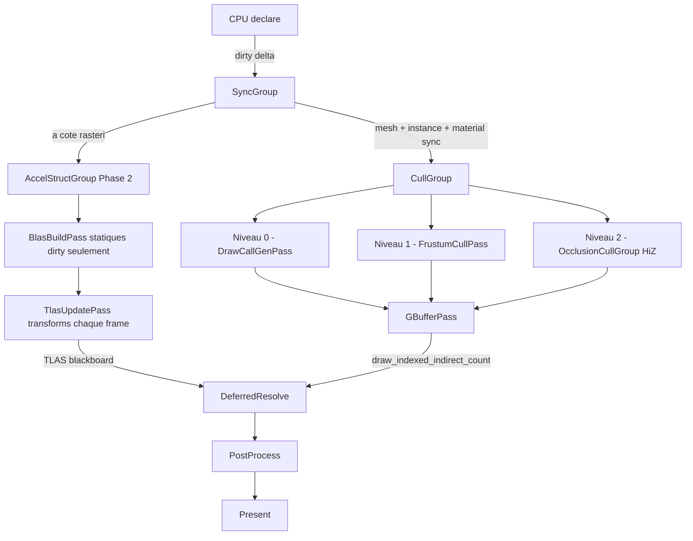
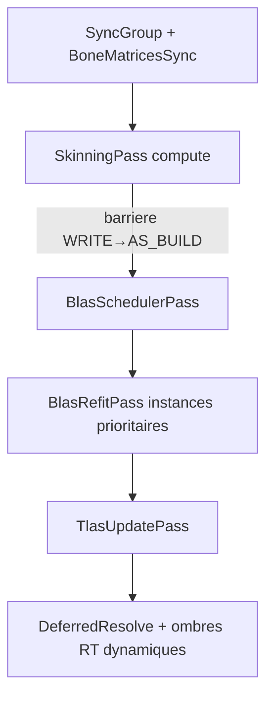

# Plan : GPU-Driven Rendering + Ray Tracing

> Basé sur la review du code au 2026-03-23.  
> Référence : `doc/workplan.md` items RN-04, RN-07, GFX-07.

---

## Contexte & état actuel

### Ce qui existe déjà

| Composant | Fichier | État |
|---|---|---|
| `SceneProvider` trait | `i3_renderer/src/scene.rs` | CPU-driven : `iter_objects()` retourne tous les objets à chaque frame |
| `ObjectData` (u64 id + Mat4 + mesh_id + material_id) | `scene.rs` | OK mais manque AABB world-space |
| `ObjectSyncPass` + `MaterialSyncPass` | `passes/sync.rs` | Upload staging → SSBO GPU. Correct |
| `GBufferPass` | `passes/gbuffer.rs` | Itère `Vec<DrawCommand>` CPU → `draw_indexed` par objet |
| `GpuBuffers` | `gpu_buffers.rs` | `object_buffer`, `material_buffer`, `light_buffer`, `camera_ubo` |
| `render_graph.rs::declare()` | `render_graph.rs:432` | Construit `Vec<DrawCommand>` CPU-side, publie `"GBufferCommands"` |
| `PassContext::draw_indexed` | `graph/backend.rs:134` | Draw direct uniquement |
| `BufferUsageFlags` | `graph/types.rs` | Pas de flag `INDIRECT_BUFFER` |

### Ce qui manque (gaps identifiés)

**Phase 1 — GPU-Driven :**
- Aucune description GPU de la scène à haut niveau (équivalent TLAS pour la rasterisation)  
- Pas d'`INDIRECT_BUFFER` dans `BufferUsageFlags`
- Pas de `draw_indexed_indirect_count()` dans `PassContext`
- Pas de `GpuMeshDescriptor` : données par-mesh résidentes GPU (AABB, stride, index_count...)
- Pas de `CullingPass` (compute shader frustum culling)
- Pas de `DrawCallBuffer` / `DrawCountBuffer` / `VisibleInstanceBuffer`
- `GBufferPass` ne peut pas faire de draw indirect

**Phase 2 — Ray Tracing :**
- Aucun type `BackendBlas` / `BackendTlas` dans `i3_gfx`
- Aucune API de création/build AS dans `RenderBackend`
- Aucune commande de build AS dans `PassContext`
- Pas de `ResourceUsage::ACCELERATION_STRUCTURE_READ/WRITE` pour les barrières
- Pas de `BlasBuildPass` / `TlasUpdatePass`
- Pas d'`AccelStructGroup` dans le render graph

---

## Flux frame cible

### Phase 1 + 1b + 2 (scène statique, pas d'animation)



### Phase 3 (future) — Animation & AS dynamiques



**Progression du `CullGroup` :**
- **Niveau 0** (premier jalon) : `DrawCallGenPass` — toutes instances, sans culling, valide le pipeline end-to-end
- **Niveau 1** : `FrustumCullPass` — AABB vs 6 plans (remplace niveau 0)
- **Niveau 2** : `OcclusionCullGroup` HiZ — frustum + pyramide de profondeur temporelle (remplace niveau 1)

---

## PHASE 1 : GPU-Driven Rasterisation

### Étape 1 — Extensions du type system (`i3_gfx`)

**Fichier : [`crates/i3_gfx/src/graph/types.rs`](crates/i3_gfx/src/graph/types.rs)**

Ajouter dans `BufferUsageFlags` :
```rust
const INDIRECT_BUFFER   = 0x100;
const DEVICE_ADDRESS    = 0x200;  // requis pour RT Phase 2
```

Ajouter dans `ResourceUsage` :
```rust
pub const INDIRECT_READ: ResourceUsage = ResourceUsage(1 << 10);
```

---

### Étape 2 — Extension du trait `PassContext` (`i3_gfx`)

**Fichier : [`crates/i3_gfx/src/graph/backend.rs`](crates/i3_gfx/src/graph/backend.rs)**

Ajouter dans le trait `PassContext` :
```rust
/// vkCmdDrawIndexedIndirectCount équivalent.
fn draw_indexed_indirect_count(
    &mut self,
    indirect_buffer: BufferHandle,   // VkDrawIndexedIndirectCommand[]
    count_buffer:    BufferHandle,   // u32 — nombre réel de draws
    max_draw_count:  u32,
    stride:          u32,
);
```

Implémenter dans `i3_vulkan_backend` (`commands.rs`) en appelant `vkCmdDrawIndexedIndirectCount`.

---

### Étape 3 — Description GPU de la scène à haut niveau

**Fichier : [`crates/i3_renderer/src/scene.rs`](crates/i3_renderer/src/scene.rs)**

#### 3a. `GpuMeshDescriptor` — description par-mesh (statique)

```rust
/// Données GPU par-mesh résidentes, uploadées une seule fois.
/// Équivalent des références de géométrie dans une BLAS.
#[repr(C, align(16))]
#[derive(Debug, Clone, Copy)]
pub struct GpuMeshDescriptor {
    pub vertex_buffer_id:  u32,   // index dans le bindless buffer table
    pub index_buffer_id:   u32,   // index dans le bindless buffer table
    pub index_count:       u32,
    pub vertex_stride:     u32,
    pub index_offset:      u32,   // premier index dans le IB
    pub vertex_offset:     i32,   // vertex offset
    pub aabb_min:          [f32; 3],
    pub _pad0:             f32,
    pub aabb_max:          [f32; 3],
    pub _pad1:             f32,
}
```

#### 3b. `GpuInstanceData` — description par-instance (dynamique)

```rust
/// Données GPU par-instance, mises à jour à chaque frame dirty.
/// Analogue conceptuel d'une entrée dans un TLAS pour la rasterisation.
#[repr(C, align(16))]
#[derive(Debug, Clone, Copy)]
pub struct GpuInstanceData {
    pub world_transform:  nalgebra_glm::Mat4,
    pub prev_transform:   nalgebra_glm::Mat4,
    pub mesh_idx:         u32,       // index dans MeshDescriptorBuffer
    pub material_id:      u32,
    pub flags:            u32,
    pub _pad:             u32,
    pub world_aabb_min:   [f32; 3],
    pub _pad2:            f32,
    pub world_aabb_max:   [f32; 3],
    pub _pad3:            f32,
}
```

#### 3c. Extension du trait `SceneProvider`

```rust
pub trait SceneProvider {
    // ... existant ...

    /// Nombre de mesh descriptors enregistrés.
    fn mesh_descriptor_count(&self) -> usize;

    /// Itère tous les mesh descriptors (upload initial).
    fn iter_mesh_descriptors(
        &self,
    ) -> Box<dyn Iterator<Item = (u32, &GpuMeshDescriptor)> + '_>;

    /// Itère uniquement les mesh descriptors nouvellement enregistrés ce frame.
    fn iter_dirty_mesh_descriptors(
        &self,
    ) -> Box<dyn Iterator<Item = (u32, &GpuMeshDescriptor)> + '_>;

    /// Instance count total (= object_count alias sémantique).
    fn instance_count(&self) -> usize { self.object_count() }
}
```

---

### Étape 4 — Extension de `GpuBuffers`

**Fichier : [`crates/i3_renderer/src/gpu_buffers.rs`](crates/i3_renderer/src/gpu_buffers.rs)**

```rust
pub struct GpuBuffers {
    // Existant
    pub object_buffer:   BackendBuffer,  // → sera remplacé par instance_buffer
    pub material_buffer: BackendBuffer,
    pub light_buffer:    BackendBuffer,
    pub camera_ubo:      BackendBuffer,

    // Nouveau — description de la scène haut-niveau
    pub mesh_descriptor_buffer: BackendBuffer, // GpuMeshDescriptor[]
    pub instance_buffer:        BackendBuffer, // GpuInstanceData[]

    // Nouveau — outputs du CullPass
    pub draw_call_buffer:       BackendBuffer, // VkDrawIndexedIndirectCommand[]
    pub draw_count_buffer:      BackendBuffer, // u32
    pub visible_instance_buffer:BackendBuffer, // u32[] (instance indices visibles)
}
```

Tailles suggérées :
- `mesh_descriptor_buffer` : `MAX_MESHES * size_of::<GpuMeshDescriptor>()` (ex: 4096 meshes)
- `instance_buffer` : `MAX_INSTANCES * size_of::<GpuInstanceData>()` (ex: 65536 instances)
- `draw_call_buffer` : `MAX_INSTANCES * size_of::<VkDrawIndexedIndirectCommand>()`
  - `VkDrawIndexedIndirectCommand` = 5 × u32 = 20 bytes
- `draw_count_buffer` : 4 bytes (u32)
- `visible_instance_buffer` : `MAX_INSTANCES * 4`

Flags : `STORAGE_BUFFER | TRANSFER_DST | INDIRECT_BUFFER`

---

### Étape 5 — Nouvelles passes de synchronisation

**Fichier : [`crates/i3_renderer/src/passes/sync.rs`](crates/i3_renderer/src/passes/sync.rs)**

#### 5a. `MeshRegistrySyncPass` (nouveau)

- Upload "dirty" mesh descriptors vers `mesh_descriptor_buffer`
- Dirty-tracké : un mesh n'est uploadé qu'une fois (géométrie statique)
- Lit `SceneProvider::iter_dirty_mesh_descriptors()`
- Staging → copy → `mesh_descriptor_buffer`

```rust
pub struct MeshRegistrySyncPass {
    mesh_descriptor_buffer: BufferHandle,
    staging_buffer:         Option<BufferHandle>,
    dirty_meshes:           Vec<(u32, GpuMeshDescriptor)>,
}
```

#### 5b. `InstanceSyncPass` (remplace `ObjectSyncPass`)

- Upload `GpuInstanceData[]` (inclut world-AABB pré-calculé côté CPU)
- Reprend la logique de `ObjectSyncPass` mais avec le nouveau type
- Le calcul du world-AABB peut être fait côté CPU lors du sync
  (`mesh_aabb_min/max` transformé par `world_transform`)

#### 5c. Extension de `SyncGroup`

**Fichier : [`crates/i3_renderer/src/groups/sync.rs`](crates/i3_renderer/src/groups/sync.rs)**

```rust
pub struct SyncGroup {
    pub mesh_registry_sync: MeshRegistrySyncPass,  // nouveau
    pub instance_sync:      InstanceSyncPass,       // remplace object_sync
    pub material_sync:      MaterialSyncPass,       // inchangé
}
```

Ordre d'exécution dans `declare()` :
1. `material_sync`
2. `mesh_registry_sync`  
3. `instance_sync`

---

### Étape 6 — `CullPass` (passe de culling GPU)

**Fichier nouveau : [`crates/i3_renderer/src/passes/cull.rs`](crates/i3_renderer/src/passes/cull.rs)**

#### Données GPU du shader `cull.slang`

**Input :**
```glsl
buffer InstanceBuffer        { GpuInstanceData instances[]; }
buffer MeshDescriptorBuffer  { GpuMeshDescriptor meshes[]; }
push_constant { mat4 view_proj; uint instance_count; uint pad[3]; }
```

**Output :**
```glsl
buffer DrawCallBuffer   { VkDrawIndexedIndirectCommand draws[]; }  // INDIRECT_BUFFER
buffer DrawCountBuffer  { uint count; }
buffer VisibleBuffer    { uint instance_ids[]; }
```

**Algorithme :**
```glsl
// Thread par instance
if (instance_idx >= instance_count) return;
GpuInstanceData inst = instances[instance_idx];
GpuMeshDescriptor mesh = meshes[inst.mesh_idx];

// Test frustum (6 plans, AABB world-space)
if (!frustum_cull(inst.world_aabb_min, inst.world_aabb_max, view_proj)) return;

// Émettre draw call
uint draw_idx = atomicAdd(draw_count, 1);
visible_ids[draw_idx] = instance_idx;

draws[draw_idx] = VkDrawIndexedIndirectCommand {
    index_count:    mesh.index_count,
    instance_count: 1,
    first_index:    mesh.index_offset,
    vertex_offset:  mesh.vertex_offset,
    first_instance: draw_idx,  // remapped via VisibleBuffer dans VS
};
```

**Struct Rust :**
```rust
pub struct CullPass {
    instance_buffer:         BufferHandle,
    mesh_descriptor_buffer:  BufferHandle,
    draw_call_buffer:        BufferHandle,
    draw_count_buffer:       BufferHandle,
    visible_instance_buffer: BufferHandle,
    push_constants:          CullPushConstants,
    pipeline:                Option<BackendPipeline>,
}
```

**`declare()` :**
```rust
builder.read_buffer(instance_buffer,        ResourceUsage::SHADER_READ);
builder.read_buffer(mesh_descriptor_buffer, ResourceUsage::SHADER_READ);
builder.write_buffer(draw_call_buffer,      ResourceUsage::SHADER_WRITE);
builder.write_buffer(draw_count_buffer,     ResourceUsage::SHADER_WRITE);
builder.write_buffer(visible_instance_buffer, ResourceUsage::SHADER_WRITE);
```

**`execute()` :**
```rust
ctx.dispatch((instance_count + 63) / 64, 1, 1);
```

---

### Étape 7 — Modification de `GBufferPass` (indirect draw)

**Fichier : [`crates/i3_renderer/src/passes/gbuffer.rs`](crates/i3_renderer/src/passes/gbuffer.rs)**

**Supprimer :**
- `draw_commands: Vec<DrawCommand>` — plus nécessaire
- `DrawCommand` struct et tous ses usages
- La boucle `for cmd in &self.draw_commands { ctx.draw_indexed(...) }`

**Ajouter :**
```rust
pub struct GBufferPass {
    // Handles
    draw_call_buffer:        BufferHandle,
    draw_count_buffer:       BufferHandle,
    visible_instance_buffer: BufferHandle,
    instance_buffer:         BufferHandle,
    mesh_descriptor_buffer:  BufferHandle,
    max_draw_count:          u32,
    // Pas de vertex_buffer / index_buffer : BDA → vertex input vide
}
```

**`declare()` :**
```rust
self.draw_call_buffer        = builder.resolve_buffer("DrawCallBuffer");
self.draw_count_buffer       = builder.resolve_buffer("DrawCountBuffer");
self.visible_instance_buffer = builder.resolve_buffer("VisibleInstanceBuffer");
self.instance_buffer         = builder.resolve_buffer("InstanceBuffer");
self.mesh_descriptor_buffer  = builder.resolve_buffer("MeshDescriptorBuffer");

builder.read_buffer(self.draw_call_buffer,        ResourceUsage::INDIRECT_READ);
builder.read_buffer(self.draw_count_buffer,       ResourceUsage::INDIRECT_READ);
builder.read_buffer(self.visible_instance_buffer, ResourceUsage::SHADER_READ);
builder.read_buffer(self.instance_buffer,         ResourceUsage::SHADER_READ);
builder.read_buffer(self.mesh_descriptor_buffer,  ResourceUsage::SHADER_READ);
// ... attachments GBuffer (color + depth) inchangés ...
```

**`execute()` :**
```rust
// Un seul appel — le GPU dispatch tous les draws visibles
ctx.draw_indexed_indirect_count(
    self.draw_call_buffer,
    self.draw_count_buffer,
    self.max_draw_count,
    std::mem::size_of::<VkDrawIndexedIndirectCommand>() as u32,
);
```

**Shader GBuffer vertex (BDA — pull-based vertex fetch) :**
```glsl
// gl_BaseInstance = first_instance encodé par CullPass = draw_idx
uint instance_id = visible_ids[gl_BaseInstance];
GpuInstanceData   inst = instances[instance_id];
GpuMeshDescriptor mesh = meshes[inst.mesh_idx];

// Fetch index depuis IB via BDA
uint idx    = fetchIndex(mesh.index_buffer_addr, gl_VertexIndex, mesh.index_type);
// Fetch vertex depuis VB via BDA
Vertex v    = fetchVertex(mesh.vertex_buffer_addr, idx, mesh.vertex_stride);

gl_Position = inst.world_transform * vec4(v.position, 1.0);
// Fragment : inst.material_id, v.normal, v.uv, v.tangent
```

> Le pipeline GBuffer a un **vertex input state vide** — aucun binding VB/IB classique.

---

### Étape 8 — Nettoyage de `render_graph.rs`

**Fichier : [`crates/i3_renderer/src/render_graph.rs`](crates/i3_renderer/src/render_graph.rs)**

**Supprimer (lignes 432–446 environ) :**
```rust
// À supprimer : extraction CPU des draw_commands
let draw_commands: Vec<DrawCommand> = scene.iter_objects()...collect();
// ...
builder.publish("GBufferCommands", draw_commands);
```

**Ajouter dans `declare()` :**
```rust
// Importer les buffers GPU-driven
builder.import_buffer("MeshDescriptorBuffer", self.gpu_buffers.mesh_descriptor_buffer);
builder.import_buffer("InstanceBuffer",       self.gpu_buffers.instance_buffer);
builder.import_buffer("DrawCallBuffer",       self.gpu_buffers.draw_call_buffer);
builder.import_buffer("DrawCountBuffer",      self.gpu_buffers.draw_count_buffer);
builder.import_buffer("VisibleInstanceBuffer", self.gpu_buffers.visible_instance_buffer);

// Publier instance_count pour le CullPass
builder.publish("InstanceCount", scene.instance_count() as u32);
```

**Ordre des passes dans `declare()` (Phase 1 seule) :**
```
0. SyncGroup (MeshRegistrySync + InstanceSync + MaterialSync)
1. CullGroup           (voir progression ci-dessous)
2. ClusteringGroup     (cluster_build + light_cull)
3. GBufferPass         (draw_indexed_indirect_count)
4. DeferredResolvePass
5. PostProcessGroup
6. EguiPass
7. PresentPass
```

---

## PHASE 1b : Progression du culling (3 niveaux)

Le `CullGroup` est implémenté par étapes successives. Chaque niveau conserve la même interface de sortie : `DrawCallBuffer`, `DrawCountBuffer`, `VisibleInstanceBuffer`.

### Niveau 0 — `DrawCallGenPass` (sans culling, premier jalon)

Passe compute triviale — zéro logique de visibilité. Permet de valider le pipeline indirect end-to-end.

```glsl
// 1 thread par instance, pas de culling
uint i = gl_GlobalInvocationID.x;
if (i >= instance_count) return;
GpuMeshDescriptor mesh = meshes[instances[i].mesh_idx];
visible_ids[i]          = i;
draws[i].indexCount     = mesh.index_count;
draws[i].instanceCount  = 1;
draws[i].firstIndex     = 0;
draws[i].vertexOffset   = 0;
draws[i].firstInstance  = i;
// draw_count écrit en dehors du shader = instance_count
```

### Niveau 1 — `FrustumCullPass` (AABB vs 6 plans)

Remplace `DrawCallGenPass`. Teste chaque instance contre les 6 plans de frustum extraits de `view_proj`.

```glsl
// SAT avec 6 plans, AABB world-space
for each plane p {
    float d = dot(p.normal, inst.world_aabb_center) + p.d;
    float r = dot(abs(p.normal), inst.world_aabb_half_extent);
    if (d + r < 0.0) return;  // hors frustum
}
uint slot = atomicAdd(draw_count, 1);
visible_ids[slot] = i;
draws[slot] = { mesh.index_count, 1, 0, 0, slot };
```

Push constants : `mat4 view_proj` + `uint instance_count`.

### Niveau 2 — `OcclusionCullGroup` (HiZ two-pass)

Remplace `FrustumCullPass`. Deux sous-passes :

**A — `HiZBuildPass`** (compute)
- Input : `DepthBuffer` du frame N-1 (temporal history via `declare_buffer_history`)
- Output : `HiZPyramid` (image mip chain, `max` depth par tile, `ceil(log2(max_dim))` niveaux)
- Dispatch : groupes 8×8, réduction hiérarchique

**B — `OcclusionCullPass`** (compute, 2 sous-phases)
1. Frustum cull → `CandidateBuffer`
2. Pour chaque candidat : projette l'AABB en NDC → choisit le niveau de mip correspondant à la taille screenspace → lit `HiZPyramid` → compare `aabb_screen_min_depth` à `hiz_max_depth`
   - `aabb_screen_min_depth > hiz_max_depth` → occlus → skip
   - Sinon → `atomicAdd(draw_count)` + écriture dans `DrawCallBuffer`

> **Latence d'1 frame** : le HiZ vient du frame précédent — acceptable (ghost visible 1 frame lors d'occluder brusquement retiré). Pour l'éliminer : ajouter un Z-prepass two-phase (Early-Z + Late-Z).

**Tableau de progression :**

| Niveau | Passe | Gain typique | Complexité |
|---|---|---|---|
| 0 | `DrawCallGenPass` | baseline | triviale |
| 1 | `FrustumCullPass` | 20–60% | faible |
| 2 | `OcclusionCullGroup` HiZ | 60–95% scènes denses | significative |

---

## PHASE 3 (Future) : Animation & Skinning GPU

> **Cette phase est hors scope des Phases 1, 1b et 2.** Les Phases 1+2 travaillent exclusivement avec des scènes statiques — pas d'animation, pas de skinning, pas de refit BLAS. Tout ce qui est décrit ici sera implémenté dans une phase ultérieure dédiée.

Le skinning produit des **skinned vertex buffers** (un par instance skinnée) qui alimentent simultanément le GBuffer VS (via BDA) et le BLAS refit (même adresse stable).

### Données supplémentaires dans `GpuInstanceData`

```rust
pub struct GpuInstanceData {
    // ... champs existants ...
    pub flags:             u32,   // bit 0 = IS_SKINNED
    pub skinning_data_idx: u32,   // index dans SkinningDataBuffer (u32::MAX si statique)
    pub skinned_vb_addr:   u64,   // BDA vers skinned VB pré-alloué (0 si statique)
}
pub const INSTANCE_FLAG_SKINNED: u32 = 1 << 0;
```

### Nouveau buffer : `SkinningDataBuffer`

Un `GpuSkinningData` par instance skinnée :

```rust
#[repr(C, align(16))]
pub struct GpuSkinningData {
    pub bind_pose_vb_addr:    u64,  // BDA vers VB bind-pose (lecture seule)
    pub skin_weights_addr:    u64,  // BDA vers buffer poids+indices os (lecture seule)
    pub bone_matrices_offset: u32,  // offset dans BoneMatricesBuffer (en nombre de Mat4)
    pub bone_count:           u32,
    pub vertex_count:         u32,
    pub vertex_stride:        u32,
}
```

### Nouveau buffer : `BoneMatricesBuffer`

Buffer flat de toutes les bone matrices de toutes les instances skinnées :
```
[ Mat4 * bone_count_inst0 | Mat4 * bone_count_inst1 | ... ]
```
Mis à jour chaque frame par le CPU (animation system → staging → BoneMatricesBuffer).

### `SkinningPass` (compute)

**Fichier nouveau : [`crates/i3_renderer/src/passes/skinning.rs`](crates/i3_renderer/src/passes/skinning.rs)**

Shader `skinning.slang` — un dispatch par instance skinnée, `(vertex_count + 63) / 64` threads :

```glsl
GpuSkinningData skin = skinning_data[dispatch_idx];

BindPoseVertex bv = fetchVertex(skin.bind_pose_vb_addr, thread_idx, skin.vertex_stride);
SkinWeights    w  = fetchSkinWeights(skin.skin_weights_addr, thread_idx);

mat4 skin_mat =
    w.weights.x * bone_matrices[skin.bone_matrices_offset + w.indices.x] +
    w.weights.y * bone_matrices[skin.bone_matrices_offset + w.indices.y] +
    w.weights.z * bone_matrices[skin.bone_matrices_offset + w.indices.z] +
    w.weights.w * bone_matrices[skin.bone_matrices_offset + w.indices.w];

SkinnedVertex sv;
sv.position = (skin_mat * vec4(bv.position, 1.0)).xyz;
sv.normal   = normalize((skin_mat * vec4(bv.normal, 0.0)).xyz);
sv.uv       = bv.uv;
sv.tangent  = skin_mat * bv.tangent;

writeVertex(instances[dispatch_idx].skinned_vb_addr, thread_idx, sv);
```

Après la passe : barrière `SHADER_WRITE → SHADER_READ` (GBuffer) + `SHADER_WRITE → AS_BUILD` (BLAS refit).

### `BlasRefitPass` (Phase 1.5 + Phase 2)

**Fichier nouveau : [`crates/i3_renderer/src/passes/blas_refit.rs`](crates/i3_renderer/src/passes/blas_refit.rs)**

Pour chaque instance skinnée : `ctx.build_blas(blas, desc, scratch, update=true)`.

> **Init BLAS skinné** : le BLAS est créé avec `vertex_buffer = skinned_vb` (pas le bind-pose). Le premier build utilise le bind-pose copié dans le skinned VB à la registration. Les refits suivants utilisent les vertices mis à jour par `SkinningPass`.

---

## PHASE 2b : Priorisation des mises à jour BLAS

Mettre à jour toutes les BLAS chaque frame est coûteux pour de grandes scènes. Un système de **scheduling par priorité** réduit le budget AS à l'essentiel.

### Critères de priorité (cumulatifs)

| Critère | Score de priorité | Mise à jour |
|---|---|---|
| **Skinning actif** | Maximal — obligatoire | Chaque frame |
| **Vélocité élevée** (`delta_transform > seuil`) | Haute | Chaque frame |
| **Angle solide / couverture écran grande** (`radius² / dist²`) | Proportionnel | Adaptatif |
| **Distance < bande 0** (< 10 m) | Haute | Chaque frame |
| **Distance bande 1** (10–50 m) | Moyenne | Tous les 2 frames |
| **Distance bande 2** (50–200 m) | Basse | Tous les 4 frames |
| **Distance > bande 3** (> 200 m) | Très basse | Tous les 8 frames |

### `BlasSchedulerPass` (compute, Phase 2b)

**Fichier nouveau : [`crates/i3_renderer/src/passes/blas_scheduler.rs`](crates/i3_renderer/src/passes/blas_scheduler.rs)**

Exécuté chaque frame avant `AccelStructGroup`. Produit un `BlasUpdateListBuffer`.

```glsl
// 1 thread par instance dynamic (skinné ou transformé)
GpuInstanceData inst = instances[i];

float dist      = length(camera_pos - inst.world_aabb_center);
float velocity  = length(inst.world_transform[3].xyz - inst.prev_transform[3].xyz);
float radius    = length(inst.world_aabb_half_extent);
float solid_ang = (radius * radius) / max(dist * dist, 0.001);

// Score = 0 → ne pas mettre à jour ce frame
uint period = 8;  // défaut : tous les 8 frames
if (inst.flags & IS_SKINNED)      period = 1;
else if (velocity > VEL_THRESH)   period = 1;
else if (solid_ang > SA_HIGH)     period = 1;
else if (dist < BAND0_DIST)       period = 1;
else if (dist < BAND1_DIST)       period = 2;
else if (dist < BAND2_DIST)       period = 4;

if (frame_index % period == 0) {
    uint slot = atomicAdd(blas_update_count, 1);
    blas_update_list[slot] = i;  // instance_idx à mettre à jour
}
```

Push constants : `camera_pos`, `frame_index`, constantes de bandes.

### Impact sur `BlasRefitPass`

- Lit `BlasUpdateListBuffer` au lieu d'itérer toutes les instances skinnées
- Budget maximal configurable : `MAX_BLAS_UPDATES_PER_FRAME` (ex: 64) — si le scheduler produit plus d'entrées, on tronque aux N plus proches

### Impact sur `TlasUpdatePass`

Le TLAS utilise toujours **toutes** les instances (même avec BLAS stale) — la TLAS instance matrix est mise à jour chaque frame pour les transforms, même si le BLAS n'a pas été refit. Cela garantit la correction des ombres/réflexions pour les transforms, avec une approximation géométrique acceptable pour les objets lointains.

---

## PHASE 2 : Acceleration Structures (Ray Tracing) — AS Statiques uniquement

> **Périmètre de Phase 2 :** pas d'animation, pas de skinning. Toutes les BLAS sont construites **une seule fois** au chargement de la scène (ou lors de la registration d'un nouveau mesh) et ne sont jamais refittées. Le TLAS est rebuilté/mis à jour chaque frame pour refléter les **transforms** qui changent (objets déplacés par le gameplay), mais la géométrie reste fixe.
>
> Le refit BLAS, le scheduler de priorité, et le skinning sont traités en **Phase 3**.

### Étape 9 — Types AS dans `i3_gfx`

**Fichier : [`crates/i3_gfx/src/graph/backend.rs`](crates/i3_gfx/src/graph/backend.rs)**

```rust
/// Handle physique vers une Bottom-Level Acceleration Structure.
#[derive(Debug, Clone, Copy, PartialEq, Eq)]
pub struct BackendBlas(pub u64);

/// Handle physique vers une Top-Level Acceleration Structure.
#[derive(Debug, Clone, Copy, PartialEq, Eq)]
pub struct BackendTlas(pub u64);
```

**Fichier : [`crates/i3_gfx/src/graph/types.rs`](crates/i3_gfx/src/graph/types.rs)**

Ajouter dans `ResourceUsage` :
```rust
pub const ACCELERATION_STRUCTURE_READ:  ResourceUsage = ResourceUsage(1 << 11);
pub const ACCELERATION_STRUCTURE_WRITE: ResourceUsage = ResourceUsage(1 << 12);
```

Ajouter dans `BufferUsageFlags` :
```rust
const ACCELERATION_STRUCTURE_STORAGE    = 0x400;
const ACCELERATION_STRUCTURE_BUILD_INPUT= 0x800;
const SHADER_BINDING_TABLE              = 0x1000;
```

---

### Étape 10 — Extension du trait `RenderBackend`

**Fichier : [`crates/i3_gfx/src/graph/backend.rs`](crates/i3_gfx/src/graph/backend.rs)**

```rust
pub trait RenderBackend {
    // ... existant ...

    // --- Acceleration Structures ---

    /// Décrit la géométrie d'une BLAS.
    fn create_blas(&mut self, desc: &BlasDesc) -> BackendBlas;

    /// Crée un TLAS vide avec capacité pour `max_instances` instances.
    fn create_tlas(&mut self, max_instances: u32) -> BackendTlas;

    /// Retourne l'adresse mémoire device d'une BLAS (pour le TLAS instance buffer).
    fn get_blas_device_address(&self, blas: BackendBlas) -> u64;

    /// Retourne l'adresse du TLAS pour les shaders RT.
    fn get_tlas_device_address(&self, tlas: BackendTlas) -> u64;

    /// Alloue un scratch buffer pour les builds AS.
    fn get_blas_build_scratch_size(&self, desc: &BlasDesc) -> u64;
    fn get_tlas_build_scratch_size(&self, max_instances: u32) -> u64;
}

/// Description d'une BLAS (géométrie triangles).
pub struct BlasDesc {
    pub vertex_buffer:  BackendBuffer,
    pub index_buffer:   BackendBuffer,
    pub vertex_count:   u32,
    pub index_count:    u32,
    pub vertex_stride:  u32,
    pub vertex_format:  Format,          // R32G32B32_SFLOAT pour positions
    pub transform_buffer: Option<BackendBuffer>, // None = identité
}
```

---

### Étape 11 — Extension du trait `PassContext` pour les AS

**Fichier : [`crates/i3_gfx/src/graph/backend.rs`](crates/i3_gfx/src/graph/backend.rs)**

```rust
pub trait PassContext {
    // ... existant ...

    /// Build ou rebuild une BLAS.
    fn build_blas(
        &mut self,
        blas:           BackendBlas,
        desc:           &BlasDesc,
        scratch_buffer: BufferHandle,
        update:         bool,  // false=build, true=update (refit)
    );

    /// Build ou update le TLAS à partir d'un buffer d'instances.
    fn build_tlas(
        &mut self,
        tlas:             BackendTlas,
        instance_buffer:  BufferHandle,   // VkAccelerationStructureInstanceKHR[]
        instance_count:   u32,
        scratch_buffer:   BufferHandle,
        update:           bool,
    );

    /// Barrière mémoire dédiée AS (équivalent VkMemoryBarrier AS_WRITE → AS_READ).
    fn pipeline_barrier_acceleration_structure(&mut self);
}
```

---

### Étape 12 — Extension de `GpuBuffers` pour les AS

**Fichier : [`crates/i3_renderer/src/gpu_buffers.rs`](crates/i3_renderer/src/gpu_buffers.rs)**

```rust
pub struct GpuBuffers {
    // ... existant Phase 1 + original ...

    // Phase 2 — Ray Tracing
    /// BLAS par mesh_id. Indexé par mesh_id.
    pub blas_pool: Vec<BackendBlas>,

    /// TLAS unique : contient toutes les instances de la scène.
    pub tlas: Option<BackendTlas>,

    /// Buffer d'instances TLAS : VkAccelerationStructureInstanceKHR[].
    /// Mis à jour par TlasUpdatePass.
    pub tlas_instance_buffer: BackendBuffer,

    /// Scratch buffer pour les builds BLAS (taille = max scratch parmi tous les meshes).
    pub blas_scratch_buffer: BackendBuffer,

    /// Scratch buffer pour le build TLAS.
    pub tlas_scratch_buffer: BackendBuffer,
}
```

Note : `VkAccelerationStructureInstanceKHR` = 64 bytes par instance.  
`tlas_instance_buffer` taille = `MAX_INSTANCES * 64`.

---

### Étape 13 — `BlasBuildPass` (passe GPU)

**Fichier nouveau : [`crates/i3_renderer/src/passes/blas_build.rs`](crates/i3_renderer/src/passes/blas_build.rs)**

```rust
pub struct BlasBuildPass {
    /// Meshes dont la BLAS doit être (re)buildée ce frame.
    pub dirty_blas: Vec<(u32, BlasDesc)>,
    scratch_buffer: BufferHandle,
    blas_pool:      *mut Vec<BackendBlas>, // référence vers GpuBuffers::blas_pool
}
```

**`declare()` :**
```rust
// Déclarer le scratch buffer transient
self.scratch_buffer = builder.declare_buffer("BlasScratch", BufferDesc {
    size: max_scratch_size,
    usage: BufferUsageFlags::STORAGE_BUFFER | BufferUsageFlags::DEVICE_ADDRESS,
    memory: MemoryType::GpuOnly,
});
builder.write_buffer(self.scratch_buffer, ResourceUsage::ACCELERATION_STRUCTURE_WRITE);
```

**`execute()` :**
```rust
for (mesh_id, desc) in &self.dirty_blas {
    let blas = blas_pool[*mesh_id as usize];
    ctx.build_blas(blas, desc, self.scratch_buffer, false);
}
// Barrière implicite AS_WRITE → AS_READ via la passe de barrière suivante
```

---

### Étape 14 — `TlasUpdatePass` (passe GPU)

**Fichier nouveau : [`crates/i3_renderer/src/passes/tlas_update.rs`](crates/i3_renderer/src/passes/tlas_update.rs)**

**Rôle :** Mettre à jour le TLAS chaque frame à partir des transforms courants de toutes les instances (pas seulement les visibles — le RT a besoin de toutes).

**`declare()` :**
```rust
self.instance_buffer = builder.resolve_buffer("InstanceBuffer"); // GpuInstanceData[]
self.tlas_instance_buffer = builder.resolve_buffer("TlasInstanceBuffer");
self.scratch_buffer = builder.declare_buffer("TlasScratch", ...);

builder.read_buffer(self.instance_buffer, ResourceUsage::SHADER_READ);
builder.write_buffer(self.tlas_instance_buffer, ResourceUsage::ACCELERATION_STRUCTURE_WRITE);
builder.write_buffer(self.scratch_buffer, ResourceUsage::ACCELERATION_STRUCTURE_WRITE);
```

**`execute()` :**
```rust
// 1. Remplir tlas_instance_buffer à partir des transforms GPU
//    (compute shader ou CPU-side si count raisonnable)
// 2. Build/update TLAS
ctx.build_tlas(
    self.tlas,
    self.tlas_instance_buffer,
    self.instance_count,
    self.scratch_buffer,
    true,  // update si TLAS déjà buildé, false première frame
);
// 3. Barrière AS
ctx.pipeline_barrier_acceleration_structure();
```

Le TLAS résultant est publié sur le blackboard :
```rust
builder.publish("TLAS", tlas_handle);  // handle physique BackendTlas
```

---

### Étape 15 — `AccelStructGroup` dans le render graph

**Fichier nouveau : [`crates/i3_renderer/src/groups/accel_struct.rs`](crates/i3_renderer/src/groups/accel_struct.rs)**

```rust
pub struct AccelStructGroup {
    pub blas_build:  BlasBuildPass,
    pub tlas_update: TlasUpdatePass,
}
```

**Ordre d'exécution dans `declare()` :**
1. `blas_build`  — build les BLAS dirty
2. Barrière AS implicite (via `ResourceUsage` dans le compile du frame graph)
3. `tlas_update` — update le TLAS

---

### Étape 16 — Ordre complet du render graph (Phase 1 + 2)

**Fichier : [`crates/i3_renderer/src/render_graph.rs`](crates/i3_renderer/src/render_graph.rs)**

```
0. SyncGroup
   ├── MeshRegistrySyncPass       (upload mesh descriptors BDA → mesh_descriptor_buffer)
   ├── InstanceSyncPass            (upload GpuInstanceData → instance_buffer)
   └── MaterialSyncPass            (upload materials → material_buffer)

1. SkinningPass                    [Phase 1.5]
   └── Pour chaque instance SKINNED :
       compute LBS : bind_pose_vb + skin_weights + bone_matrices → skinned_vb
       barriere SHADER_WRITE→SHADER_READ + SHADER_WRITE→AS_BUILD

2. AccelStructGroup                [Phase 2]
   ├── BlasBuildPass               (build BLAS statiques : meshes dirty/nouveaux)
   ├── BlasRefitPass               (refit BLAS skinnes : chaque frame, après SkinningPass)
   └── TlasUpdatePass              (update TLAS depuis instance_buffer + BLAS handles)
       └── publier "TLAS" blackboard

3. DrawCallGenPass   ← ÉTAPE 1 (sans culling)
   OU CullPass       ← ÉTAPE 2 (frustum culling AABB)
   └── outputs: DrawCallBuffer, DrawCountBuffer, VisibleInstanceBuffer

4. ClusteringGroup                 (cluster_build + light_cull)

5. GBufferPass                     (draw_indexed_indirect_count)
   └── VS pull BDA : skinned_vb_addr si SKINNED sinon mesh.vertex_buffer_addr

6. DeferredResolvePass             (lit "TLAS" pour shadow rays RT)

7. PostProcessGroup

8. EguiPass

9. PresentPass
```

---

## Synthèse des fichiers à créer / modifier

### Fichiers à modifier

| Fichier | Changement |
|---|---|
| [`crates/i3_gfx/src/graph/types.rs`](crates/i3_gfx/src/graph/types.rs) | `INDIRECT_BUFFER`, `DEVICE_ADDRESS`, `ResourceUsage::INDIRECT_READ`, `AS_READ/WRITE` |
| [`crates/i3_gfx/src/graph/backend.rs`](crates/i3_gfx/src/graph/backend.rs) | `BackendBlas`, `BackendTlas`, `BlasDesc`, `draw_indexed_indirect_count`, `build_blas`, `build_tlas`, `pipeline_barrier_acceleration_structure` dans traits |
| [`crates/i3_vulkan_backend/src/commands.rs`](crates/i3_vulkan_backend/src/commands.rs) | Implémenter `draw_indexed_indirect_count`, `build_blas`, `build_tlas`, `pipeline_barrier_as` |
| [`crates/i3_vulkan_backend/src/backend.rs`](crates/i3_vulkan_backend/src/backend.rs) | Implémenter `create_blas`, `create_tlas`, `get_blas_device_address`, `get_tlas_device_address` |
| [`crates/i3_renderer/src/scene.rs`](crates/i3_renderer/src/scene.rs) | Ajouter `GpuMeshDescriptor`, `GpuInstanceData`, étendre `SceneProvider` |
| [`crates/i3_renderer/src/gpu_buffers.rs`](crates/i3_renderer/src/gpu_buffers.rs) | Ajouter `mesh_descriptor_buffer`, `instance_buffer`, `draw_call_buffer`, `draw_count_buffer`, `visible_instance_buffer`, `blas_pool`, `tlas`, `tlas_instance_buffer`, scratch buffers |
| [`crates/i3_renderer/src/passes/sync.rs`](crates/i3_renderer/src/passes/sync.rs) | Ajouter `MeshRegistrySyncPass`, `InstanceSyncPass` (remplace `ObjectSyncPass`) |
| [`crates/i3_renderer/src/groups/sync.rs`](crates/i3_renderer/src/groups/sync.rs) | Intégrer `MeshRegistrySyncPass` + `InstanceSyncPass` |
| [`crates/i3_renderer/src/passes/gbuffer.rs`](crates/i3_renderer/src/passes/gbuffer.rs) | Supprimer `DrawCommand`, passer à `draw_indexed_indirect_count` |
| [`crates/i3_renderer/src/render_graph.rs`](crates/i3_renderer/src/render_graph.rs) | Supprimer génération CPU des draw commands, importer nouveaux buffers, ajouter `CullPass` + `AccelStructGroup` |
| [`crates/i3_renderer/src/passes/mod.rs`](crates/i3_renderer/src/passes/mod.rs) | Déclarer `cull`, `blas_build`, `tlas_update` |
| [`crates/i3_renderer/src/groups/mod.rs`](crates/i3_renderer/src/groups/mod.rs) | Déclarer `accel_struct` |
| [`crates/i3_null_backend/src/lib.rs`](crates/i3_null_backend/src/lib.rs) | Implémenter les nouvelles méthodes (stubs no-op) |

### Fichiers à créer

| Fichier | Rôle |
|---|---|
| [`crates/i3_renderer/src/passes/cull.rs`](crates/i3_renderer/src/passes/cull.rs) | `CullPass` — frustum culling GPU compute |
| [`crates/i3_renderer/src/passes/blas_build.rs`](crates/i3_renderer/src/passes/blas_build.rs) | `BlasBuildPass` — build BLAS pour meshes dirty |
| [`crates/i3_renderer/src/passes/tlas_update.rs`](crates/i3_renderer/src/passes/tlas_update.rs) | `TlasUpdatePass` — update TLAS chaque frame |
| [`crates/i3_renderer/src/groups/accel_struct.rs`](crates/i3_renderer/src/groups/accel_struct.rs) | `AccelStructGroup` — groupe BlasBuild + TlasUpdate |
| `crates/i3_renderer/assets/cull.slang` | Shader compute de frustum culling |

---

## Contraintes et décisions d'architecture

### Méga-vertex-buffer vs. bind-per-draw

Pour que le draw indirect soit efficace, le GBuffer shader ne peut pas binder un VB/IB différent par draw (le GPU assume un VB unique). Solutions :

**Option A (recommandée) : Megabuffer**  
Tous les vertex buffers sont sub-alloués dans un unique `mega_vertex_buffer` et `mega_index_buffer`. `GpuMeshDescriptor` stocke des offsets byte. Le GBuffer VS utilise un fetch manuel via le bindless layout.

**Option B : Bindless buffer table**  
Le GBuffer VS accède au VB/IB via une table de handles bindless (`buffer_reference` en Vulkan). `GpuMeshDescriptor::vertex_buffer_id` est un index dans cette table.

→ **Choisir Option A pour la Phase 1** (plus simple), Option B pour Phase 2 (requis pour les accès RT).

### Première frame du TLAS

La première frame, `TlasUpdatePass` fait un **build** complet (`update = false`). Les frames suivantes, si seules les transforms changent (pas la topologie), faire un **refit** (`update = true`). Si des meshes sont ajoutés/supprimés, rebuild complet.

### Synchronisation des barrières AS

Le frame graph compiler doit générer des barrières correctes autour des passes AS. Pour Vulkan :
- Après `BlasBuildPass` : `VkMemoryBarrier { src=AS_WRITE, dst=AS_READ, srcStage=AS_BUILD, dstStage=AS_BUILD }`
- Après `TlasUpdatePass` : `VkMemoryBarrier { src=AS_WRITE, dst=SHADER_READ, srcStage=AS_BUILD, dstStage=RAY_TRACING_SHADER }`

Le `ResourceUsage::ACCELERATION_STRUCTURE_WRITE/READ` déclaré dans `declare()` permet au compilateur de générer ces barrières automatiquement.

---

## Ordre d'implémentation suggéré

1. **P1a** : `BufferUsageFlags::INDIRECT_BUFFER | DEVICE_ADDRESS` + `ResourceUsage::INDIRECT_READ` dans `types.rs`
2. **P1b** : `draw_indexed_indirect_count` dans `PassContext` + `get_buffer_device_address` dans `RenderBackend` + implémentation Vulkan (`commands.rs` + `backend.rs`)
3. **P1c** : `GpuMeshDescriptor` (BDA) + `GpuInstanceData` + extension `SceneProvider` dans `scene.rs`
4. **P1d** : Nouveaux champs `GpuBuffers` + allocation au init
5. **P1e** : `MeshRegistrySyncPass` (appelle `get_buffer_device_address` → remplit BDA dans descripteur) + `InstanceSyncPass` + refactor `SyncGroup`
6. **P1f** : `CullPass` (Rust struct + shader `cull.slang`)
7. **P1g** : Refactoring `GBufferPass` → vertex input vide + pull BDA + `draw_indexed_indirect_count`
8. **P1h** : Nettoyage `render_graph.rs`
9. **P2a** : Types AS + `RenderBackend` extensions + implémentation Vulkan
10. **P2b** : `PassContext::build_blas/tlas` + implémentation Vulkan
11. **P2c** : Extension `GpuBuffers` RT
12. **P2d** : `BlasBuildPass` + `TlasUpdatePass` + `AccelStructGroup`
13. **P2e** : Intégration render graph + publication TLAS sur blackboard
