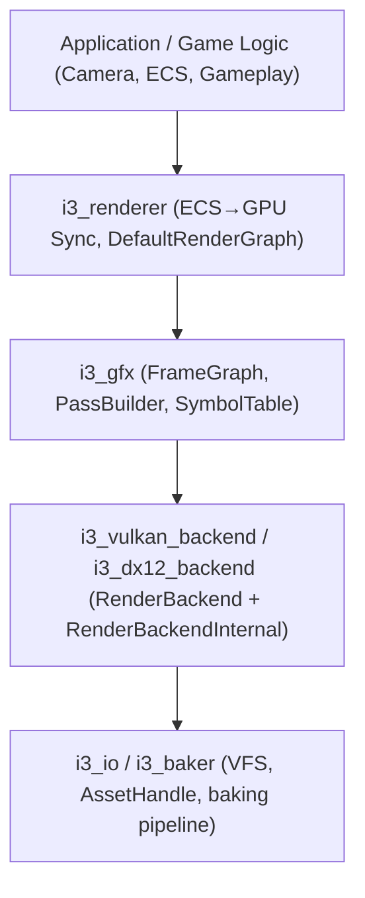
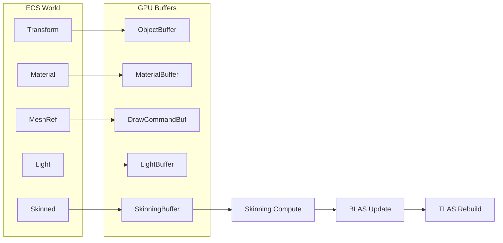
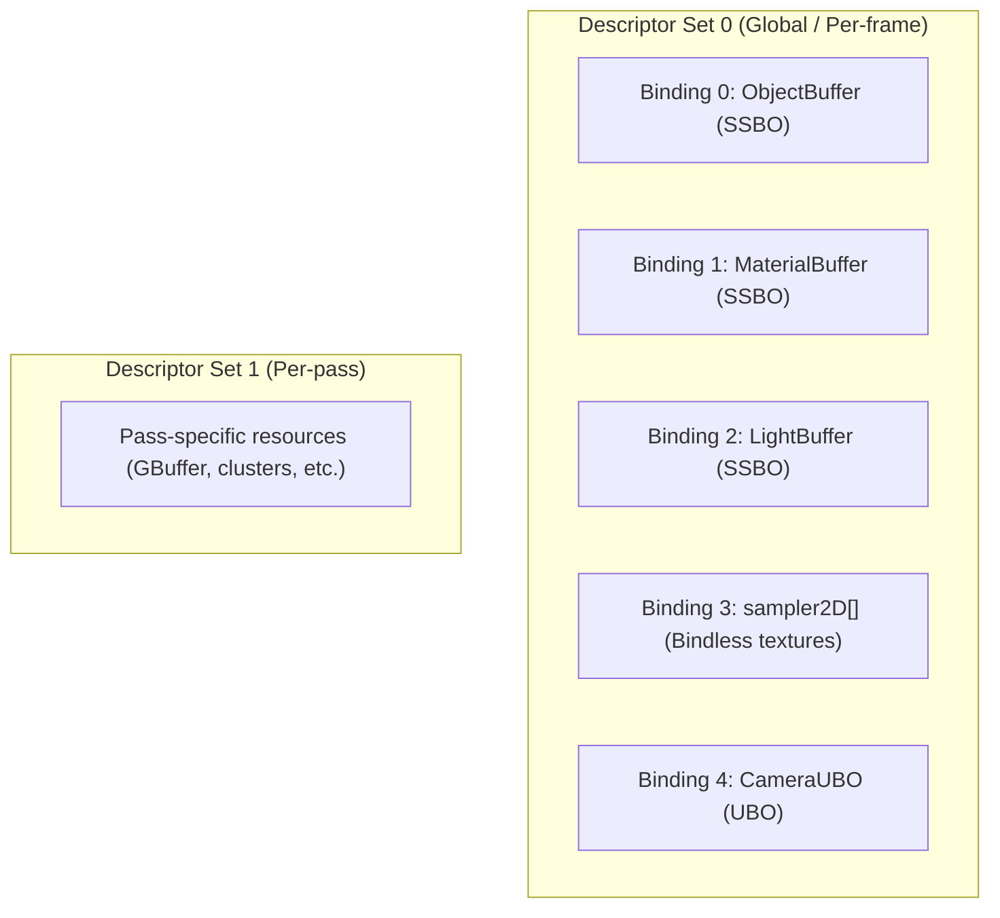
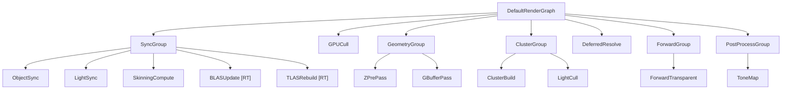
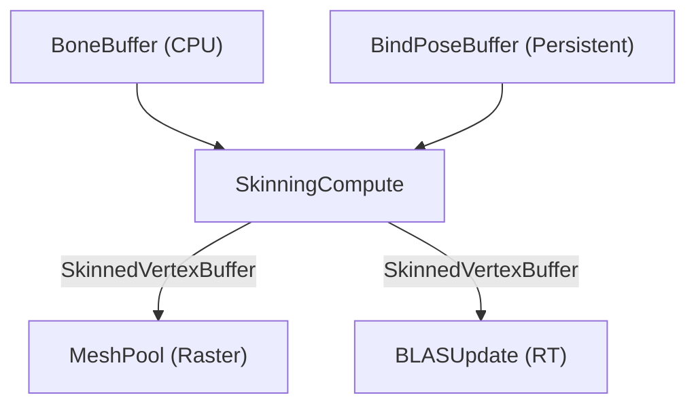

# i3 Renderer — Default Render Graph Design

## Overview

The **i3 Renderer** (`i3_renderer`) is a crate that builds on top of `i3_gfx` (FrameGraph) and provides the engine's default render pipeline: **Deferred Clustered Shading**.

It is a **consumer** of the FrameGraph API — not a modification of it. The renderer records its passes into a `FrameGraph` each frame, leveraging the existing declare/compile/execute pipeline, symbol table, transient resources, and automatic synchronization.

### Design Goals

1. **Data-Oriented**: GPU-driven scene. Transforms, materials, and draw commands live in persistent GPU buffers. CPU uploads delta changes per frame.
2. **Clustered Shading** (Infinity Ward X×Y+Z): Screen-space tile grid (X×Y) with logarithmic depth slicing (+Z). Light assignment via compute.
3. **ECS-Driven**: Scene data lives in the ECS. GPU synchronization is a generic pass group that extracts components and streams them to GPU buffers — no monolithic `GpuScene` object.
4. **Extensible**: The graph is assembled from composable pass groups. RT shadows, GI, decals, particles, and advanced post-processing can be inserted without restructuring.
5. **Zero Abstraction Leak**: The renderer never calls `RenderBackendInternal` directly — it uses `PassBuilder`/`PassContext` exclusively.

---

## Layer Architecture



`i3_renderer` depends on `i3_gfx` (for FrameGraph API) and `i3_slang` (for shader compilation). It does **not** depend on any specific backend crate.

---

## ECS ↔ GPU Sync Model

### Principle

The scene lives in the ECS (transforms, materials, mesh refs, light components). The renderer does **not** own the scene — it **observes** it through a generic synchronization pass group that runs at the beginning of each frame.



### The Sync Pass Group

Instead of a monolithic `GpuScene` struct, the sync is a **series of FrameGraph passes** — generic enough that any ECS can feed it. The application provides a `SceneSnapshot` (or implements a trait) that the sync passes consume.

```rust
/// Trait that the application (or ECS bridge) implements.
/// The renderer consumes this to populate GPU buffers.
pub trait SceneProvider {
    fn object_count(&self) -> usize;
    fn iter_objects(&self) -> impl Iterator<Item = &ObjectData>;
    fn iter_dirty_objects(&self) -> impl Iterator<Item = (ObjectId, &ObjectData)>;
    fn iter_lights(&self) -> impl Iterator<Item = &LightData>;
    fn iter_skinned_meshes(&self) -> impl Iterator<Item = &SkinnedMeshData>;
}
```

The sync passes:

1. **ObjectSync** (CPU→GPU): Streams dirty transforms + material IDs into `ObjectBuffer`. Builds `DrawCommandBuffer` (indirect draw commands).
2. **LightSync** (CPU→GPU): Streams dirty light data into `LightBuffer`.
3. **SkinningCompute** (GPU compute): Reads bind poses + bone transforms, writes skinned vertex data. **Must complete before BLAS update.**
4. **BLASUpdate** (GPU compute/RT): Rebuilds BLAS for skinned/deformed meshes using the skinned vertex output.
5. **TLASRebuild** (GPU compute/RT): Rebuilds the top-level acceleration structure from all BLAS instances + transforms from `ObjectBuffer`.

> [!IMPORTANT]
> **Ordering invariant**: SkinningCompute → BLASUpdate → TLASRebuild → Render passes. The FrameGraph's dependency tracking handles this automatically through declared resource reads/writes.

### Why Sync ≠ TLAS

The acceleration structure pipeline **cannot be fully mutualized** with the raster geometry data:
- BLAS geometry references the skinned vertex buffer, not the original mesh pool directly.
- TLAS needs its own instance buffer with `VkAccelerationStructureInstanceKHR` layout, which differs from the raster `ObjectBuffer`.
- TLAS rebuild is capability-gated (RT hardware required).

The sync passes write **shared** data (ObjectBuffer, LightBuffer) that both raster and RT paths consume. But the accel struct construction is a separate sub-graph, activated only when RT features are enabled.

---

## GPU Buffer Layout

### Core Buffers (Persistent SSBOs)

| Buffer | Content | Upload Strategy |
|---|---|---|
| **ObjectBuffer** | Per-instance: `world_transform`, `prev_transform`, `material_id`, `mesh_id`, `flags` | CPU streams dirty entries |
| **MaterialBuffer** | Material table: `albedo_idx`, `normal_idx`, `roughmetal_idx`, `emissive_idx`, `params` | CPU streams dirty entries |
| **MeshPool** | Single large vertex + index buffer. Sub-allocated per mesh asset. | Loaded once via `i3_io` |
| **DrawCommandBuffer** | `VkDrawIndexedIndirectCommand` + instance data | Rebuilt by ObjectSync or GPU cull |
| **LightBuffer** | `position`, `direction`, `color`, `radius`, `type`, `shadow_params` | CPU streams dirty entries |
| **SkinningBuffer** | Bone transforms per skinned instance | CPU uploads per frame |

### Bindless Resource Model

All textures are referenced by index into a global descriptor array (descriptor indexing, Vulkan 1.2+). Materials store texture **indices**, not handles.



> [!NOTE]
> Set 0 convention is enforced by `i3_renderer`, not by the FrameGraph layer. The FrameGraph remains convention-agnostic.

---

## Render Graph Structure

Each frame, the renderer records the following pass tree:



---

## GBuffer Layout

| Target | Format | Content |
|---|---|---|
| GBuffer_Albedo | `R8G8B8A8_SRGB` | RGB = base color, A = AO |
| GBuffer_Normal | `R16G16_SFLOAT` | Octahedral-encoded world normals |
| GBuffer_RoughMetal | `R8G8_UNORM` | R = roughness, G = metallic |
| GBuffer_Emissive | `R11G11B10_SFLOAT` | Emissive color (RT emissive source) |
| DepthBuffer | `D32_SFLOAT` | Hardware depth |

---

## Clustered Shading — Infinity Ward X×Y+Z

### Cluster Grid

```
Grid: TILE_X × TILE_Y × NUM_DEPTH_SLICES
  TILE_X = ceil(screen_width / TILE_SIZE)    (TILE_SIZE = 64)
  TILE_Y = ceil(screen_height / TILE_SIZE)
  NUM_DEPTH_SLICES = 24 (tunable)
```

Depth slicing — logarithmic (Infinity Ward):
```
slice = floor(log2(z / z_near) * NUM_SLICES / log2(z_far / z_near))
```

### Compute Passes

1. **ClusterBuild**: Computes AABB for each cluster cell using depth buffer min/max per tile (subgroup/atomic reduction).
2. **LightCull**: Tests active lights against cluster AABBs. Outputs `ClusterLightList[cluster]` (offset+count) and `ClusterLightIndices[]` (flat light index list).

### Shader Access (Deferred Resolve)

```hlsl
uint3 cid = uint3(pixel.xy / TILE_SIZE, depthToSlice(depth));
uint flat = cid.x + cid.y * TILE_X + cid.z * TILE_X * TILE_Y;
uint offset = clusterLightList[flat].offset;
uint count  = clusterLightList[flat].count;

for (uint i = 0; i < count; i++) {
    Light light = lightBuffer[clusterLightIndices[offset + i]];
    // shade...
}
```

---

## Skinning & Acceleration Structures

### Compute Skinning Pipeline

Skinned meshes require vertex transformation on the GPU before both rasterization (indirect draw) and ray tracing (BLAS build):



The `MeshPool` for skinned meshes points to the **skinned output buffer**, not the bind pose. This is a sub-allocation within the same large vertex pool.

### BLAS / TLAS Management

- **Static meshes**: BLAS is built once when the mesh is loaded. Stored alongside the `MeshPool` entry.
- **Skinned meshes**: BLAS is rebuilt each frame from the skinned vertex output.
- **TLAS**: Rebuilt each frame from all active BLAS instances + transforms from `ObjectBuffer`.
- The TLAS instance buffer uses `VkAccelerationStructureInstanceKHR`, separate from the raster draw commands.

> [!IMPORTANT]
> The accel struct sub-graph is **capability-gated**. When RT hardware is not available, the entire BLAS/TLAS sub-graph is not recorded into the FrameGraph, and the deferred resolve uses raster-only lighting.

---

## Asset Pipeline Integration

### Mesh Assets (`i3_io` + `i3_baker`)

Mesh data flows through the existing asset pipeline:

```
Source (.gltf, .obj)
    │
    ▼ (i3_baker)
Baked Asset (.i3b)
  ├── vertex data (GPU-ready layout)
  ├── index data
  ├── sub-mesh table
  ├── material refs (UUIDs)
  └── bind pose + bone hierarchy (if skinned)
    │
    ▼ (i3_io AssetLoader)
AssetHandle<Mesh>
    │
    ▼ (i3_renderer)
Sub-allocated into MeshPool + BLAS built
```

**Key design constraint**: The baked mesh format must produce GPU-ready vertex data (position, normal, tangent, UV) in the layout expected by the renderer's shaders. The baker is responsible for vertex format conversion, tangent generation, and index optimization.

### Texture Assets

```
Source (.png, .hdr, .exr)
    │
    ▼ (i3_baker)
Baked Texture (.i3b)
  ├── BCn/ASTC compressed mipmaps
  └── metadata (format, dimensions, mip count)
    │
    ▼ (i3_io AssetLoader)
AssetHandle<Texture>
    │
    ▼ (i3_renderer)
Uploaded to GPU, registered in bindless texture array → texture_index
```

### Material Assets

Materials reference textures by **asset UUID**, resolved at load time to bindless indices. The `MaterialBuffer` GPU layout stores indices, not handles.

---

## Crate Structure

```
crates/
  i3_renderer/
    src/
      lib.rs
      scene.rs             // SceneProvider trait, ObjectData, LightData
      gpu_buffers.rs        // Persistent GPU buffer management
      render_graph.rs       // DefaultRenderGraph assembly
      passes/
        mod.rs
        sync.rs             // ObjectSync, LightSync
        skinning.rs         // SkinningCompute
        accel_struct.rs     // BLASUpdate, TLASRebuild [RT-gated]
        gpu_cull.rs
        z_prepass.rs
        gbuffer.rs
        cluster_build.rs
        light_cull.rs
        deferred_resolve.rs
        forward.rs
        tonemap.rs
      shaders/
        skinning.slang
        gpu_cull.slang
        z_prepass.slang
        gbuffer.slang
        cluster_build.slang
        light_cull.slang
        deferred_resolve.slang
        forward.slang
        tonemap.slang
```

---

## API Surface

```rust
/// The application implements this to feed scene data to the renderer.
pub trait SceneProvider {
    fn object_count(&self) -> usize;
    fn iter_objects(&self) -> impl Iterator<Item = &ObjectData>;
    fn iter_dirty_objects(&self) -> impl Iterator<Item = (ObjectId, &ObjectData)>;
    fn iter_lights(&self) -> impl Iterator<Item = &LightData>;
    fn iter_skinned_meshes(&self) -> impl Iterator<Item = &SkinnedMeshData>;
}

/// The default render graph. Records into a FrameGraph each frame.
pub struct DefaultRenderGraph { ... }

impl DefaultRenderGraph {
    pub fn new(backend: &mut dyn RenderBackend, compiler: &SlangCompiler) -> Self;

    /// Records the full render graph for one frame.
    pub fn declare(
        &self,
        graph: &mut FrameGraph,
        scene: &dyn SceneProvider,
        window: WindowHandle,
    );
}
```

Usage from the application:

```rust
fn render(&mut self) {
    let mut graph = FrameGraph::new();
    self.render_graph.declare(&mut graph, &self.ecs_bridge, self.window);
    let compiled = graph.compile();
    compiled.execute(&mut self.backend).unwrap();
}
```

The application's ECS bridge implements `SceneProvider`:

```rust
struct EcsBridge<'a> { world: &'a World }

impl<'a> SceneProvider for EcsBridge<'a> {
    fn iter_dirty_objects(&self) -> impl Iterator<Item = (ObjectId, &ObjectData)> {
        self.world.query::<(&Transform, &Material, &Changed)>()
            .map(|(entity, (t, m, _))| (entity.into(), ObjectData { ... }))
    }
    // ...
}
```

---

## Implementation Plan — Phased

### Phase 1: Foundation
Create `i3_renderer` crate. Define `SceneProvider`, GPU buffer structs, sync passes. Single debug fullscreen pass (output depth as color). Validate pipeline end-to-end.

### Phase 2: Geometry
ZPrePass + GBuffer with indirect draw. Baker outputs GPU-ready vertex data. Static scene with hardcoded materials.

### Phase 3: Clustered Lighting
Cluster build + light cull compute. Deferred resolve. Validate with point lights.

### Phase 4: Forward Transparency
Forward sub-graph, sorted blend, same clustered light data.

### Phase 5: Post-Processing
Tone mapping → Bloom → TAA (incremental).

### Phase 6: Skinning + Accel Structs
Compute skinning. BLAS/TLAS build passes. Capability-gated.

### Phase 7: RT Extensions
RT shadows → RT emissive → GI (DDGI / probes).

### Phase 8: Polish
Decals, particle systems, volumetrics, debug rendering.

---

## Open Questions

1. **GPU Culling timing**: Phase 1 with CPU frustum culling, or include GPU cull from the start? CPU-side is simpler to bootstrap but adds a throwaway path.
2. **Mesh storage**: Single large vertex/index pool with sub-allocation (required for efficient indirect draw). Confirm this as the approach.
3. **ECS choice**: Should `i3_renderer` be ECS-agnostic via the `SceneProvider` trait, or should we commit to a specific ECS crate (e.g., `hecs`, `bevy_ecs`)?
4. **Bindless capacity**: Default max texture array size? 4096 is safe for most drivers, 16384 for modern hardware.
