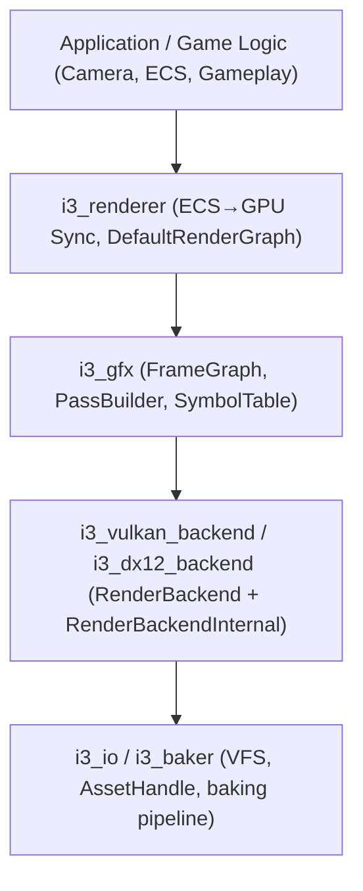
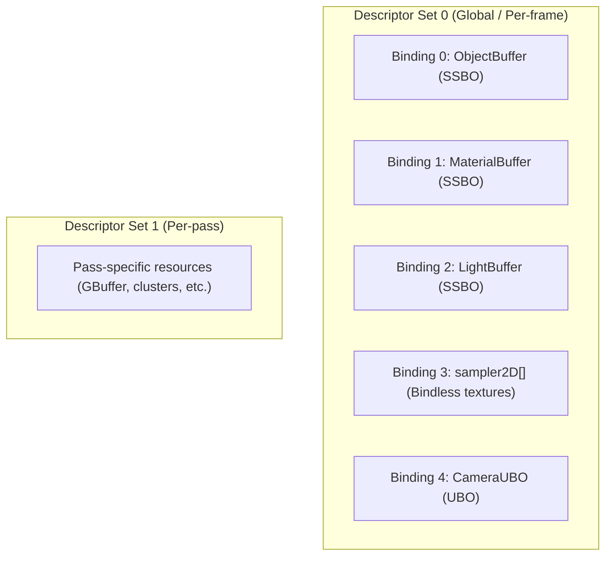

# i3 Renderer — Default Render Graph Design

## Overview

The **i3 Renderer** (`i3_renderer`) is a crate that builds on top of `i3_gfx` (FrameGraph) and provides the engine's default render pipeline: **Deferred Clustered Shading**.

It is a **consumer** of the FrameGraph API — not a modification of it. The renderer records its passes into a `FrameGraph` each frame, leveraging the existing declare/compile/execute pipeline, symbol table, transient resources, and automatic synchronization.

### Design Goals

1. **Data-Oriented**: GPU-driven scene. Transforms, materials, and draw commands live in persistent GPU buffers. CPU uploads delta changes per frame.
2. **Clustered Shading** (Infinity Ward X×Y+Z): Screen-space tile grid (X×Y) with logarithmic depth slicing (+Z). Light assignment via compute.
3. **ECS-Driven**: Scene data lives in the ECS. GPU synchronization is a generic pass group that extracts components and streams them to GPU buffers — no monolithic `GpuScene` object.
4. **Extensible**: The graph is assembled from composable pass groups. RT shadows, GI, decals, particles, and advanced post-processing can be inserted without restructuring.
5. **Zero Abstraction Leak**: The renderer never calls `RenderBackendInternal` directly — it uses `PassBuilder`/`PassContext` exclusively.

---

## Layer Architecture


```mermaid
graph TD
    A["Application / Game Logic (Camera, ECS, Gameplay)"]
    B["i3_renderer (ECS→GPU Sync, DefaultRenderGraph)"]
    C["i3_gfx (FrameGraph, PassBuilder, SymbolTable)"]
    D["i3_vulkan_backend / i3_dx12_backend (RenderBackend + RenderBackendInternal)"]
    E["i3_io / i3_baker (VFS, AssetHandle, baking pipeline)"]

    A --> B
    B --> C
    C --> D
    D --> E
```

`i3_renderer` depends on `i3_gfx` (for FrameGraph API) and `i3_slang` (for shader compilation). It does **not** depend on any specific backend crate.

---

## Scene ↔ GPU Sync Model

### Principle

The renderer does **not** own the scene. It observes it through the `SceneProvider` trait, which the application implements. The renderer calls `sync()` each frame, then assembles the render graph.

> **Note**: L'intégration ECS n'est pas implémentée. L'application fournit directement une implémentation de `SceneProvider` (ex: `BasicScene` dans `examples/common`). Il n'y a pas de `EcsBridge`.

```rust
/// Trait that the application implements to feed scene data to the renderer.
pub trait SceneProvider {
    fn iter_mesh_descriptors(&self, backend: &mut dyn RenderBackend)
        -> impl Iterator<Item = (u32, GpuMeshDescriptor)>;
    fn iter_instances(&self)   -> impl Iterator<Item = GpuInstanceData>;
    fn iter_materials(&self)   -> impl Iterator<Item = (u32, MaterialData)>;
    fn iter_lights(&self)      -> impl Iterator<Item = (LightId, &LightData)>;
    fn iter_blas_instances(&self) -> impl Iterator<Item = TlasInstanceDesc>;
    // ...
}
```

### The Sync Pass Group (`SyncGroup`)

A series of FrameGraph passes that upload CPU scene deltas to GPU buffers each frame:

1. **MeshRegistrySyncPass**: Streams mesh descriptors (BDA, AABB) into `MeshDescriptorBuffer` via staging + `copy_buffer`.
2. **InstanceSyncPass**: Streams instance data (transform, prev_transform, mesh_idx, material_id) into `InstanceBuffer`.
3. **MaterialSyncPass**: Streams material data into `MaterialBuffer`.
4. **LightSync** (inline, no dedicated pass): Uploads `GpuLightData` array into `LightBuffer` via mapped write.
5. **BlasUpdatePass** [RT-gated]: Builds newly created BLAS from `accel_struct_system.blas_cache`.
6. **TlasRebuildPass** [RT-gated]: Rebuilds TLAS from all active BLAS instances + dirty-checked instance list.

> **Ordering invariant**: BlasUpdatePass → TlasRebuildPass → shader passes. Handled by the frame graph's AS dependency tracking (SYNC-06).

> **Not implemented**: Skinning compute, per-frame BLAS rebuild for deformed meshes.

---

## GPU Buffer Layout

### Core Buffers (Persistent SSBOs)

| Buffer | Content | Upload Strategy |
|---|---|---|
| **MeshDescriptorBuffer** | BDA + AABB + stride par mesh | Staging + copy si dirty |
| **InstanceBuffer** | `world_transform`, `prev_transform`, `mesh_idx`, `material_id` | Staging + copy si dirty |
| **MaterialBuffer** | `base_color_factor`, `emissive`, `metallic`, `roughness`, `tex_indices` | Staging + copy si dirty |
| **LightBuffer** | `position`, `radius`, `color`, `intensity`, `direction`, `light_type` | Mapped write chaque frame |
| **DrawCommandBuffer** | `VkDrawIndexedIndirectCommand` (5×u32) par instance | Écrit par DrawCallGenPass compute |
| **CommonBuffer** | UBO : matrices VP, inv_VP, prev_VP, screen size, camera pos, near/far | Mapped write chaque frame |
| **ExposureBuffer** | `current_exposure` (f32) — EMA avec history | Écrit par AverageLuminancePass |

> **Non implémenté** : SkinningBuffer, BindPoseBuffer.

### Bindless Resource Model

All textures are referenced by index into a global descriptor array (descriptor indexing, Vulkan 1.2+). Materials store texture **indices**, not handles.


```mermaid
graph TD
    subgraph Set0 ["Descriptor Set 0 (Global / Per-frame)"]
        B0["Binding 0: ObjectBuffer (SSBO)"]
        B1["Binding 1: MaterialBuffer (SSBO)"]
        B2["Binding 2: LightBuffer (SSBO)"]
        B3["Binding 3: sampler2D[] (Bindless textures)"]
        B4["Binding 4: CameraUBO (UBO)"]
    end

    subgraph Set1 ["Descriptor Set 1 (Per-pass)"]
        P["Pass-specific resources (GBuffer, clusters, etc.)"]
    end
```

> [!NOTE]
> Set 0 convention is enforced by `i3_renderer`, not by the FrameGraph layer. The FrameGraph remains convention-agnostic.

---

## Render Graph Structure

Passes enregistrées par frame (état actuel — 2026-05-21) :

```
SyncGroup
  ├─ MeshRegistrySyncPass      CPU→GPU: MeshDescriptorBuffer (BDA, AABB)
  ├─ InstanceSyncPass          CPU→GPU: InstanceBuffer (transform, material_id)
  ├─ MaterialSyncPass          CPU→GPU: MaterialBuffer
  ├─ LightSync (inline)        CPU→GPU: LightBuffer
  ├─ BlasUpdatePass [RT]       GPU: build new BLAS
  └─ TlasRebuildPass [RT]      GPU: rebuild TLAS

DrawCallGenPass                  GPU compute: frustum+backface cull → DrawCommandBuffer

GBufferPass                      Raster: albedo/normal/roughmetal/emissive/depth

ClusterBuildPass                 Compute: cluster AABB from depth min/max
LightCullPass                    Compute: light→cluster assignment

HiZBuildPass                     Compute: hierarchical Z (multi-dispatch)

AoGroup (GTAO ou RTAO)
  ├─ GtaoPass / RtaoPass       Compute/RT: raw AO noisy
  └─ GtaoTemporalPass / RtaoTemporalPass   Compute: EMA temporal accumulation

SssrPass                         Compute: stochastic SSR sample + TAA history

HdrMipGenPass                    Compute: HDR mip chain (pour bloom + SPD)

BloomGroup
  ├─ BloomDownPass
  ├─ BloomUpPass
  └─ BloomCompositePass

HistogramBuildPass               Compute: log-luminance histogram (256 bins)
AverageLuminancePass             Compute: average luminance + exposure EMA

DeferredResolvePass              Graphics (fullscreen): PBR + clustered lights + AO + RT shadows
SkyPass                          Compute: sky + atmosphere

TonemapPass                      Graphics (fullscreen): tonemap + bloom + FXAA

DebugDrawPass                    Graphics: wireframe/gizmos (debug only)
EguiPass                         Graphics: UI
```

**Passes non encore implémentées** (dans `workplan.md`) :
- ZPrePass — pas de depth pre-pass, l'overdraw n'est pas optimisé
- ForwardTransparent — pas de transparents
- GPU frustum culling en deux passes — `DrawCallGenPass` fait uniquement frustum+backface, pas de HiZ occlusion culling
- Skinning compute + BLAS per-frame rebuild

---

## GBuffer Layout

| Target | Format | Content |
|---|---|---|
| GBuffer_Albedo | `R8G8B8A8_SRGB` | RGB = base color, A = AO |
| GBuffer_Normal | `R16G16_SFLOAT` | Octahedral-encoded world normals |
| GBuffer_RoughMetal | `R8G8_UNORM` | R = roughness, G = metallic |
| GBuffer_Emissive | `R11G11B10_SFLOAT` | Emissive color (RT emissive source) |
| DepthBuffer | `D32_SFLOAT` | Hardware depth |

---

## Clustered Shading — Infinity Ward X×Y+Z

### Cluster Grid

```
Grid: TILE_X × TILE_Y × NUM_DEPTH_SLICES
  TILE_X = ceil(screen_width / TILE_SIZE)    (TILE_SIZE = 64)
  TILE_Y = ceil(screen_height / TILE_SIZE)
  NUM_DEPTH_SLICES = 16   (CLUSTER_GRID_Z dans constants.rs)
  MAX_LIGHTS_PER_CLUSTER = 512
```

Depth slicing — logarithmic (Infinity Ward):
```
slice = floor(log2(z / z_near) * NUM_SLICES / log2(z_far / z_near))
```

### Compute Passes

1. **ClusterBuild**: Computes AABB for each cluster cell using depth buffer min/max per tile (subgroup/atomic reduction).
2. **LightCull**: Tests active lights against cluster AABBs. Outputs `ClusterLightList[cluster]` (offset+count) and `ClusterLightIndices[]` (flat light index list).

### Shader Access (Deferred Resolve)

```hlsl
uint3 cid = uint3(pixel.xy / TILE_SIZE, depthToSlice(depth));
uint flat = cid.x + cid.y * TILE_X + cid.z * TILE_X * TILE_Y;
uint offset = clusterLightList[flat].offset;
uint count  = clusterLightList[flat].count;

for (uint i = 0; i < count; i++) {
    Light light = lightBuffer[clusterLightIndices[offset + i]];
    // shade...
}
```

---

## Acceleration Structures

### BLAS / TLAS Management (implémenté)

- **Static meshes**: BLAS est build lors du chargement via `backend.create_blas()`. Le handle est stocké dans `AccelStructSystem.blas_cache`.
- **TLAS**: Rebuild par frame si la liste d'instances change (dirty check). `TlasRebuildPass` compare `instances` vs `instances_cache`.
- **Ordering**: `BlasUpdatePass` → `TlasRebuildPass` → shader passes. Garanti par les dépendances AS dans le frame graph (SYNC-06 corrigé).

> **Non implémenté** : Skinning compute. Les BLAS skinned (rebuild per-frame depuis le buffer skinné) ne sont pas supportés.

> **Capability-gated** : si `backend.capabilities().ray_tracing == false`, les passes BlasUpdate et TlasRebuild ne sont pas ajoutées au graph, et le deferred resolve n'utilise pas les RT shadows.

---

## Asset Pipeline Integration

### Mesh Assets (`i3_io` + `i3_baker`)

Mesh data flows through the existing asset pipeline:

```
Source (.gltf, .obj)
    │
    ▼ (i3_baker)
Baked Asset (.i3b)
  ├── vertex data (GPU-ready layout)
  ├── index data
  ├── sub-mesh table
  ├── material refs (UUIDs)
  └── bind pose + bone hierarchy (if skinned)
    │
    ▼ (i3_io AssetLoader)
AssetHandle<Mesh>
    │
    ▼ (i3_renderer)
Sub-allocated into MeshPool + BLAS built
```

**Key design constraint**: The baked mesh format must produce GPU-ready vertex data (position, normal, tangent, UV) in the layout expected by the renderer's shaders. The baker is responsible for vertex format conversion, tangent generation, and index optimization.

### Texture Assets

```
Source (.png, .hdr, .exr)
    │
    ▼ (i3_baker)
Baked Texture (.i3b)
  ├── BCn/ASTC compressed mipmaps
  └── metadata (format, dimensions, mip count)
    │
    ▼ (i3_io AssetLoader)
AssetHandle<Texture>
    │
    ▼ (i3_renderer)
Uploaded to GPU, registered in bindless texture array → texture_index
```

### Material Assets

Materials reference textures by **asset UUID**, resolved at load time to bindless indices. The `MaterialBuffer` GPU layout stores indices, not handles.

---

## Crate Structure

```
crates/
  i3_renderer/
    src/
      lib.rs
      scene.rs             // SceneProvider trait, ObjectData, LightData
      gpu_buffers.rs        // Persistent GPU buffer management
      render_graph.rs       // DefaultRenderGraph assembly
      passes/
        mod.rs
        sync.rs             // ObjectSync, LightSync
        skinning.rs         // SkinningCompute
        accel_struct.rs     // BLASUpdate, TLASRebuild [RT-gated]
        gpu_cull.rs
        z_prepass.rs
        gbuffer.rs
        cluster_build.rs
        light_cull.rs
        deferred_resolve.rs
        forward.rs
        tonemap.rs
      shaders/
        skinning.slang
        gpu_cull.slang
        z_prepass.slang
        gbuffer.slang
        cluster_build.slang
        light_cull.slang
        deferred_resolve.slang
        forward.slang
        tonemap.slang
```

---

## API Surface (implémentée)

```rust
/// The application implements this to feed scene data to the renderer.
pub trait SceneProvider {
    fn iter_mesh_descriptors(&self, backend: &mut dyn RenderBackend)
        -> Box<dyn Iterator<Item = (u32, GpuMeshDescriptor)> + '_>;
    fn iter_instances(&self)   -> Box<dyn Iterator<Item = GpuInstanceData> + '_>;
    fn iter_materials(&self)   -> Box<dyn Iterator<Item = (u32, MaterialData)> + '_>;
    fn iter_lights(&self)      -> Box<dyn Iterator<Item = (LightId, &LightData)> + '_>;
    fn iter_blas_instances(&self) -> Box<dyn Iterator<Item = TlasInstanceDesc> + '_>;
    fn sun(&self)              -> LightData;
    fn light_count(&self)      -> usize;
    fn mesh(&self, id: u32)    -> &Mesh;
}

pub struct DefaultRenderGraph { ... }

impl DefaultRenderGraph {
    pub fn new(backend: &mut dyn RenderBackend, config: RenderConfig) -> Self;

    /// CPU sync: upload scene deltas to GPU, rebuild AS if needed.
    pub fn sync(&mut self, backend: &mut dyn RenderBackend,
                window: WindowHandle, scene: &dyn SceneProvider);

    /// Per-frame render: declare, compile, execute.
    pub fn render(&mut self, backend: &mut dyn RenderBackend,
                  window: WindowHandle, scene: &dyn SceneProvider);
}
```

Usage from the application (example from `examples/viewer`) :

```rust
fn on_frame(&mut self, backend: &mut dyn RenderBackend) {
    self.render_graph.sync(backend, self.window, &self.scene);
    self.render_graph.render(backend, self.window, &self.scene);
}
```

---

## État d'implémentation (2026-05-21)

| Phase | Description | État |
|---|---|---|
| Sync CPU→GPU | MeshRegistry, Instance, Material, Light, BLAS/TLAS | ✅ Implémenté |
| GBuffer | Indirect draw, albedo/normal/roughmetal/emissive/depth | ✅ Implémenté |
| Clustered shading | Cluster build + light cull + deferred resolve | ✅ Implémenté |
| AO | GTAO + temporal accumulation, RTAO + temporal [RT] | ✅ Implémenté |
| SSR | SSSR stochastique avec history TAA | ✅ Implémenté |
| Bloom | Jimenez dual-pass down/up + composite | ✅ Implémenté |
| Exposition | Histogramme log-lum + EMA auto-exposure | ✅ Implémenté |
| Sky | Sky pass (atmosphere) | ✅ Implémenté |
| Tonemap + FXAA | ACES/filmic + anti-aliasing | ✅ Implémenté |
| Debug | DebugDrawPass, GUI egui | ✅ Implémenté |
| ZPrePass | Depth pre-pass avant GBuffer | ❌ Non implémenté |
| Forward transparent | Transparents + sorted blend | ❌ Non implémenté |
| GPU occlusion culling | HiZ 2nd-pass cull | ❌ Non implémenté (frustum+backface seulement) |
| Skinning | Compute skinning + BLAS rebuild | ❌ Non implémenté |
| GI / probes | DDGI, RT GI | ❌ Non implémenté |
