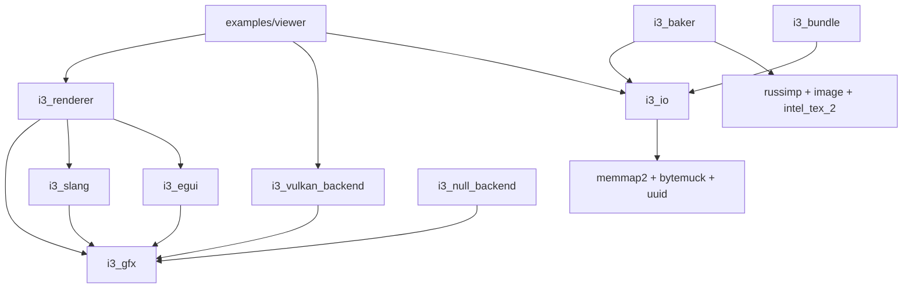

# i3 Engine -- Project Review & Action Plan

> **Date:** 2026-03-12 | **Mise à jour:** 2026-03-17
> **Scope:** Revue complete du workspace, analyse code vs design, plan d'action segmente.
> **Rev:** 3 -- Sampler/Mipmapping fix, i3_egui integration, DebugViz depth+channel fix, PresentPass refactor, Push Descriptor removal

---

## Table of Contents

1. [Project Overview](#1-project-overview)
2. [Crate-by-Crate Review](#2-crate-by-crate-review)
3. [Design vs Implementation Gaps](#3-design-vs-implementation-gaps)
4. [Cross-Cutting Concerns](#4-cross-cutting-concerns)
5. [Tooling & Agent Skills](#5-tooling--agent-skills)
6. [Action Plan](#6-action-plan)

---

## 1. Project Overview

The i3 engine is a Rust 2024 workspace targeting high-end desktop rendering with Vulkan 1.3. It implements a Frostbite-inspired Frame Graph pattern with deferred clustered shading.

### Workspace Members

| Crate | Role | LOC approx | Maturity |
|---|---|---|---|
| `i3_gfx` | Frame Graph core, HRI abstraction | ~2500 | Functional |
| `i3_vulkan_backend` | Vulkan 1.3 implementation | ~5500 | Functional |
| `i3_null_backend` | Validation oracle | ~550 | Basic |
| `i3_slang` | Slang shader compiler wrapper | ~560 | Functional |
| `i3_renderer` | Deferred clustered shading | ~4000 | Functional but incomplete |
| `i3_io` | VFS, binary formats, asset loading | ~1200 | Functional |
| `i3_baker` | Asset baking pipeline | ~1600 | Functional |
| `i3_egui` | Egui UI integration layer | ~350 | MVP |
| `i3_bundle` | CLI bundle inspector | ~130 | Basic |
| `examples/` | draw_triangle, compute_mandelbrot, deferred_stress, viewer | ~1400 | Working |

### Dependency Graph



---

## 2. Crate-by-Crate Review

### 2.1 i3_gfx

**Files:** `graph/mod.rs`, `graph/backend.rs`, `graph/compiler.rs`, `graph/pass.rs`, `graph/pipeline.rs`, `graph/types.rs`, `graph/temporal.rs`

#### Strengths
- Solid Declare/Compile/Execute pattern in `compiler.rs`
- Scoped Symbol Table with parent scope resolution
- Type-safe handles: `ImageHandle`, `BufferHandle`, `PipelineHandle` backed by `SymbolId`
- `RenderPass` trait with `init/record/execute` lifecycle
- `PassBuilder` API is clean and ergonomic -- `publish/consume` for CPU data, `read_image/write_image` for GPU intents
- `TemporalRegistry` for double-buffered N/N-1 resources
- Comprehensive pipeline types: rasterization, blend, depth/stencil, vertex input, etc.
- `PassContextExt` trait provides typed push constant helper

#### Issues

| ID | File | Line | Severity | Description |
|---|---|---|---|---|
| GFX-01 | `backend.rs` | 27-34 | Medium | `GraphicsPipelineDescDummy` is a named placeholder with a `dummy: u32` field. Dead code, should be removed. |
| GFX-02 | `compiler.rs` | 13-25 | Low | `SyncPtr<T>` wrapper is defined but `SyncPtr::{}` impl block is empty. Dead code. |
| GFX-03 | `compiler.rs` | -- | High | File is 1029 lines. The `FrameGraph`, `PassRecorder`, `CompiledGraph`, `SymbolTable`, and `NodeStorage` are all in one file. Should be split. |
| GFX-04 | `compiler.rs` | 178 | Medium | `consume_erased` panics on missing symbol instead of returning `Result`. Fragile at runtime. |
| GFX-05 | `types.rs` | 300+ | Low | `ResourceUsage` bitflags and `SamplerDesc` are at the end of a 384-line file. Consider a dedicated `sampler.rs` or keep grouped. |
| GFX-06 | Design gap | -- | Info | No memory aliasing implemented. Design doc describes lifetime intervals and memory pools but compiler does not generate an `AliasingPlan`. |
| GFX-07 | Design gap | -- | Info | No multi-queue support. Design doc describes async compute/transfer with timeline semaphores, but execution is single-queue. |
| GFX-08 | Design gap | -- | Info | No dead node elimination. Design doc describes culling unused symbols, but all declared passes execute. |

### 2.2 i3_vulkan_backend

**Files:** `backend.rs` (3820 LOC), `device.rs`, `instance.rs`, `swapchain.rs`, `window.rs`, `convert.rs`

#### Strengths
- `ResourceArena<T>` with generational indices -- correct insert/get/remove with generation validation
- Full Vulkan 1.3 usage: dynamic rendering, synchronization2, timeline semaphores
- Bindless descriptor management with unbounded descriptor arrays
- Transient resource pooling with `create_transient_image/buffer` and `release_transient_image/buffer`
- Image/buffer synchronization state tracking per-resource: `last_layout`, `last_access`, `last_stage`
- Negative viewport for Y-flip as per `engine_conventions.md`

#### Issues

| ID | File | Line | Severity | Description |
|---|---|---|---|---|
| VK-01 | `backend.rs` | -- | **High** | 3820 LOC in a single file. Monolithic and not clear. Must split into at least: resource management, command recording, pipeline creation, descriptor management, submission. **User confirmed priority.** |
| VK-02 | `backend.rs` | -- | Medium | Debug object naming via `set_buffer_name`/`set_image_name` only in `#[cfg(debug_assertions)]`. Should be unconditional in Debug builds. |
| VK-03 | `convert.rs` | -- | Low | Format conversion module exists but may not cover all `Format` variants added since initial implementation. Needs audit. |

### 2.3 i3_null_backend

**Files:** `lib.rs` (537 LOC), `tests.rs`

#### Strengths
- Implements both `RenderBackend` and `RenderBackendInternal` traits
- Validation via `ValidationError` enum
- Tracks allocated images/buffers/pipelines in `HashSet<u64>`

#### Issues

| ID | File | Line | Severity | Description |
|---|---|---|---|---|
| NB-01 | `lib.rs` | -- | Medium | `ValidationError` enum has only 2 variants. Should validate: undeclared resource access, double-free, use-after-destroy. |
| NB-02 | `lib.rs` | -- | Medium | No barrier validation. Could log and verify transition correctness. |
| NB-03 | `tests.rs` | -- | Low | Test coverage is minimal. Should mirror graph_test.rs scenarios. |

### 2.4 i3_slang

**Files:** `lib.rs` (564 LOC), `tests/slang_compiler.rs`

#### Strengths
- Clean Slang global session lifecycle
- Full reflection: entry points, bindings, push constants, thread group sizes
- Binding deduplication with `HashMap<(u32, u32), Binding>`
- Texture + Sampler -> CombinedImageSampler merging
- Handles push constant extraction from `PushConstantBuffer` category

#### Issues

| ID | File | Line | Severity | Description |
|---|---|---|---|---|
| SL-01 | `lib.rs` | 9-10 | Trivial | Duplicate comment: `// Re-export types from i3_gfx for convenience` appears twice. |
| SL-02 | `lib.rs` | 158 | Trivial | Empty line between `(ty, count)` -- minor formatting. |
| SL-03 | Design gap | -- | Info | `ShaderTarget` only supports `Spirv`. DXIL variant should be added when DX12 backend starts. |

### 2.5 i3_renderer

**Files:** `render_graph.rs` (644 LOC), `scene.rs`, `bindless.rs`, `gpu_buffers.rs`, `passes/` (10 files), `groups/` (2 files)

#### Implemented Passes

| Pass | Type | Status |
|---|---|---|
| SyncGroup - ObjectSync + MaterialSync | CPU to GPU | Working |
| GBufferPass | Graphics | Working |
| SkyPass | Graphics | Working |
| ClusterBuildPass | Compute | Working |
| LightCullPass | Compute | Working |
| DeferredResolvePass | Compute | Working |
| HistogramBuildPass | Compute | Working |
| AverageLuminancePass | Compute | Working |
| TonemapPass | Graphics | Working |
| DebugVizPass | Graphics | Working -- depth channel added, DebugChannel now explicit u32 values |
| EguiPass | Graphics | MVP -- font atlas only, no scissor |
| PresentPass | Utility | Working -- separated from TonemapPass |

#### Strengths
- `SceneProvider` trait decouples renderer from scene ownership -- ECS-ready
- `BindlessManager` with physical texture registry
- `GpuBuffers` for persistent Object/Material/Light/Camera buffers
- `CommonData` published to symbol table for cross-pass sharing
- `DefaultRenderGraph` orchestrates the full pipeline
- Debug visualization with switchable channels

#### Issues

| ID | File | Line | Severity | Description |
|---|---|---|---|---|
| RN-01 | `render_graph.rs` | 67-83 | Medium | `Arc<Mutex<T>>` sur chaque pass encore présent. Per-frame handles toujours stockés comme champs publics de la pass struct. La refactor complète (P3) n'est pas encore faite. |
| RN-02 | `render_graph.rs` | -- | High | Normal mapping not used in deferred resolve. Shader reads GBuffer normal but no tangent-space normal map sampling. |
| RN-03 | `gpu_buffers.rs` | 33-34 | Medium | Buffer sizes are magic numbers: `1024 * 64`. Should be computed from `MAX_OBJECTS` / `MAX_MATERIALS` constants with proper struct sizes. |
| RN-04 | Design gap | -- | High | No GPU culling pass. Design doc describes `GPUCull` compute pass writing `DrawCommandBuffer`, but current implementation uses CPU-side draw commands. |
| RN-05 | Design gap | -- | High | No ZPrePass. Design doc shows it before GBuffer, but it is not implemented. |
| RN-06 | Design gap | -- | Medium | No forward transparency pass. Design doc describes `ForwardTransparent` in `ForwardGroup`. |
| RN-07 | Design gap | -- | Info | No RT support - BLASUpdate, TLASRebuild, RTShadows. Expected -- marked as future in design. |
| RN-08 | `bindless.rs` | 84 | Low | `get_texture_index` uses `image.0.0` which assumes ImageHandle maps directly to physical ID. Fragile. |
| RN-09 | `scene.rs` | 56-62 | Low | `LightData` uses `nalgebra_glm::Vec3` which is not `repr(C)` compatible for GPU upload without padding. |
| **RN-10** | `render_graph.rs` | ALL | **Critical** | **Render Graph ergonomics are poor.** See dedicated section 2.5.1 below. |
| RN-11 | `render_graph.rs` | 82 | Medium | `pub egui: Arc<EguiIntegration>` exposé directement depuis `DefaultRenderGraph`. Couplage fort renderer/UI. Egui devrait être une abstraction optionnelle (trait `DebugUiProvider` ?) ou injectable depuis l'extérieur. |
| RN-12 | `passes/debug_viz.rs` | 93-103 | Low | Mapping `u32 -> DebugChannel` dans `record()` duplique l'info already in the enum discriminants. Utiliser `transmute` sécurisé ou une table explicite. |

#### 2.5.1 Render Graph Ergonomics -- Architectural Issue

**User feedback:** "There is a mix of closures and trait declarations that is not simple at all. The architecture needs rework and clarification."

**Observed problems:**

1. **Two incompatible pass definition patterns:**
   - Struct-based: `impl RenderPass for MyPass { fn record(); fn execute(); }` -- used for all persistent passes
   - Closure-based: `add_pass_from_closures("name", |builder| {...}, |ctx| {...})` -- available but rarely used
   - This creates cognitive overhead: which pattern to use and when?

2. **`Arc<Mutex<T>>` everywhere in `DefaultRenderGraph`:**
   ```rust
   // render_graph.rs lines 49-56 -- every pass is wrapped
   pub gbuffer_pass: Arc<Mutex<GBufferPass>>,
   pub sky_pass: Arc<Mutex<SkyPass>>,
   pub sync_group: Arc<Mutex<SyncGroup>>,
   pub clustering_group: Arc<Mutex<ClusteringGroup>>,
   pub deferred_resolve_pass: Arc<Mutex<DeferredResolvePass>>,
   pub post_process_group: Arc<Mutex<PostProcessGroup>>,
   pub debug_viz_pass: Arc<Mutex<DebugVizPass>>,
   ```
   This is pure noise. Passes never actually run in parallel -- the graph is recorded sequentially.

3. **Dummy handles at init, mutation via lock before add_pass:**
   Every pass is constructed with `ImageHandle(SymbolId(0))` then mutated each frame:
   ```rust
   // render_graph.rs lines 365-377
   {
       let mut pass = self.gbuffer_pass.lock().unwrap();
       pass.depth_buffer = depth;
       pass.gbuffer_albedo = albedo;
       // ... 5 more field assignments
   }
   builder.add_pass(self.gbuffer_pass.clone());
   ```
   This lock-mutate-add pattern repeats for EVERY pass. The `record()` method is 170 lines of this boilerplate.

4. **Unsafe transmute for SceneProvider:**
   ```rust
   // render_graph.rs line 456
   let scene_ptr = unsafe { std::mem::transmute::<*const dyn SceneProvider,
       *const (dyn SceneProvider + 'static)>(scene as *const _) };
   ```
   This is a safety hazard to work around the symbol table's `'static` requirement.

5. **Pass structs store resource handles as public fields:**
   Each pass has 5-11 public `ImageHandle`/`BufferHandle` fields that are set externally BEFORE recording. This is the root cause of the dummy-handle and lock-mutate patterns. Passes should resolve resources from the symbol table during `record()`, not have them pre-set.

6. **No clear separation between persistent and per-frame state in passes:**
   Every pass struct mixes two fundamentally different categories of data:
   ```rust
   pub struct DeferredResolvePass {
       // PER-FRAME resources -- change every frame, resolved from graph
       pub hdr_target: ImageHandle,        // Set before each record()
       pub gbuffer_albedo: ImageHandle,    // Set before each record()
       pub gbuffer_normal: ImageHandle,    // Set before each record()
       // ... 8 more per-frame handles

       // PERSISTENT resources -- created once, survive across frames
       shader: Option<ShaderModule>,       // Compiled in init()
       pipeline: Option<BackendPipeline>,  // Created in init()
       sampler: SamplerHandle,             // Passed at construction
   }
   ```
   This confusion is the root of all ergonomic problems. It forces `Arc<Mutex<T>>` (to mutate per-frame fields), dummy handles (persistent struct needs construction before per-frame handles exist), and the lock-mutate pattern (setting per-frame fields on a persistent struct).

   **Future concern:** When pipelines are loaded from `i3_io` (baked pipeline assets) instead of compiled at startup, the persistent state management needs to be even cleaner. The `init()` lifecycle must support loading from bundles.

**Proposed solution direction:**

The fix is a **clear separation of persistent vs per-frame state:**

- **Persistent state** (pipelines, shaders, samplers) stays in the pass struct. Initialized in `init()`, currently via `SlangCompiler`, later from baked `i3pipeline` assets via `i3_io`.
- **Per-frame state** (resource handles) is resolved from the symbol table by NAME during `record()`. No public handle fields needed.

This eliminates:
- Dummy handles at init (per-frame handles no longer stored)
- `Arc<Mutex<T>>` wrappers (no per-frame mutation of persistent struct)
- The lock-mutate-add boilerplate (handles resolved in record, not pre-set)
- The unsafe transmute (SceneProvider goes through a different channel, not the blackboard)

Example of the target API:
```rust
// Pass struct holds ONLY persistent state
struct DeferredResolvePass {
    // Persistent -- survives across frames
    shader: Option<ShaderModule>,
    pipeline: Option<BackendPipeline>,
    sampler: SamplerHandle,
}

impl RenderPass for DeferredResolvePass {
    fn init(&mut self, backend: &mut dyn RenderBackend) {
        // Today: compile from source
        self.shader = Some(compile_shader("deferred_resolve.slang"));
        self.pipeline = Some(backend.create_compute_pipeline(...));

        // Future: load from baked bundle
        // let asset = loader.load::<PipelineAsset>("deferred_resolve");
        // self.pipeline = Some(backend.create_pipeline_from_asset(&asset));
    }

    fn record(&mut self, builder: &mut PassBuilder) {
        // Per-frame: resolved from symbol table by name
        let hdr = builder.resolve_image("HDR_Target");
        let albedo = builder.resolve_image("GBuffer_Albedo");
        let depth = builder.resolve_image("DepthBuffer");
        let lights = builder.resolve_buffer("LightBuffer");

        builder.read_image(albedo, ResourceUsage::SHADER_READ);
        builder.read_image(depth, ResourceUsage::SHADER_READ);
        builder.read_buffer(lights, ResourceUsage::SHADER_READ);
        builder.write_image(hdr, ResourceUsage::STORAGE_WRITE);
    }

    fn execute(&self, ctx: &mut dyn PassContext) {
        // Uses persistent pipeline + per-frame resources resolved during record
        ctx.bind_pipeline_raw(self.pipeline.unwrap());
        ctx.dispatch(x, y, 1);
    }
}

// DefaultRenderGraph: passes owned directly, no Arc<Mutex<T>>
struct DefaultRenderGraph {
    gbuffer_pass: GBufferPass,
    deferred_resolve_pass: DeferredResolvePass,
    // ...
}

// Graph assembly becomes simple and declarative
fn record(&mut self, graph: &mut FrameGraph, ...) {
    graph.record(|builder| {
        builder.publish("Common", common);
        builder.add_pass(&mut self.sync_group);
        builder.add_pass(&mut self.clustering_group);
        builder.add_pass(&mut self.gbuffer_pass);
        builder.add_pass(&mut self.sky_pass);
        builder.add_pass(&mut self.deferred_resolve_pass);
        builder.add_pass(&mut self.post_process_group);
    });
}
```

**Three categories of pass state -- the complete model:**

| Category | Where it lives | Lifecycle | Examples |
|---|---|---|---|
| **Persistent private** | Pass struct fields | Created in `init()`, survives across frames | Pipeline, ShaderModule, Sampler, CPU BVH, spatial cache |
| **Per-frame graph resources** | Symbol table, resolved by name | Created each frame by declaring passes | GBuffer textures, depth buffer, cluster buffers |
| **External systems** | Blackboard via `publish/consume` | Owned by app, published each frame | ECS world, SceneProvider, AssetLoader, camera |

Example: a culling pass with a persistent BVH that queries the ECS:
```rust
struct GpuCullPass {
    // Persistent: survives across frames
    pipeline: Option<BackendPipeline>,
    cpu_bvh: BvhTree,  // Complex persistent state
}

impl RenderPass for GpuCullPass {
    fn init(&mut self, backend: &mut dyn RenderBackend) {
        self.pipeline = Some(backend.create_compute_pipeline(...));
        self.cpu_bvh = BvhTree::new();
    }

    fn record(&mut self, builder: &mut PassBuilder) {
        // Access external system from blackboard
        let scene = builder.consume::<SceneSnapshot>("SceneSnapshot");
        self.cpu_bvh.update(scene.iter_spatials());

        // Per-frame resources resolved by name
        let objects = builder.resolve_buffer("ObjectBuffer");
        let commands = builder.resolve_buffer("DrawCommandBuffer");
        builder.read_buffer(objects, ResourceUsage::SHADER_READ);
        builder.write_buffer(commands, ResourceUsage::STORAGE_WRITE);
    }
}
```

**Technical issue: the `'static` bound on the blackboard.**
Currently the symbol table requires `T: 'static + Send + Sync` for published data. This forces `unsafe transmute` for references to external systems (like SceneProvider). Solutions:
- **Option A:** Publish external systems as `Arc<T>` (no lifetime issue, slight overhead)
- **Option B:** Add a dedicated `FrameContext` parameter alongside `PassBuilder` for non-owned external refs (cleaner, but more API surface)
- **Option C:** Make `PassBuilder` lifetime-parameterized to support borrowed data (complex but most correct)

**Recommendation:** Option A (`Arc<T>`) for simplicity. Most external systems (ECS world, scene snapshot) are naturally shareable. The app publishes `Arc<SceneSnapshot>` to the blackboard, passes consume it. No unsafe needed.

**Key API changes needed in i3_gfx:**
- `PassBuilder::resolve_image(name: &str) -> ImageHandle` -- looks up symbol table
- `PassBuilder::resolve_buffer(name: &str) -> BufferHandle` -- looks up symbol table
- `PassBuilder::add_pass(&mut self, pass: &mut impl RenderPass)` -- borrow instead of move/clone
- Resource names become well-known constants documented in `i3_renderer`

This is a significant refactor that touches `i3_gfx` (PassBuilder API) and `i3_renderer` (all passes rewritten). It should be planned carefully.

### 2.6 i3_io

**Files:** `lib.rs`, `asset.rs`, `vfs.rs`, `mesh.rs`, `scene_asset.rs`, `texture.rs`, `material.rs`, `error.rs`, `prelude.rs`

#### Strengths
- Clean binary format design with `AssetHeader` (64 bytes), `CatalogHeader`, `CatalogEntry` (128 bytes)
- All structures are `repr(C)` + `bytemuck::Pod` -- zero-copy ready
- VFS trait with `PhysicalBackend` and `BundleBackend`
- `BundleBackend` mmap-based with O(1) catalog entry lookup
- `MeshAsset` with multiple `VertexFormat` variants (static, UV, tangent, skinned)
- `SceneAsset` with string table for names
- `AssetLoader` with threaded loading and condvar-based `wait_loaded()`
- `Asset` trait with `ASSET_TYPE_ID` for type safety

#### Issues

| ID | File | Line | Severity | Description |
|---|---|---|---|---|
| IO-01 | `asset.rs` | 50-63 | High | `AssetHandle::get()` returns `&T` through raw pointer casting while holding mutex. Unsafe and could be UB if lock is dropped. Should use `Arc<T>` or parking_lot `MappedMutexGuard`. |
| IO-02 | `asset.rs` | 65-92 | High | `AssetHandle::wait_loaded()` same unsafe pattern. The returned reference outlives the `MutexGuard`. |
| IO-03 | `texture.rs` | 55-63 | Medium | `TextureAsset::load` uses manual unsafe pointer cast for header instead of `bytemuck::from_bytes` or `pod_read_unaligned`. Inconsistent with other assets. |
| IO-04 | `vfs.rs` | -- | Low | `BundleFile::as_slice` returns data starting at `offset` but ignores `AssetHeader` prefix. Caller must manually skip header. Could be clearer in API. |
| IO-05 | Review item | -- | Medium | 64KB alignment in `writer.rs` line 42 -- is this really required for mmap? OS page size is 4KB. 64KB is a DirectStorage recommendation but wastes space for small assets. Consider making alignment configurable (default 4KB, option for 64KB). |
| IO-06 | `material.rs` | 29 | Low | `MaterialHeader` has `_padding: [u8; 20]` -- comment says "Pad to 128 bytes or similar?" -- size should be validated with `static_assert`. |

### 2.7 i3_baker

**Files:** `pipeline.rs` (300 LOC), `writer.rs`, `importers/assimp_importer.rs` (803 LOC), `importers/image_importer.rs` (257 LOC), `error.rs`

#### Strengths
- Clean Importer -> Extractor architecture
- `AssimpImporter` with `MeshExtractor`, `SceneExtractor`, `MaterialExtractor`
- `ImageImporter` with BC7/BC5 compression via `intel_tex_2`, mipmap generation, sRGB handling
- `BundleBaker` integrates with Cargo `build.rs` for incremental baking (mtime-based)
- `BundleWriter` produces aligned `.i3b` blobs + `.i3c` catalogs
- Integration test covers full bake -> VFS -> load cycle

#### Issues

| ID | File | Line | Severity | Description |
|---|---|---|---|---|
| BK-01 | `pipeline.rs` | -- | Medium | `PipelineNode` trait is defined in the `pipeline.rs` prelude exports but never used by any actual pipeline. The `BundleBaker` only uses `Importer` + `add_asset`. Dead abstraction? **Review item from user.** |
| BK-02 | Design gap | -- | ~~Removed~~ | ~~No SQLite registry for true incremental builds.~~ **Decision:** SQLite is overkill. The resource list is declared in `build.rs`, the rebuild calculation is direct via mtime. Remove SQLite from the design spec entirely. Current mtime-based approach is sufficient. |
| BK-03 | Design gap | -- | Info | No `SlangImporter` / `PipelineExtractor` yet. Design doc describes baking pipelines as complete PSO state + SPIR-V. |
| BK-04 | Design gap | -- | Info | No `SkeletonExtractor` / `AnimationExtractor`. These are Phase 2/3 per design. |
| BK-05 | `assimp_importer.rs` | -- | Low | No tangent recalculation when Assimp provides `has_tangents = false` and vertex format is `POSITION_NORMAL_UV_TANGENT`. Falls back silently. |
| **BK-06** | `image_importer.rs` + `assimp_importer.rs` | -- | **High** | **All textures are baked as BC7 regardless of semantic.** Normal maps should use BC5_UNORM (2-channel, lighter, better quality for normals). The `ImageImporter` already supports BC5 compression, but the `AssimpImporter` always creates `ImageImporter` with `TextureImportOptions { format: BC7_SRGB, .. }`. Need semantic-aware format selection: albedo -> BC7_SRGB, normal -> BC5_UNORM, metallic-roughness -> BC5_UNORM or BC7_UNORM, emissive -> BC7_SRGB. |
| **BK-07** | `pipeline.rs` | -- | **Medium** | **No progress indicator during baking.** Sponza baking takes significant time with zero feedback. Cargo build scripts can emit `cargo:warning=...` for progress messages that Cargo displays in real-time. Should emit per-asset progress: `cargo:warning=[i3_baker] Baking mesh 3/47: Sponza_Wall...`. Also investigate `eprintln!` which Cargo forwards to stderr. |

### 2.8 i3_bundle

**Files:** `main.rs` (123 LOC)

#### Strengths
- Clean CLI with clap parser
- Pretty-printed table output with type name resolution
- Size formatting helper

#### Issues

| ID | File | Line | Severity | Description |
|---|---|---|---|---|
| BN-01 | Review item | -- | Medium | **User request:** Show fragmentation information -- gaps between entries, wasted padding bytes, total overhead percentage. |
| BN-02 | -- | -- | Low | No `compact` or `defragment` command. Could be useful for production bundles. |

### 2.9 Examples

#### Viewer - `examples/viewer/`
- Full pipeline: VFS -> AssetLoader -> BasicScene -> DefaultRenderGraph
- Loads baked scenes with meshes, materials, textures
- Camera controller with mouse look

| ID | File | Line | Severity | Description |
|---|---|---|---|---|
| EX-01 | `main.rs` | 184-188 | Medium | Texture format matching uses magic numbers (112, 111, 109). Should use `TextureFormat` enum values. |
| EX-02 | `main.rs` | 44 | Low | Hardcoded `near = 1.0` with commented-out dynamic calculation. |
| EX-03 | `basic_scene.rs` | 117 | Low | Hardcoded stride `48` for vertex data. Should derive from `VertexFormat`. |

---

## 3. Design vs Implementation Gaps

### 3.1 Frame Graph - `frame_graph_design.md` vs `i3_gfx`

| Feature | Design Status | Implementation Status | Priority |
|---|---|---|---|
| Declare/Compile/Execute | Documented | Implemented | -- |
| Scoped Symbol Table | Documented | Implemented | -- |
| Temporal History | Documented | Implemented | -- |
| Memory Aliasing | Documented | Not implemented | Medium |
| Dead Node Elimination | Documented | Not implemented | Low |
| Multi-Queue async compute | Documented | Not implemented | Low |
| Parallel Recording | Documented | Not implemented | Low |

### 3.2 Renderer - `renderer_design.md` vs `i3_renderer`

| Feature | Design Status | Implementation Status | Priority |
|---|---|---|---|
| GBuffer Pass | Documented | Implemented | -- |
| Clustered Shading | Documented | Implemented | -- |
| Deferred Resolve | Documented | Implemented - no normal mapping | High |
| Tonemap + Exposure | Documented | Implemented - histogram-based | -- |
| Bindless Resources | Documented | Implemented | -- |
| SceneProvider trait | Documented | Implemented | -- |
| GPU Culling | Documented | Not implemented | High |
| ZPrePass | Documented | Not implemented | High |
| Forward Transparency | Documented | Not implemented | Medium |
| Normal Mapping | Documented | Not implemented | High |
| RT Shadows | Documented | Not implemented | Future |
| Skinning Compute | Documented | Not implemented | Future |

### 3.3 Baker - `baker_design.md` vs `i3_baker`

| Feature | Design Status | Implementation Status | Priority |
|---|---|---|---|
| AssimpImporter | Documented | ✅ Implemented | -- |
| MeshExtractor | Documented | ✅ Implemented | -- |
| SceneExtractor | Documented | ✅ Implemented | -- |
| MaterialExtractor | Partially documented | ✅ Implemented | -- |
| ImageImporter/TextureExtractor | Documented | ✅ BC7/BC5/BC1/BC3, semantic format selection | -- |
| Semantic texture format selection | Not documented | ✅ Implemented (P1) | Done |
| PipelineImporter `.i3p` | Not documented | ✅ Implemented (P7) | Done |
| BundleBaker (build.rs integration) | Not documented | ✅ Implemented (P7) | Done |
| System bundle `assets/system.i3b` | Not documented | ✅ Generated par `i3_renderer/build.rs` | Done |
| ~~Incremental Builds via SQLite~~ | ~~Documented~~ | Supprimé -- mtime-based à la place | **Removed** |
| Build progress reporting | Not documented | ✅ Partiel -- `cargo:warning` par asset | Low |
| SkeletonExtractor | Documented | Not implemented | Future |
| AnimationExtractor | Documented | Not implemented | Future |

### 3.4 HLD - `engine_hld.md` vs Workspace

| Item | Doc Says | Actual | Action |
|---|---|---|---|
| Workspace structure | Missing i3_renderer, i3_io, i3_baker, examples | These crates exist | Update doc |
| Testing conventions | types.tests.rs pattern | No .tests.rs files exist in project | Either adopt or update doc |
| Incremental builds | SQLite registry | mtime-based | Update baker_design.md to remove SQLite |
| i3_dx12_backend | Listed as future | Not created | Keep as future |

---

## 4. Cross-Cutting Concerns

### 4.1 Safety & Soundness
- **IO-01/IO-02** are the most critical: `AssetHandle::get()` and `wait_loaded()` return references that may outlive the `MutexGuard`. This is potential UB. Fix: store loaded asset in `Arc<T>` and return `Arc<T>` from accessors.
- **GFX-04**: `consume_erased` panics on missing symbol. Should return `Result<&dyn Any, GraphError>`.
- **RN-10 line 456**: `unsafe transmute` of SceneProvider pointer to satisfy `'static` bound. Should be eliminated by the render graph ergonomics rework.

### 4.2 Code Organization
- **VK-01**: `backend.rs` at 3820 LOC is the largest file and the most monolithic. Split is user-confirmed priority.
- **GFX-03**: `compiler.rs` at 1029 LOC should be split (symbol table, node storage, pass recorder, compiled graph).
- **RN-10**: Render graph ergonomics need architectural rework (see section 2.5.1).

### 4.3 Testing
- Integration test for baker is good (`test_full_baking_pipeline`).
- Frame graph tests exist in `graph_test.rs` (558 LOC) with NullBackend -- good coverage.
- Missing: renderer-level tests with NullBackend, i3_io roundtrip tests, VFS unit tests.

### 4.4 Documentation Sync
- `engine_hld.md` workspace structure needs updating.
- `baker_design.md` must remove SQLite references, add semantic texture format selection.
- Testing conventions described but not adopted.
- Design docs for renderer and baker need implementation status annotations.

---

## 5. Tooling & Agent Skills

### 5.1 Existing Skills - `.agent/`
- `rust_diagnostics/` -- Rust cargo check/clippy automation
- `vulkan_diagnostics/` -- Vulkan validation layer analysis
- `workflows/rust_check.md` -- Cargo check workflow

### 5.2 Agent Productivity Issues - from user
- Model launches program twice: first `cargo run` (cannot interpret output), then rerun with grep. **Fix:** Update rules to always capture output in a single invocation.
- Same for Vulkan validation errors -- model should use the vulkan_diagnostics skill.
- Model tries Linux shell commands on Windows. **Fix:** Reinforce Windows-specific rules in `.agent/rules/general.md`.
- Model rules need update for these patterns.

---

## 6. Action Plan

Each section below is an independently executable work package. They are ordered by priority and dependency. Each task is scoped for a focused coding session.

### Phase 0 -- Housekeeping & Safety Fixes

#### P0-1: Fix AssetHandle unsoundness
- **Status:** ❌ Not done
- **Files:** `crates/i3_io/src/asset.rs`
- **What:** Replace unsafe pointer casting in `AssetHandle::get()` and `wait_loaded()` with `Arc<T>` storage. Once loaded, store `Arc<T>` and return `Arc<T>` clones. This eliminates the lifetime-vs-MutexGuard UB.
- **Test:** Existing `test_full_baking_pipeline` + new unit test for concurrent `wait_loaded()` calls.

#### P0-2: Fix TextureAsset::load unsafe
- **Status:** ❌ Not done
- **Files:** `crates/i3_io/src/texture.rs`
- **What:** Replace manual unsafe pointer cast (lines 55-63) with `bytemuck::pod_read_unaligned` to match `MeshAsset` and `SceneAsset` loading patterns.
- **Test:** Load a baked texture in integration test.

#### P0-3: Remove dead code in i3_gfx
- **Status:** ❌ Not done
- **Files:** `crates/i3_gfx/src/graph/backend.rs`, `crates/i3_gfx/src/graph/compiler.rs`
- **What:**
  - Remove `GraphicsPipelineDescDummy` struct (backend.rs:27-34).
  - Remove empty `SyncPtr<T>` (compiler.rs:13-25) or add a TODO if planned.
- **Test:** `cargo build` + `cargo test`.

#### P0-4: Fix duplicate comment in i3_slang
- **Status:** ❌ Not done
- **Files:** `crates/i3_slang/src/lib.rs`
- **What:** Remove duplicate `// Re-export types from i3_gfx for convenience` at line 10.

#### P0-5: Clean up magic numbers in viewer ✅
- **Status:** ✅ Done -- `TextureFormat` enum utilisé partout dans viewer. Formats BC1/BC3 ajoutés. Calcul de mip_size corrigé par format.

#### P0-6: Remove dead PipelineNode abstraction
- **Status:** ❌ Not done
- **Files:** `crates/i3_baker/src/pipeline.rs`, `crates/i3_baker/src/lib.rs`
- **What:** Remove `PipelineNode` trait if confirmed unused. Clean up prelude exports.

### Phase 1 -- Baker: Semantic Texture Format Selection ✅

#### P1-1: Add texture semantic enum to ImageImporter ✅
- **Status:** ✅ Done -- `TextureSemantic` enum (Albedo, Normal, MetallicRoughness, Emissive, Occlusion, Generic) et `TextureImportOptions` implémentés. Format par défaut selon le semantic.

#### P1-2: Update AssimpImporter to use semantic format selection ✅
- **Status:** ✅ Done -- `MaterialExtractor` passe le bon `TextureSemantic` pour chaque slot texture. Normal → BC5_UNORM, Albedo/Emissive → BC7_SRGB, MetallicRoughness → BC7_UNORM.

#### P1-3: Update viewer texture loading for format diversity ✅
- **Status:** ✅ Done -- Formats BC1, BC3, BC5, BC7 tous gérés. Calcul de mip_size correct par format (8 bytes/block pour BC1, 16 pour le reste).

### Phase 2 -- Baker: Build Ergonomics

#### P2-1: Add progress reporting to BundleBaker
- **Files:** `crates/i3_baker/src/pipeline.rs`
- **What:**
  - Implement a `ProgressReporter` trait to decouple the baker from Cargo's output format.
  - During `BundleBaker::execute()`, emit progress.
  - For `build.rs` usage, use `cargo:warning=` messages.
  - **Note on buffering:** Cargo buffers `build.rs` output by default. To see real-time progress, the user must run `cargo build -vv`.
  - **Future:** Consider a standalone `i3_baker` CLI tool for a better interactive experience outside of Cargo's build lifecycle.
- **Test:** Run `cargo build -vv` on viewer, observe real-time progress.

#### P2-2: Update baker_design.md
- **Files:** `doc/baker_design.md`
- **What:** Remove all references to SQLite registry. Document the mtime-based incremental approach as the design choice. Add section on semantic texture format selection. Add section on progress reporting.

### Phase 3 -- Render Graph Ergonomics Rework

This is the most impactful phase. It restructures how passes interact with the frame graph.

#### P3-1: Add `resolve_image` / `resolve_buffer` to PassBuilder ✅ (Partiel)
- **Status:** ✅ `resolve_image` et `resolve_buffer` existent déjà dans `PassBuilder`. Les passes les utilisent en `record()`. Les handles ne sont plus pré-settés depuis l'extérieur sur les passes standard.
- **Reste:** Formaliser les noms de ressources comme constantes publiques dans `i3_renderer`.

#### P3-2: Refactor renderer passes to use name-based resolution ✅ (Partiel)
- **Status:** ✅ Les passes utilisent `builder.resolve_image("GBuffer_Albedo")` etc. en `record()`. La résolution par nom est le pattern dominant.
- **Reste:** `Arc<Mutex<T>>` toujours présents dans `DefaultRenderGraph`. Les champs handles dans les passes sont maintenant locaux à `record()` mais le struct nécessite encore le `Arc<Mutex<T>>` pour être clonable dans le graph. Voir P3-3.

#### P3-3: Refactor DefaultRenderGraph to own passes directly
- **Status:** ✅ Done -- Les `Arc<Mutex<T>>` ont été supprimés. Les passes sont possédées directement par `DefaultRenderGraph`. `record()` est maintenant propre et utilise `add_pass(&mut self.pass)`. Le `unsafe transmute` du SceneProvider a été éliminé au profit d'une publication de données possédées sur le blackboard.
- **Files:** `crates/i3_renderer/src/render_graph.rs`
- **What:**
  1. Remove `Arc<Mutex<T>>` wrappers -- passes owned directly by `DefaultRenderGraph`
  2. `record()` becomes a clean sequence of `builder.add_pass()` calls
  3. Remove `unsafe transmute` of SceneProvider
  4. Target: `record()` should be ~30 lines instead of 200
- **Test:** Run viewer example, verify same visual output.

#### P3-4: Remove SimplePass / add_pass_from_closures
- **Status:** ✅ Done -- `SimplePass` et les helpers basés sur des closures ont été supprimés de `i3_gfx`. L'architecture est unifiée autour du trait `RenderPass`.
- **Files:** `crates/i3_gfx/src/graph/pass.rs`, `crates/i3_gfx/src/graph/compiler.rs`

### Phase 4 -- Vulkan Backend Segmentation

#### P4-1: Split backend.rs into sub-modules
- **Status:** ✅ Done -- `backend.rs` a été ramené à ~1400 LOC. Les structures de contexte de frame et de commande ont été déplacées vers `commands.rs`, et la création de ressources lourdes vers `resources.rs`. L'initialisation a été segmentée en méthodes privées (`init_bindless`, `init_frame_contexts`).
- **Files:** `crates/i3_vulkan_backend/src/backend.rs`, `crates/i3_vulkan_backend/src/commands.rs`, `crates/i3_vulkan_backend/src/resources.rs`
- **Test:** `cargo check` OK. Viewer s'exécute correctement.

#### P4-2: Supprimer les Push Descriptors
- **Status:** ❌ à faire -- Décision : **suppression complète**.
- **Contexte et rationale :**
  - Les Push Descriptors étaient censés éviter l'allocation de descriptor sets. Dans ce codebase, le pool est **reset à chaque frame** : l'allocation est O(1), pas de fragmentation, pas de free individuel. L'avantage des PD est nul.
  - Le code est **incohérent** : 3 fonctions sur 4 ont le bloc `/* ... */` commenté (PD désactivés), seule `create_compute_pipeline_from_baked` l'a actif. Comportement divergent non intentionnel.
  - La complexité se traduit par **deux paths dans `flush_descriptors`** (~130 lignes push vs ~35 lignes pool) maintenus en parallèle.
  - Le vrai levier perf pour le binding est de **ne binder que les sets qui changent** (rebind set 0 par frame, laisser set 1 statique) — indépendant du mécanisme.
- **Diff attendu :**
  - `pipeline_cache.rs` : supprimer `pushable_sets_mask` calcul + flag `PUSH_DESCRIPTOR_KHR` + blocs commentés (nettoyage des 4 fonctions)
  - `commands.rs` : supprimer la branche push dans `flush_descriptors()` (~130 lignes)
  - `resource_arena.rs` : supprimer le champ `pushable_sets_mask` de `PhysicalPipeline`
  - `device.rs` : supprimer `ash::khr::push_descriptor::Device` du struct + extension de la liste + `push_descriptor` loader
- **Test:** `cargo build` (pas de warnings) + run viewer, validation layer propre.

#### P4-3: Multi-GPU selection
- **Status:** ❌ Not done
- **Contexte :** `VulkanDevice::new()` sélectionne automatiquement le discrete GPU si présent, sinon premier GPU. `VulkanDevice::new_with_physical()` existe mais n'est jamais exposé en dehors du backend. Aucune option de sélection utilisateur, aucun listing des GPUs disponibles.
- **Use case immédiat :** machine avec iGPU AMD (APU) + GPU discrète NVIDIA/AMD. Permet de tester la compat engine sur deux drivers différents sans modifier le code.
- **Ce qu'il faut faire :**
  1. Ajouter `BackendConfig { gpu_index: Option<usize>, prefer_discrete: bool }` (ou `gpu_name_filter: Option<String>`)
  2. Exposer `VulkanBackend::enumerate_gpus() -> Vec<GpuInfo>` où `GpuInfo { index, name, device_type }`
  3. `VulkanBackend::new_with_config(config)` utilise `new_with_physical` avec le bon device
  4. Exposer via CLI flag `--gpu <index>` dans les examples (viewer, stress)
- **Non-objectifs :** multi-GPU simultané (mGPU), SLI/NVLink -- hors scope
- **Test:** Lancer viewer avec `--gpu 0` et `--gpu 1`, vérifier que le bon GPU est logé, valider qu'il n'y a pas de crash sur l'iGPU.

### Phase 5 -- Renderer: Normal Mapping

#### P5-1: Add tangent data to GBuffer
- **Status:** ❌ Not done
- **Files:** `crates/i3_renderer/assets/shaders/gbuffer.slang`, `crates/i3_renderer/src/passes/gbuffer.rs`
- **What:** Ensure vertex input includes tangent attribute (vec4). Update GBuffer vertex shader to pass tangent + bitangent to fragment shader. Store world-space normal from tangent-space normal map in GBuffer_Normal target.
- **Requires:** Baker already produces `POSITION_NORMAL_UV_TANGENT` format meshes. Phase 1 ensures normal maps use BC5.

#### P5-2: Sample normal map in deferred resolve
- **Status:** ❌ Not done
- **Files:** `crates/i3_renderer/assets/shaders/deferred_resolve.slang`, `crates/i3_renderer/src/passes/deferred_resolve.rs`
- **What:** Modify deferred resolve shader to use the reconstructed normal from GBuffer (which now includes tangent-space normal mapping from P5-1).
- **Test:** Visual verification with DamagedHelmet (has normal maps).

### Phase 6 -- Renderer: GPU-Driven Pipeline

#### P6-1: Implement ZPrePass
- **Files:** New `crates/i3_renderer/src/passes/zprepass.rs`, new shader `crates/i3_renderer/shaders/zprepass.slang`
- **What:** Create a minimal depth-only pass that runs before GBuffer. Writes to the shared `DepthBuffer`. GBuffer pass then uses depth test `Equal` with writes off.
- **Register in:** `crates/i3_renderer/src/passes/mod.rs`, `crates/i3_renderer/src/render_graph.rs`

#### P6-2: Implement GPU Culling - compute
- **Files:** New `crates/i3_renderer/src/passes/gpu_cull.rs`, new shader `crates/i3_renderer/shaders/gpu_cull.slang`
- **What:** Compute pass that reads `ObjectBuffer` + `CameraUBO`, performs frustum culling, writes `DrawCommandBuffer` (VkDrawIndexedIndirectCommand) + `VisibleCount`. GBuffer pass switches to `draw_indexed_indirect`.
- **Requires:** `DrawCommandBuffer` declared as a graph resource.

#### P6-3: Implement Draw Indirect support in backend
- **Files:** `crates/i3_gfx/src/graph/backend.rs` (add `draw_indexed_indirect` to `PassContext`), `crates/i3_vulkan_backend/src/backend.rs`
- **What:** Add `draw_indexed_indirect(buffer, offset, draw_count, stride)` to `PassContext` trait. Implement in Vulkan backend via `vkCmdDrawIndexedIndirect`.

### Phase 7 -- Baker: Pipeline Baking ✅

#### Flux end-to-end du baking

```
Source (.i3p RON + .slang)
    ↓  PipelineImporter::import()
        └─ lit PipelineConfig (RON)
        └─ SlangCompiler::compile_file() → ShaderModule { bytecode: Vec<u8>, reflection }
    ↓  PipelineImporter::extract()
        └─ GraphicsConfig::to_bakeable() → BakeableGraphicsPipeline (repr(C), Pod)
        └─ postcard::to_allocvec(reflection) → Vec<u8>
        └─ [PipelineHeader | BakeableGraphicsPipeline | reflection | SPIR-V]
    ↓  BundleWriter::add_bake_output()
        └─ écrit dans assets/system.i3b (blob)
        └─ écrit dans assets/system.i3c (catalog UUID → offset)

Runtime:
    VFS::open("system.i3b") + Catalog
    → vfs.load::<PipelineAsset>(uuid)
    → PipelineAsset::load() -- bytemuck::pod_read_unaligned, zero-copy header
    → backend.create_graphics_pipeline_from_baked(state, reflection, bytecode)
```

**Trigger :** `i3_renderer/build.rs` via `BundleBaker` (cargo build step). S'exécute si `.i3p` ou `.slang` plus récent que `system.i3c` (mtime check). Force rebuild : `FORCE_BAKE=1 cargo build`.

#### P7-1: Define i3pipeline binary format ✅
- **Status:** ✅ Done -- `crates/i3_io/src/pipeline_asset.rs` implémenté. `PipelineHeader` (64 bytes, Pod/Zeroable), `BakeableGraphicsPipeline` (état rasterization, depth/stencil, vertex layout, color targets), `PipelineType` (Graphics/Compute). `PipelineAsset::load()` par `bytemuck::pod_read_unaligned`. UUID enregistré.

#### P7-2: Implement PipelineImporter ✅
- **Status:** ✅ Done -- `crates/i3_baker/src/importers/pipeline_importer.rs` implémenté. Format source : `.i3p` (RON). Le `PipelineImporter` lit la config RON (`PipelineConfig`), compile le shader via `SlangCompiler`, sérialise la reflection via `postcard`, écrit le bundle binaire. Supporte `ShaderSource::Path` et `ShaderSource::Inline`. Gestion des dépendances (`get_dependencies`) avec scan des `#include` par regex pour le rerun-if-changed.

#### P7-3: Create system bundle for renderer pipelines ✅
- **Status:** ✅ Done -- `crates/i3_renderer/build.rs` utilise `BundleBaker` pour bake tous les `.i3p` de `assets/pipelines/` + les assets `i3_egui/assets/pipelines/` en un bundle unique `assets/system.i3b`/`.i3c`. 9 pipelines renderer + egui pipeline inclus. Le renderer charge les pipelines depuis ce bundle au démarrage via `i3_io::vfs::BundleBackend`.

#### P7-4: .i3p pipeline descriptors ✅
- **Status:** ✅ Done -- 9 fichiers `.i3p` créés pour tous les passes renderer :
  `average_luminance`, `cluster_build`, `debug_viz`, `deferred_resolve`, `gbuffer`, `histogram_build`, `light_cull`, `sky`, `tonemap`. Format RON lisible avec rasterization, depth/stencil, vertex layout, targets explicitement déclarés.

#### Issues ouvertes P7

| ID | Severity | Description |
|---|---|---|
| P7-I01 | Low | `BK-03` supprimé du backlog -- `PipelineNode` trait dans `pipeline.rs` reste mort (BK-01 toujours ouvert). |
| P7-I02 | Low | Pas de `VkPipelineCache` disque. Le backend recompile les PSO depuis le SPIR-V à chaque lancement. Acceptable pour l'instant, mais un cache disque accélérerait le cold start. |
| P7-I03 | Medium | `get_dependencies` utilise une regex naïve pour scanner les `#include`. Ne suit pas les includes Slang transitifs ni les imports de module. Peut causer des oublis de recompilation. |

### Phase 8 -- RT Support

#### P8-1: Add acceleration structure types to i3_gfx
- **Files:** `crates/i3_gfx/src/graph/types.rs`, `crates/i3_gfx/src/graph/backend.rs`
- **What:** Add `AccelStructHandle`, `AccelStructDesc` (BLAS/TLAS), `ResourceUsage::ACCEL_STRUCT_READ/WRITE`. Add `create_blas`, `create_tlas`, `build_blas`, `build_tlas` to `RenderBackend`.

#### P8-2: Implement Vulkan RT backend
- **Files:** `crates/i3_vulkan_backend/src/backend.rs` (or new `rt.rs`)
- **What:** Implement accel struct creation/build using `VK_KHR_acceleration_structure`. Capability-gated: check device support at init.

#### P8-3: Add ray query shadow pass
- **Files:** New `crates/i3_renderer/src/passes/rt_shadow.rs`, new shader `crates/i3_renderer/shaders/rt_shadow.slang`
- **What:** Compute pass: for each pixel, trace shadow ray against TLAS. Writes `ShadowMask` texture. DeferredResolve reads it.

### Phase 9 -- Code Quality & Refactoring

#### P9-1: Split compiler.rs
- **Files:** `crates/i3_gfx/src/graph/compiler.rs`
- **What:** Extract into:
  - `symbol_table.rs` -- `SymbolTable`, `Symbol`
  - `node_storage.rs` -- `NodeStorage`, `PlaceholderPass`
  - `pass_recorder.rs` -- `PassRecorder`, `InternalPassBuilder` impl
  - `frame_graph.rs` -- `FrameGraph`, recording logic
  - `compiled_graph.rs` -- `CompiledGraph`, execution logic

#### P9-2: Replace consume_erased panic with Result
- **Files:** `crates/i3_gfx/src/graph/compiler.rs`, `crates/i3_gfx/src/graph/pass.rs`

### Phase 10 -- Global Scope & Long-lived Graph (P3-5) 🦦🏗️

This phase finalizes the ergonomics by making the FrameGraph persistent and introducing a Global Scope for long-lived services (AssetLoader, Physics, etc.).

#### P10-1: Persistent FrameGraph & Global Scope (i3_gfx)
- **Files:** `crates/i3_gfx/src/graph/compiler.rs`
- **What:**
  - Add `globals: SymbolTable` to `FrameGraph`.
  - Add `FrameGraph::publish<T>` for the Global Scope.
  - Fix `FrameGraph` to be long-lived (stored in the renderer).
  - Update `PassRecorder` to include the Global Scope in `ancestor_symbols`.
- **Test:** Unit test with a symbol published globally and consumed in a pass.

#### P10-2: RenderPass::init Refactor
- **Files:** `crates/i3_gfx/src/graph/pass.rs`, `crates/i3_gfx/src/graph/compiler.rs`
- **What:**
  - Change `RenderPass::init` signature to `fn init(&mut self, backend: &mut dyn RenderBackend, globals: &mut PassBuilder)`.
  - Implement a restricted `PassBuilder` for initialization (only `consume` allowed).
  - Ensure `init` is called once per pass registration or via an explicit `graph.init_all()` call.
- **Test:** `cargo check`.

#### P10-3: DefaultRenderGraph Integration
- **Files:** `crates/i3_renderer/src/render_graph.rs`
- **What:**
  - Store `AssetLoader` in the Global Scope.
  - Move heavy pipeline initialization inside each `RenderPass::init`.
  - Clean up `DefaultRenderGraph::new` to just register passes and set up globals.
  - Reduce `record()` to just the per-frame plumbing.
- **Test:** Run `viewer` example, verify shader loading log moves to passes.

🦦 **This will eliminate the last "verbiage" from the renderer and make it extremely scalable.** 🦦
- **What:** Change `consume_erased` to return `Result<&dyn Any, GraphError>`. Propagate through `PassBuilder::consume<T>`. This makes symbol resolution errors recoverable.

#### P9-3: Validate MaterialHeader size
- **Files:** `crates/i3_io/src/material.rs`
- **What:** Add `const _: () = assert!(std::mem::size_of::<MaterialHeader>() == 128);` to validate padding. Same for other `repr(C)` headers.

### Phase X -- i3_egui: Intégration UI Debug (Nouveau)

Ajout non prévu initialement. L'intégration egui dans le renderer permet le debug en temps réel dans le viewer.

#### EG-01: UiSystem fondation ✅
- **Status:** ✅ Done -- `i3_egui` crate créée avec `UiSystem`, `EguiRenderer`, `EguiPass`. Découplé du renderer via Blackboard.

#### EG-02: Viewer - Debug Channel UI ✅
- **Status:** ✅ Done -- `DebugChannel` selectionable en runtime via egui. `DebugChannel` a maintenant des discriminants explicites alignés avec les valeurs shader. Depth channel ajouté au `DebugVizPass`.

#### EG-03: PresentPass séparé ✅
- **Status:** ✅ Done -- `ctx.present()` extrait de `TonemapPass` vers un `PresentPass` dédié. Tonemapping ne fait plus la présentation; Egui s'insère entre Tonemap et Present.

#### Issues ouvertes i3_egui

| ID | File | Severity | Description |
|---|---|---|---|
| EG-I01 | `renderer.rs` | Medium | Support textures utilisateur (autres que font atlas). `update_textures` ignore `ImageData::Color`. Table de textures nécessaire (HashMap<TextureId, BackendImage>). |
| EG-I02 | `renderer.rs` | Medium | Scissoring non implémenté dans `execute()`. Les `clipped_primitive.clip_rect` sont ignorés. Potentiel artifact UI si les widgets débordent. |
| EG-I03 | `renderer.rs` | Low | VB/IB re-alloués chaque frame. Devrait être un buffer persist avec ring-buffer ou resize-on-demand. |
| EG-I04 | `lib.rs` | Resolved | ✅ Découplé via FrameGraph blackboard et renommé en `UiSystem`. |
| EG-I05 | `lib.rs` | Low | `pixles_per_point` hardcodé à `1.0` dans `tessellate`. Devrait utiliser le DPI réel de la fenêtre. |

### Phase 10 -- i3_bundle Enhancements

#### P10-1: Add fragmentation report
- **Files:** `crates/i3_bundle/src/main.rs`
- **What:** Add `--fragmentation` flag. Compute: total blob size, total asset data size, padding overhead, largest gap, fragmentation percentage. Display as summary.

#### P10-2: Add compact command
- **Files:** `crates/i3_bundle/src/main.rs`
- **What:** Add `compact` subcommand. Reads a `.i3b`+`.i3c`, rewrites with minimal padding (respecting alignment). Produces optimized bundle.

### Phase 11 -- Testing & CI

#### P11-1: Add i3_io roundtrip tests
- **Files:** New `crates/i3_io/tests/roundtrip_test.rs`
- **What:** Test: create MeshAsset in memory -> serialize to bytes -> load via `Asset::load` -> verify fields match. Same for SceneAsset, TextureAsset, MaterialAsset.

#### P11-2: Add renderer NullBackend tests
- **Files:** New `crates/i3_renderer/tests/render_graph_test.rs`
- **What:** Create a `BasicScene`, run `DefaultRenderGraph::record()` + `compile()` + `execute()` against NullBackend. Verify no panics, correct pass execution order.

#### P11-3: Add VFS unit tests
- **Files:** New `crates/i3_io/tests/vfs_test.rs`
- **What:** Test PhysicalBackend: exist/open/read. Test BundleBackend: mount, open by name, open by UUID, as_slice zero-copy path.

### Phase 12 -- Documentation Sync

#### P12-1: Update engine_hld.md workspace structure
- **Files:** `doc/engine_hld.md`
- **What:** Add `i3_renderer`, `i3_io`, `i3_baker`, `i3_bundle`, `examples/` to the workspace structure diagram. Update component descriptions.

#### P12-2: Annotate design docs with implementation status
- **Files:** `doc/frame_graph_design.md`, `doc/renderer_design.md`, `doc/baker_design.md`
- **What:** Add `[IMPLEMENTED]` / `[NOT YET]` / `[PARTIAL]` annotations to each feature section. Remove SQLite references from baker_design.md.

#### P12-3: Reconcile testing conventions
- **Files:** `doc/engine_hld.md`
- **What:** The doc describes `types.tests.rs` sibling file pattern but no file in the project uses it. Either: (a) adopt the pattern and move existing inline tests, or (b) update the doc to describe current practice.

### Phase 13 -- Agent Skills & Rules

#### P13-1: Fix model double-run issue ✅
- **Status:** ✅ Done -- Règle ajoutée dans `general.md` pour éviter les doubles exécutions.
- **What:** Add rule: "When running a program, always capture output in a single invocation. Do not re-run with grep or shell pipes."

#### P13-2: Fix Linux command usage on Windows ✅
- **Status:** ✅ Done -- PowerShell est désormais obligatoire dans les règles `general.md`.
- **What:** Add explicit rule: "This is a Windows environment. Never use `grep`, `sed`, `awk`, `cat`, `rm`. Use `Select-String`, `findstr`, `type`, `del`, or PowerShell equivalents."

#### P13-3: Improve diagnostics workflow ✅
- **Status:** ✅ Done -- "Skill-First Workflow" ajouté aux règles, forçant l'utilisation de `i3-cargo.ps1` et `i3-vrun.ps1`.
- **What:** Add mandatory check of `.agent/skills` to ensure structured diagnostics.

### Next Steps - from user's original notes

These items are tracked here for completeness but are beyond the immediate action plan:

- **Shading DSL** on top of pipelines -- high-level material description language that compiles to `i3pipeline` assets
- **Blog technical article series** -- intro, engine rationale, baker, frame graph, etc.

---

## Summary Priority Matrix

```
         High Impact
              |
   P0 Safety  |  P3 RenderGraph Ergo    P6 GPU-Driven
   P4 VK Split|  P1 Texture Formats      P7 Pipeline Bake
              |  P5 Normal Mapping
              |
 Low ---------+------------ High Effort
              |
   P0 Cleanup |  P8 RT Support
   P2 Baker   |  P11 Testing
   P10 Bundle |  P9 Refactoring
   P12 Docs   |  P13 Agent
              |
         Low Impact
```

### Recommended Execution Order

> **État actuel (Rev 3) :** P1 ✅, P7 ✅, i3_egui MVP ✅. P0 partielle (P0-5 ✅). P4 partielle (pipeline_cache.rs extrait). P3 partielle (resolve_image OK, `Arc<Mutex<T>>` reste).

1. **P0** ❌ -- Finir les safety fixes restants (P0-1 AssetHandle UB, P0-3 dead code, P0-6 PipelineNode)
2. ~~**P1**~~ ✅ -- Done
3. ~~**P7**~~ ✅ -- Done (PipelineImporter + .i3p + system bundle + build.rs)
4. **P4-2** -- Supprimer les Push Descriptors proprement (pipeline_cache, commands, resource_arena, device)
5. **P4-3** -- Multi-GPU selection : `enumerate_gpus()` + `--gpu <index>` CLI flag (tester iGPU AMD)
6. **P3-3** -- Refactor DefaultRenderGraph: supprimer `Arc<Mutex<T>>`, simplifier `record()` (~½ journée)
7. **P5** -- Normal mapping (dépend de P1 ✅ pour les formats)
8. **EX** -- Egui: scissoring, multi-texture, DPI (polish progressif)
9. **P4** -- Finir le split de backend.rs (readability)
10. **P6** -- GPU-driven pipeline (performance, dépend de P3)
11. **P2, P8** -- Baker ergonomics, RT (future)
12. **P9-P13** -- Quality, testing, docs (ongoing)
