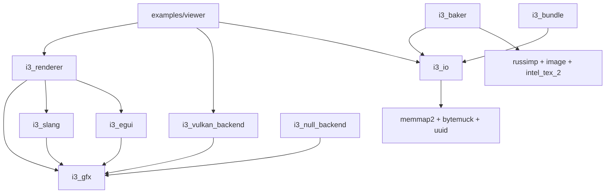

# i3 Engine -- Roadmap & Remaining Tasks

This document tracks the technical debt, design gaps, and upcoming features for the i3 engine.

---

## 1. Project Overview

The i3 engine is a Rust 2024 workspace targeting high-end desktop rendering with Vulkan 1.3. It implements a Frame Graph pattern with deferred clustered shading.

### Workspace Members

| Crate | Role | LOC approx | Maturity |
|---|---|---|---|
| `i3_gfx` | Frame Graph core, HRI abstraction | ~2500 | Functional |
| `i3_vulkan_backend` | Vulkan 1.3 implementation | ~5500 | Functional |
| `i3_null_backend` | Validation oracle | ~550 | Basic |
| `i3_slang` | Slang shader compiler wrapper | ~560 | Functional |
| `i3_renderer` | Deferred clustered shading | ~4000 | Functional but incomplete |
| `i3_io` | VFS, binary formats, asset loading | ~1200 | Functional |
| `i3_baker` | Asset baking pipeline | ~1600 | Functional |
| `i3_egui` | Egui UI integration layer | ~350 | MVP |
| `i3_bundle` | CLI bundle inspector | ~130 | Basic |
| `examples/` | draw_triangle, compute_mandelbrot, deferred_stress, viewer | ~1400 | Working |

### Dependency Graph

---

## 2. Remaining Issues & Technical Debt

### 2.1 Core & Infrastructure (i3_gfx, i3_vulkan_backend, i3_io)

| ID | Component | Severity | Description |
|---|---|---|---|
| GFX-03 | i3_gfx | High | `compiler.rs` is too large (~1000 LOC). Split into symbol_table, node_storage, etc. |
| GFX-04 | i3_gfx | Medium | `consume_erased` panics on missing symbol; should return Result. |
| GFX-06 | i3_gfx | Medium | Memory aliasing (AliasingPlan) described in design but not implemented. |
| GFX-07 | i3_gfx | Low | Multi-queue support (async compute/transfer) not implemented. |
| GFX-08 | i3_gfx | Low | Dead node elimination not implemented. |
| IO-01 | i3_io | High | `AssetHandle::get()`/`wait_loaded()` return refs that may outlive the lock (potential UB). Use Arc<T>. |
| IO-03 | i3_io | Medium | Manual unsafe pointer cast in `texture.rs` load. Use match `bytemuck` patterns. |
| VK-03 | i3_vulkan_backend | Low | Format conversion audit needed for recent Vulkan additions. |

### 2.2 Renderer & Shading (i3_renderer)

| ID | Severity | Description |
|---|---|---|
| RN-02 | High | Normal mapping not utilized in deferred resolve. GBuffer normal lacks tangent-space map sampling. |
| RN-03 | Medium | Buffer sizes in `gpu_buffers.rs` are magic numbers. Derive from constants. |
| RN-04 | High | No GPU culling pass (GPUCull). Currently uses CPU-side draw commands. |
| RN-05 | High | No ZPrePass implemented. |
| RN-06 | Medium | No forward transparency pass. |
| RN-07 | Info | No RT support (BLAS/TLAS). Planned for future phases. |
| RN-09 | Low | `LightData` in `scene.rs` needs `repr(C)` padding check for GPU compatibility. |

### 2.3 Tools (i3_baker, i3_bundle, i3_egui)

| ID | Component | Severity | Description |
|---|---|---|---|
| BK-01 | i3_baker | Medium | Dead `PipelineNode` abstraction review. |
| BK-05 | i3_baker | Low | No tangent recalculation when Assimp metadata is missing. |
| BN-01 | i3_bundle | Medium | Show fragmentation info in bundle inspector (gaps, padding, overhead). |
| BN-02 | i3_bundle | Low | Missing `compact`/`defragment` command for optimized production bundles. |
| EG-I01 | i3_egui | Medium | Support user textures beyond the font atlas. |
| EG-I02 | i3_egui | Medium | Scissoring not implemented in `execute()`. |
| EG-I03 | i3_egui | Low | VB/IB re-allocated every frame. Use persistent or ring buffers. |

---

## 3. Action Plan: Upcoming Phases

### Phase 1: Safety & Foundation
- Refactor `AssetHandle` accessors to return `Arc<T>` (Fix IO-01/IO-02).
- Clean up unsafe casts in `texture.rs`.
- Split large files (`compiler.rs`).
- Implement disk-based `VkPipelineCache` for faster cold starts.

### Phase 2: Advanced Rendering Features
- **P2.1: Normal Mapping**: Update GBuffer to include tangent/bitangent and sample normal maps in deferred resolve.
- **P2.2: ZPrePass**: Implement depth-only pass for early Z optimization.
- **P2.3: GPU-Driven Pipeline**: Implement compute-based frustum culling and `draw_indexed_indirect` support.
- **P2.4: Forward Transparency**: Add forward pass group for transparent objects.

### Phase 3: Hardware Evolution
- **P3.1: Ray Tracing Support**: Add BLAS/TLAS types to i3_gfx and implement backend logic for RT shadows/queries.
- **P3.2: Multi-GPU Selection**: Implement explicit GPU selection via config and CLI flags.

### Phase 4: Ergonomics & Polish
- **P4.1: Shading DSL**: High-level material description language that compiles to `.i3p` assets.
- **P4.2: Baker Progress**: Real-time progress reporting during long bakes (e.g., Sponza).
- **P4.3: Egui Polish**: Scissoring, DPI support, and multi-texture management.

---

## 4. Documentation & Quality
- Update `engine_hld.md` to reflect current workspace structure.
- Annotate all design documents with current implementation status.
- Reconcile testing conventions between documentation and code.
- Implement VFS unit tests and renderer-level NullBackend integration tests.
