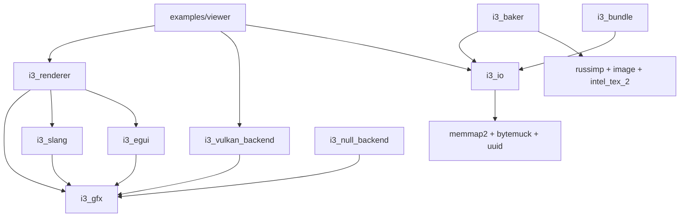

# i3 Engine -- Roadmap & Remaining Tasks

This document tracks the technical debt, design gaps, and upcoming features for the i3 engine.

---

## 1. Project Overview

The i3 engine is a Rust 2024 workspace targeting high-end desktop rendering with Vulkan 1.3. It implements a Frame Graph pattern with deferred clustered shading.

### Workspace Members

| Crate | Role | LOC approx | Maturity |
|---|---|---|---|
| `i3_gfx` | Frame Graph core, HRI abstraction | ~2800 | Functional |
| `i3_vulkan_backend` | Vulkan 1.3 implementation | ~5500 | Functional |
| `i3_null_backend` | Validation oracle | ~550 | Basic |
| `i3_slang` | Slang shader compiler wrapper | ~560 | Functional |
| `i3_renderer` | Deferred clustered shading | ~4500 | Functional |
| `i3_io` | VFS, binary formats, asset loading | ~1200 | Functional |
| `i3_baker` | Asset baking pipeline | ~1600 | Functional |
| `i3_egui` | Egui UI integration layer | ~350 | MVP |
| `i3_bundle` | CLI bundle inspector | ~130 | Basic |
| `examples/` | draw_triangle, compute_mandelbrot, deferred_stress, viewer | ~1400 | Working |

### Dependency Graph



---

## 2. Remaining Issues & Technical Debt

### 2.1 Core & Infrastructure (i3_gfx, i3_vulkan_backend, i3_io)

| ID | Component | Severity | Description |
|---|---|---|---|
| GFX-03 | i3_gfx | **DONE** | ~~`compiler.rs` too large.~~ Split into `symbol_table.rs` (Symbol, SymbolTable, FrameBlackboard), `node.rs` (NodeStorage, PassRecorder), `compiled.rs` (CompiledGraph, ExecutionStep). `compiler.rs` now only holds `FrameGraph` + compile pipeline (~300 LOC). |
| GFX-04 | i3_gfx | Medium | `consume_erased` panics on missing symbol; should return Result. |
| GFX-06 | i3_gfx | Medium | Memory aliasing (AliasingPlan) described in design but not implemented. |
| GFX-08 | i3_gfx | Low | Dead node elimination not implemented. `is_output` + `PresentPass` terminal are already in place as foundation. |
| GFX-09 | i3_gfx + i3_renderer | **DONE** | ~~Phase-aware RenderPass + symbol outputs + resource relocalisation.~~ Implemented. See §3 for remaining follow-ups. |
| GFX-10 | i3_gfx + i3_renderer | **DONE** | ~~Stable compiled topology.~~ `compiled: Option<CompiledGraph>` cached; `mark_dirty()` added; recompile only on resize, debug channel change, or sync-pass dirty. `CompiledGraph::execute` now takes `&mut self`. |
| SYNC-01 | i3_gfx / i3_vulkan_backend | **DONE** | ~~Cross-queue stage/access normalization.~~ |
| SYNC-02 | i3_gfx | Low | `queue_family: u32` in `ResourceState` leaks Vulkan indices into the abstract layer. Should be `queue_type: QueueType`; translation to `vk::QueueFamily` index belongs in the backend. |
| SYNC-03 | i3_gfx | Low | `load_ops: HashMap<u64, LoadOp>` in `PassSyncData` is a renderpass concern mixed into the sync plan. Consider splitting into a separate `PassRenderInfo` or at minimum document the coupling. |
| SYNC-04 | i3_gfx | Low | `SyncPlanner::image_seed` / `buffer_seed` are `pub`. Replace with explicit `fn seed_image()` / `fn seed_buffer()` / `fn clear_seeds()` methods. |
| SYNC-05 | i3_gfx | Low | `layout` field in `ResourceState` is meaningless for buffers. Either introduce separate `ImageState`/`BufferState` types or document the field as image-only. |
| SYNC-06 | i3_gfx / i3_vulkan_backend | **DONE** | ~~Present barrier managed by sync planner via `builder.present_image()`.~~ |
| GFX-07 | i3_gfx | **DONE** | ~~Multi-queue async compute/transfer.~~ Working, no validation errors. |
| GFX-MQ-01 | i3_vulkan_backend | **DONE** | ~~`begin_frame` per-queue timeline wait before pool reset.~~ Compute and transfer semaphore waits added at `submission.rs:159-205`. |
| GFX-MQ-02 | i3_vulkan_backend | **DONE** | ~~`get_queue_family()` unwrap.~~ Already uses `unwrap_or(graphics_family)` fallback in `sync.rs:80-90`. |
| GFX-MQ-03 | i3_vulkan_backend | **DONE** | ~~`sanitize_stages` silent fallback.~~ Already emits `tracing::warn!` in `sync.rs:438-441,453-457`. |
| IO-01 | i3_io | **DONE** | ~~`AssetHandle` ref lifetime.~~ `get()` and `wait_loaded()` already return owned `Arc<T>` cloned under the lock. |
| IO-03 | i3_io | **DONE** | ~~Manual unsafe cast in `texture.rs`.~~ Already uses `bytemuck::pod_read_unaligned`. |
| VK-03 | i3_vulkan_backend | Low | Format conversion audit needed for recent Vulkan additions. |
| GFX-12 | i3_vulkan_backend | Medium | Implement `VkBufferView` for `UniformTexelBuffer` and `StorageTexelBuffer` support. |
| GFX-13 | i3_gfx / i3_vulkan_backend | Medium | Support subresource views (mip/layer) via explicit `ImageViewDesc` in the Frame Graph. |
| GFX-14 | i3_gfx / i3_vulkan_backend | Medium | GPU→CPU readback absent. `copy_image_to_buffer` manquant dans `PassContext` + implémentation `vkCmdCopyImageToBuffer`. `OutputKind::Readback` dans `types.rs` déclaré mais non implémenté dans le SyncPlanner (pas de barrier finale `TRANSFER_SRC_OPTIMAL`). Prérequis pour : bake IBL GPU-side, lightmaps, capture de frames, debug texture dumps. |
| GFX-15 | i3_renderer | Medium | CommonData Uniform Buffer. Currently, every pass copies `CommonData` fields (matrices, screen size, camera pos) into push constants. Should be a single global UBO synchronized once per frame to reduce overhead and improve consistency. |

### 2.2 Renderer & Shading (i3_renderer)

| ID | Severity | Description |
|---|---|---|
| RN-02 | **DONE** | ~~Normal mapping.~~ TBN matrix + tangent-space normal map sampling implemented in `gbuffer.slang`; tangent vertex attribute present. |
| RN-03 | **DONE** | ~~Magic numbers duplicated.~~ Extracted to `constants.rs`: `MAX_MESHES`, `MAX_INSTANCES`, `MAX_LIGHTS`, `CLUSTER_GRID_Z`, `CLUSTER_TILE_SIZE`, `DRAW_INDIRECT_CMD_SIZE`. |
| RN-04 | High | No GPU culling pass (GPUCull). Currently uses CPU-side draw commands. |
| RN-05 | High | No ZPrePass implemented. |
| RN-06 | Medium | No forward transparency pass. |
| RN-07 | Info | No RT support (BLAS/TLAS). Planned for future phases. |
| RN-08 | **DONE** | ~~`sync.rs` dirty-check: length check first, then zip.~~ Already correct in code; marked done. |
| RN-09 | Low | `LightData` in `scene.rs` needs `repr(C)` padding audit for GPU compatibility. |
| RN-10 | **DONE** | ~~`Arc<Mutex<AccelStructSystem>>`~~ Replaced with direct field ownership. Passes populated by `sync()`, no blackboard needed. |
| RN-11 | Low | `unsafe ptr::copy_nonoverlapping` in `sync.rs` lacks bounds checking and casts through `*const u8`. Audit and tighten. |
| RN-12 | **DONE** | ~~TLAS rebuilt every frame.~~ `TlasRebuildPass` now caches the instance list and skips `build_tlas` when unchanged. |

### 2.3 Frame Graph API Ergonomics (i3_gfx)

| ID | Severity | Description |
|---|---|---|
| GFX-11 | Medium | `bind_descriptor_set` takes `Vec<DescriptorWrite>` with explicit struct literals — verbose and error-prone. Replace with a `DescriptorSetWriter` fluent builder. |

**GFX-11 Design** — `DescriptorSetWriter` builder sur `PassBuilder`:

```rust
builder.descriptor_set(0, |d| {
    d.combined_image_sampler(0, self.gbuffer_albedo, DescriptorImageLayout::ShaderReadOnlyOptimal, self.sampler);
    d.combined_image_sampler(1, self.gbuffer_normal,  DescriptorImageLayout::ShaderReadOnlyOptimal, self.sampler);
    d.combined_image_sampler(2, self.gbuffer_roughmetal, DescriptorImageLayout::ShaderReadOnlyOptimal, self.sampler);
    d.combined_image_sampler(3, self.gbuffer_emissive,   DescriptorImageLayout::ShaderReadOnlyOptimal, self.sampler);
    d.combined_image_sampler(4, self.depth_buffer,       DescriptorImageLayout::ShaderReadOnlyOptimal, self.sampler);
    d.storage_buffer(5, self.lights);
    d.storage_buffer(6, self.cluster_grid);
    d.storage_buffer(7, self.cluster_light_indices);
    d.storage_buffer(8, self.exposure_buffer);
    d.acceleration_structure(9, self.tlas_handle);  // conditional — only emitted if handle != INVALID
});
```

`DescriptorSetWriter` est un struct interne avec `writes: Vec<DescriptorWrite>`, construit dans la closure, passé à `bind_descriptor_set` à la fin. L'API `d.acceleration_structure(binding, handle)` skip silencieusement si `handle == AccelerationStructureHandle::INVALID`. L'API existante (`bind_descriptor_set(u32, Vec<DescriptorWrite>)`) reste disponible pour les cas avancés.

---

### 2.4 Tools (i3_baker, i3_bundle, i3_egui)

| ID | Component | Severity | Description |
|---|---|---|
| BK-01 | i3_baker | Medium | Dead `PipelineNode` abstraction review. |
| BK-05 | i3_baker | Low | No tangent recalculation when Assimp metadata is missing. |
| BN-01 | i3_bundle | Medium | Show fragmentation info in bundle inspector (gaps, padding, overhead). |
| BN-02 | i3_bundle | Low | Missing `compact`/`defragment` command for optimized production bundles. |
| EG-I01 | i3_egui | Medium | Support user textures beyond the font atlas. |
| EG-I02 | i3_egui | Medium | Scissoring not implemented in `execute()`. |
| EG-I03 | i3_egui | Low | VB/IB re-allocated every frame. Use persistent or ring buffers. |

---

## 3. Action Plan: Upcoming Phases

### Phase 1: Safety & Foundation
- **[DONE]** Multi-queue async compute + transfer (GFX-07).
- **[DONE]** SYNC-01: Cross-queue stage/access normalization in abstract sync planner.
- **[DONE]** SYNC-06: Present barrier fully managed by sync planner; `builder.present_image()` API.
- **[DONE]** GFX-09: Phase-aware RenderPass + symbol outputs + resource relocalisation + FrameBlackboard.
- **[DONE]** GFX-10: Stable compiled topology — `mark_dirty()` + per-frame `CompiledGraph` cache.
- **[DONE]** Fix GFX-MQ-01: per-queue `last_completion_value` and wait in `begin_frame`.
- **[DONE]** Fix GFX-MQ-02: safe `get_queue_family()` with fallback.
- **[DONE]** Fix GFX-MQ-03: log warn in `sanitize_stages` on fallback.
- **[DONE]** Refactor `AssetHandle` accessors to return `Arc<T>` (IO-01).
- **[DONE]** Clean up unsafe casts in `texture.rs` (IO-03).
- **[DONE]** Split `compiler.rs` (GFX-03).

### Phase 2: Advanced Rendering Features
- **P2.1: Normal Mapping**: Update GBuffer to include tangent/bitangent and sample normal maps in deferred resolve. (Unblocks RN-02, BK-05)
- **P2.2: ZPrePass**: Implement depth-only pass for early Z optimization. (RN-05)
- **P2.3: GPU-Driven Pipeline**: Compute-based frustum culling and `draw_indexed_indirect`. (RN-04)
- **P2.4: Forward Transparency**: Add forward pass group for transparent objects. (RN-06)
- **P2.5: Cleanup**: RN-03 constants, RN-08 dirty-check fix, RN-10 AccelStructSystem, RN-11 unsafe audit.

### Phase 3: Hardware Evolution
- **P3.1: Ray Tracing Support**: Add BLAS/TLAS types to i3_gfx and implement backend logic for RT shadows/queries. (RN-07)
- **P3.2: Multi-GPU Selection**: Explicit GPU selection via config and CLI flags.

### Phase 4: Ergonomics & Polish
- **P4.1: Shading DSL**: High-level material description language that compiles to `.i3p` assets.
- **P4.2: Baker Progress**: Real-time progress reporting during long bakes.
- **P4.3: Egui Polish**: Scissoring (EG-I02), DPI support, multi-texture (EG-I01), persistent VB/IB (EG-I03).

---

## 4. Documentation & Quality
- Update `engine_hld.md` to reflect current workspace structure.
- Update `frame_graph_design.md` — many sections are now outdated (see §5).
- Implement VFS unit tests and renderer-level NullBackend integration tests.

---

## 5. Documentation Gaps (frame_graph_design.md vs Code)

`doc/frame_graph_design.md` was written before the implementation and is partially outdated.

| Topic | Doc says | Code reality |
|---|---|---|
| `RenderPass::domain()` | Required method returning `PassDomain` | Removed — domain auto-inferred from resource declarations |
| `RenderPass::prefer_async()` | Not mentioned | Present in trait; default = `true`; controls async queue routing |
| `CommandBatch` / `BatchStep` | Not mentioned | Core submission primitive; `BatchStep::{Command,Wait,Signal}` drives sub-batch splitting |
| Multi-queue sync | Timeline semaphores described abstractly | Concrete: ordered `BatchStep` steps, sub-batch splitting at `Signal` boundaries, per-queue `cpu_timeline` |
| Memory aliasing | Described as "from day one" | **Not yet implemented** (GFX-06) |
| `PassContext` | Enum with `Gpu`/`Cpu` variants | Implemented as a trait |
| `PassBuilder::add_node()` | FnOnce closure API | Actual API: `add_pass(&mut dyn RenderPass)` / `add_owned_pass<P: RenderPass>` |
| `graph.setup()` / `is_setup` | Present | **Removed** (GFX-09 done): `declare()` is per-frame; `FrameBlackboard` handles per-frame data |
| `FrameBlackboard` | Not mentioned | **Implemented** (GFX-09): `frame.consume::<T>("key")` in `execute()` |
| Symbol outputs | Not mentioned | **Implemented** (GFX-09): `declare_image_output` / `declare_buffer_output` / `import_buffer` promote symbols to parent scope |
| `DefaultRenderGraph` topology | Not mentioned | `render()` still rebuilds each frame; `mark_dirty()` + cached `CompiledGraph` is GFX-10 |
